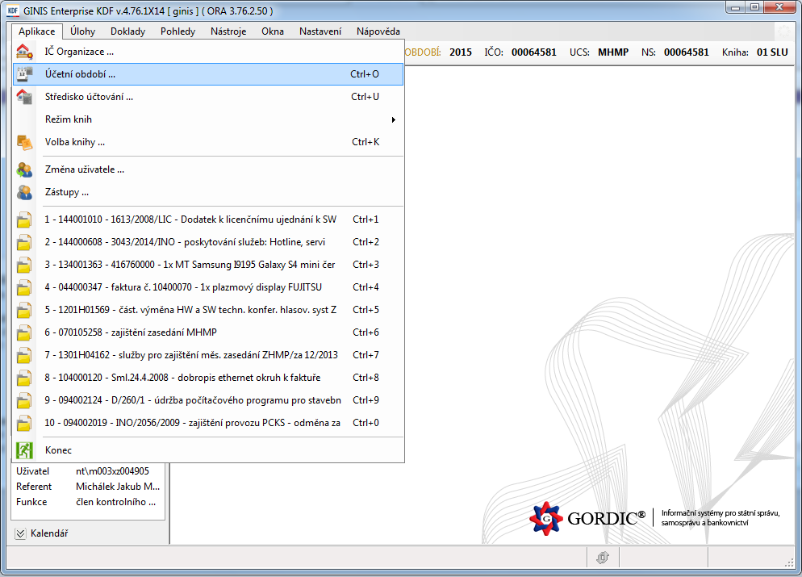
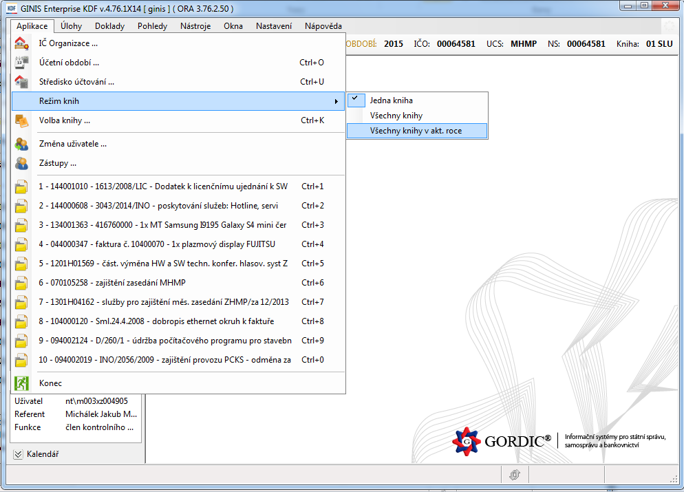

# Návod pro zveřejnění faktur ve strojově čitelném formátu a ve formátu CSV

## 1. Úvod

Hlavní město Praha používá pro evidenci svého účetnictví software Gordic Ginis od známé jihlavské společnosti. Tento software je nasazen jednak pro potřeby Magistrátu hlavního města Prahy, tak ale i pro 57 městských částí Prahy a dále celou řadu příspěvkových organizací. 

Jedním z cílů Pirátů je prosadit transparentní hospodaření samosprávy a příspěvkových organizací města. Proto je nezbytné **zveřejnit faktury města** jako tzv. **Otevřená data**. Data ze software Gordic Ginis lze exportovat, a nyní si předvedeme jak. 
Úvod

Tento návod představuje druhou a upravenou verzi předchozího manuálu, který popisoval způsob exportu faktur. Nyní si ukážeme **rychlejší** a **jednodušší** metodu, jak vyexportovat hospodaření Vaší organizace. Namísto několika desítek souborů, které je nezbytné postupně generovat v řádech dní, lze použít rychlejší postup pro tvorbu CSV souborů a celou práci tak zvládnete za několik málo minut nebo hodin (podle velikosti Vaší organizace). Ty poté můžete použít v jakékoliv databázi.
Postup

## 2. Postup

Základním modulem software Gordic Ginis, který budeme potřebovat, je modul Kniha došlých faktur, neboli KDF. S jinými moduly nebudeme v tomto návodu pracovat.

V modulu Knihy došlých faktur jsou jednotlivá data strukturována hierarchicky. Pro každé účetní období (podle let) jsou k dispozici určité účetní knihy (podle interního rozdělení organizace, např. podle odborů). V účetních knihách se nacházejí jednotlivé faktury. Jedná se o obdobnou strukturu, jak je struktura složek ve vašem počítači. 

* **Účetní období** představuje jeden rok v historii účetnictví organizace
* **Účetní kniha** představuje záznam účetních operací pro danou část organizace v průběhu jednoho roku
* **Účetní záznam** je jeden záznam v účetní knize. Faktury generují nové záznamy. 

Vaše organizace může mít například evidovaných 10 let v systému Gordic Ginis (a tedy 10 účetních období). Existuje-li pro jedno účetní období dalších 10 účetních knih podle různých odborů Vaší organizace, dělá to dohromady 100 knih k exportování. 

Můžete však exportovat účetní záznamy podle jednotlivých let, a tedy data ze všech **účetních knih** z jednoho roku najednou.

### 2.1. Výběr účetního období

První co nás nejspíše bude v tomto případě zajímat, bude přístup k jednotlivým datům. Pomocí volby **Aplikace → Účetní období** v levé horní části obrazovky zvolte rok, odkud chcete faktury exportovat. 

Poté musíte vybrat konkrétní **účetní knihu**. Vyberte jakoukoliv, a hned poté pomocí volby **Aplikace → Režim knihy → Všechny knihy v aktuálním roce** potvrďte, že si chcete zobrazit **všechny účetní knihy najednou**. 

Pokud jste zvolili vše správně, měli byste v pravém horním rohu vidět jako vybranou účetní knihu hodnotu **ROK**. V kolonce **účetní období** poté bude vybrán ten rok, který jste zvolili pro export.

### 2.2. Knihy a masky

Různá účetní data mají nastavena svůj vlastní příznak viditelnosti. To znamená, že ne každý uživatel, který má přístup k modulu Kniha došlých faktur, uvidí všechna data. Někteří uživatelé vidí více účetních dat (a tedy i účetních knih), než ti ostatní, protože jsou například správci systému, nebo mají zvláštní oprávnění apod.

Kromě tohoto předdefinovaného příznaku viditelnosti účetních dat, potažmo účetních knih, je tu i další, a to uživatelský. Systém Gordic Ginis jej označuje pod názvem maska. Lze jej užívat jako filtr; zobrazit jen ta účetní data (tj. faktury), které jsou jen z určitého roku, mají určitý řetězec textu v názvu, nebo jsou pro nás jiným způsobem zajímavá.

**Důležitým faktem** také je, že po spuštění systému se automaticky zapíná maska, která nezobrazí primárně žádná data. Je nezbytné jí proto přenastavit tak, že po kliknutí na ikonku knihy vlevo (dvakrát) nastavíme svůj filtr. Nastavení této masky nám zobrazí veškeré účetní položky, ke kterým máme přístup.

Chceme-li účinně získat veškerá data ze systému Gordic Ginis, musíme vybrat takový uživatelský filtr/masku, která nám bez výjimky **zobrazí veškerá účetní data, ke kterým máme přístup.** Pro výběr masky klikněte na ikonku otevřené knihy v levé horní části obrazovky.

### 2.3. Seřazení dat do správné podoby.

Protože jste došli až sem, znamená to, že už nyní dokážete bezpečně zobrazit všechny účetní data, která eviduje systém Gordic Ginis a ke kterým máte jako uživatelé přístup. 

Výše jsme si řekli, že software pracuje s tzv. účetními daty. Ta seskupuje do jednotlivých knih. Pokud si knihu zobrazíte, uvidíte jí jako tabulku a každá položka účetních dat v ní představuje jeden řádek. V našem případě bude jedna faktura jedním řádkem.

Potřebnád data již máte dané účetní období vybrané a zobrazují se vám všechny účetní data ve všech účetních knihách v jednom roce (tedy v jednom účetní období).

Nyní je potřeba ještě seřadit sloupce v dané tabulce tak, aby byla všechna účetní data uspořádána stejným způsobem. To je nezbytné pro lepší analýzu dat. Klikněte pravým tlačítkem na název jakéhokoliv sloupce v zobrazené tabulce a vyberte volbu **nastavení**

V okně, které se zobrazilo, byste po pravé straně měli vidět sloupce, které máte nastavené ve vaší tabulce. Vlevo se poté nacházejí další sloupce které můžete vybrat. 

Mezi oběma sloupci můžete přesouvat položky buď tahem myší, nebo pomocí dvou šipek. Seřaďte položky na pravé straně tak, aby byly odshora dolů umístěny v tomto pořadí: 

* Kniha
* Kat.
* N
* Částka
* Měna
* DPH
* Název subjektu
* Adresa subjektu
* IČO
* Akt. ev. číslo
* ID sm. obj.
* Ag. číslo
* Evid. číslo
* Číslo dokl. dod.
* Identifikátor
* Dat. evid.
* Datum doručení
* Dat. úhr.
* Dat. účt.
* Dat. zdan.
* Dat. splat.
* Dat. ÚUP
* Datum změny
* Popis
* Poznámky

## 2. 4. Export dat

Jakmile jsou data seřazena tímto způsobem, lze je exportovat v podobě, která je dobře strojově analyzovatelná.

1. označíme veškeré položky (CTRL+A)
2. pravým tlačítkem vybereme z kontextové nabídky „export → vše do Excelu“
3. otevře se nám automaticky spreadsheetový editor s účetními daty z dané knihy.
4. uložíme danou tabulku ve formátu .xlsx
5. Otevřeme si danou tabulku ve formátu Libre Office
6. Uložíme tabulku jako Textové CSV
