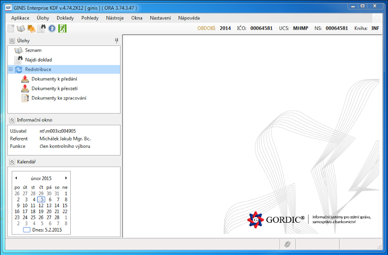
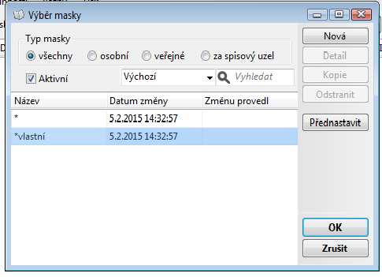
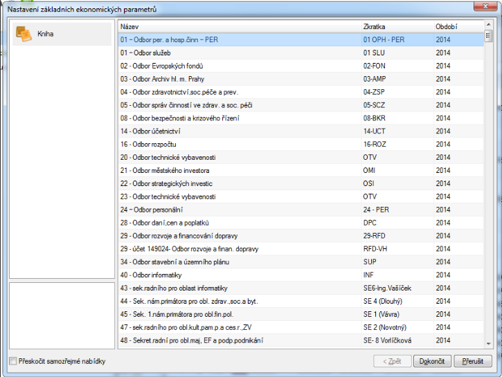
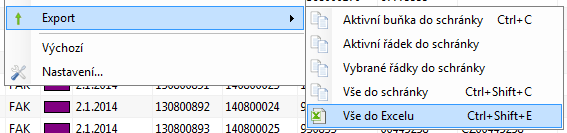

Návod: získání dát ze softwaru Ginis
====================================

Úvod
----

V dnešní době stále častěji pracujeme a chceme pracovat s tzv. otevřenými daty. V případě hlavního města Prahy, jeho městských částí a příspěvkových organizací se však střetáváme s problémem: existuje sice vůle data uvolnit, nicméně software nám v tomto brání. Proč tomu tak je, a jak tento problém lze vyřešit?
Tento návod se bude věnovat software Gordic Ginis, který je používám k evidenci celé řady operací (hlavně účetního charakteru). Používá jej Praha, její městské části i příspěvkové organizace. Pracuje s vlastními formáty souborů, které dokáže otevřít pouze program Gordic Ginis a nikdo jiný.

Mluvíme tedy o stavu, známém jako vendor lock-in (proprietární uzavření). Software je totiž navržen tak, aby nám s daty neumožnil pracovat nezávisle na něm. Tím se zvyšuje závislost nás jako pracovníka s tímto software na jeho dodavateli.

Struktura software Ginis
-------------------------

Gordic Ginis není jedním programem, jako je tomu v případě kancelářských balíků, grafických editorů a podobně. Naopak se sestává z celé řady modulů. Agenda úřadu tak může být efektivně rozdělena do jednotlivých modulů. Různí pracovníci úřadu mají přístup pouze do vybraných modulů podle svého pracovního zařazení, čímž je řešena problematika řízení přístupu. 

Jednotlivých modulů existuje až několik desítek a jsou označovány třípísmennými zkratkami. Nás bude zajímat modul s názvem Kniha došlých faktur (se zkratkou KDF). 

V tomto modulu jsou jednotlivá data strukturována následujícím způsobem:

**Modul obsahuje určité množství účetních knih, které obsahují účetní data týkající se jednotlivých faktur.**

- **Modul** je daná část software, se kterou pracujeme (v tomto návodu je to jedině Kniha došlých faktur, tedy KDF)
- **Účetní** kniha je určité seskupení účetních dat, které má stejnou charakteristiku (může to být třeba odbor úřadu nebo daný účetní rok)
- **Účetní** data jsou jednotlivá data v systému Gordic Ginis; v tomto případě odpovídá jedna položka účetních dat jedné faktuře.

Výběr knihy
-----------

První co nás nejspíše bude v tomto případě zajímat, bude přístup k jednotlivým datům. Pomocí tlačítka s dvěma knihami v levé horní části obrazovky se dostaneme do menu „výběr knihy“, kde si vybereme příslušnou účetní knihu.

Vlastní filtry – flagy a masky
------------------------------

Různá účetní data mají nastavena svůj vlastní flag (příznak) viditelnosti. To znamená, že ne každý uživatel, který má přístup k modulu Kniha došlých faktur uvidí všechna data. Někteří uživatelé vidí více účetních dat (a tedy i účetních knih), než ti ostatní. 

Kromě tohoto předdefinovaného příznaku viditelnosti účetních dat, potažmo účetních knih, je tu i další, a to uživatelský. Systém Gordic Ginis jej označuje pod názvem maska. Lze jej užívat jako filtr; zobrazit jen ta účetní data (tj. faktury), které jsou jen z určitého roku, mají určitý řetězec textu v názvu, nebo jsou pro nás jiným způsobem zajímavá.

**Důležitým faktem** také je, že po spuštění systému se automaticky zapíná maska, která nezobrazí primárně žádná data. Je nezbytné jí proto přenastavit tak, že po kliknutí na ikonku knihy vlevo (dvakrát) nastavíme svůj filtr. Nastavení této masky nám zobrazí veškeré účetní položky, ke kterým máme přístup.

Chceme-li účinně získat veškerá data ze systému Gordic Ginis, musíme vybrat takový uživatelský filtr/masku, která nám bez výjimky **zobrazí veškerá účetní data, ke kterým máme přístup.**

Jak těžit data
---------------

Protože jsme došli až sem, znamená to, že už nyní dokážeme bezpečně zobrazit všechny účetní data, která eviduje systém Gordic Ginis a ke kterým máme jako uživatelé přístup. Sám software Gordic Ginis sice není navržen tak, aby poskytoval otevřená data, lze z něj však jednotlivé účetní knihy vyexportovat.

Výše jsme si řekli, že software pracuje s tzv. Účetními daty. Ta seskupuje do jednotlivých knih. Pokud si knihu zobrazíme, vidíme jí jako tabulku a každá položka účetních dat v ní představuje jeden řádek. 

**Nejjednodušší metoda těžby dat z Gordic Ginis spočívá v zobrazení každé účetní knihy zvlášť a v jejím exportu do tabulky ve formátu `.xlsx`, .ods nebo i `.csv`. 
Toto lze provést následujícími způsoby:**

1. Automatizovaným skrze API
2. Ručním
	1.    Po částech (při větších objemech dat přehlednější)
	2.    V jednom celku

Automatizovaný export může zajistit vaše IT oddělení skrze zdokumentované API. Výsledek je stejný jako, když export provádíte ručně. Pro začátek je ruční export zcela dostačující. V dalších měsících město dodá exportní skript.

Magistrát hlavního města Prahy jako uživatel systému Gordic Ginis má ve své databázi v Knize došlých faktur cca 230 000 účetních dat (tj. faktur). To je opravdu hodně. Software Gordic Ginis umožňuje zobrazit si je všechny najednou...

Pomalý způsob spočívá v exportu každé účetní knihy zvlášť do separátního souboru. Rychlý způsob spočívá v exportu všech účetních dat z každé účetní knihy a každého roku do jednoho souboru. Rychlý způsob vyžaduje jen jediný export, zároveň ale potřebuje tolik paměti při samotné konverzi dat, že vede zcela jistě k havárii systému – ale jen v případech, kdy pracujeme s velkými objemy dat.

Chceme-li bezpečně exportovat data ze systému Gordic Ginis výše uvedeným způsobem po částech, uskutečníme toto prostřednictvím následujícího pracovního postupu:

1. Vybereme konkrétní knihu, kterou chceme exportovat
2. označíme veškeré položky (CTRL+A)
3. pravým tlačítkem vybereme z kontextové nabídky „export → vše do Excelu“
4. otevře se nám automaticky spreadsheetový editor s účetními daty z dané knihy.
5. uložíme danou tabulku
6. postup opětujeme s další knihou.

Formát CSV - Comma separated values
-----------------------------------

Jakmile máme data ze systému Gordic Ginis v tabulkovém editoru, máme v podstatě vyhráno – lze s nimi již totiž pracovat tak, jako s čímkoliv jiným. Nyní si vysvětlíme, proč je dobré je ukládat ve formátu „comma separated values“. 

Podobně jako pro čistý text je zdrojový kód samotným základem, i v případě tabulkových editorů existuje jeden, základní formát – zdrojový kód. Je to tzv. „comma separated values“, tedy hodnoty oddělené čárkami. V tomto formátu oddělují jednotlivé buňky čárky a jednotlivé řádky jsou uspořádány tak, jak by se zobrazily v tabulkovém editoru. Z tabulkového editoru lze exportovat data do formátu „comma separated values“ (který má zpravidla příponu .csv). Lze si také vybrat, zda-li budou hodnoty odděleny středníkem, nebo formátovány pro různé operační systémy. 

Výhodou tohoto formátu je skutečnost, že jej lze otevřít v internetovém prohlížeči, nejobyčejnějším textovém editoru, ba jej dokonce zobrazit bez jakýchkoliv problémů i v textovém (tj. negrafickém) rozhraní operačního systému. Jedná se proto o dobrý formát pro provedení kontroly a především pro export dat takovým způsobem, aby byla dostupná opravdu všem. 

