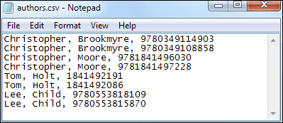
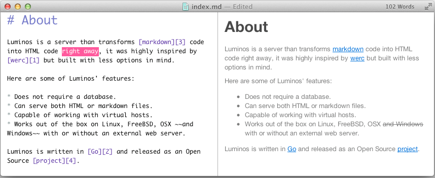

# 1. Úvod

Otevřená data (anglicky open data) jsou data, která jsou ve strojově čitelné podobě[^1] dostupná veřejnosti. V programovém prohlášení Rady hl. m. Prahy[^2] i komise ICT RHMP[^3] jsou OpenData (a dokonce i OpenSource) rozhodným způsobem podpořena. Pojďme se proto nyní podívat, jak lze z obyčejných dat udělat otevřená data, která mohou sloužit nejen úřadu, ale i veřejnosti. 

# 2. Jak získat data

Prvním krokem k úspěchu je získat samotná data, která poté budou uveřejněna jako data otevřená. Data, která je možné zpracovat jako otevřená, lze získat různými způsoby. 

## 2.1. Formáty

Data se nacházejí na různých místech, mají různou podobu a pracují s nimi různí lidé. Kromě toho všeho však mají ještě jinou vlastnost ₋ jsou k dispozici v různých formátech. Váš úřad nebo organizace používá určité formáty souborů, které znáte z programů, se kterými každodenně pracujete. Protože otevřená data mají být k dispozici všem, je nezbytné užívat takové formáty, které si otevřou lidé s **různými** počítači, v **různých** institucích ₋ kde mají lidé samozřejmě i jiné programy.

Podívejme se nyní na to, jaké formáty bychom měli preferovat pro úspěšné rozšíření otevřených dat. Programy, se kterými pracujete by Vám měly umožnit uložit data do těchto formátů. 

### 2.1.1. CSV ₋ Comma separated values

Často v případě otevřených dat hovoříme o tabulkách. Pracujeme-li s nimi, ukládáme výsledky naší práce ve formátech jako např. .xls, .ods, nebo .xlsx. Aby ale výsledek naší práce mohl otevřít kdokoliv, potřebujeme základní, nejzákladnější formát. Je to tzv. „comma separated values“, česky doslova hodnoty oddělené čárkami. V tomto formátu oddělují jednotlivé buňky čárky a jednotlivé řádky jsou uspořádány tak, jak by se zobrazily v tabulkovém editoru. Z tabulkového editoru lze exportovat data do formátu „comma separated values“ (který má zpravidla příponu **.csv**). Lze si také vybrat, zda-li budou hodnoty odděleny středníkem, nebo formátovány pro různé operační systémy. 

Výhodou tohoto formátu je skutečnost, že jej lze otevřít v internetovém prohlížeči, nejobyčejnějším textovém editoru, ba jej dokonce zobrazit bez jakýchkoliv problémů i v textovém (tj. negrafickém) rozhraní operačního systému. Jedná se proto o dobrý formát pro provedení kontroly a především pro export dat takovým způsobem, aby byla dostupná opravdu všem. 

**Tento formát proto preferujte pro tabulky.**

### 2.1.2. xlsx

Formát .xlsx je formát podobný známému a rozšířenému formátu .xls (který používá například Microsoft Excel). Od něho se ale liší tím, že .xlsx má otevřenou specifikaci ₋ lze jej tedy otevřít a pracovat s ním i v jiném programu, než v Microsoft Excel. Protože chceme, aby byla otevřená data k dispozici co nejvíce lidem, chceme také, aby k nim měli přístup všichni, bez ohledu na to, jaký mají právě ve svém počítači nebo zařízení nainstalovaný program. Formát .xls má mezinárodní specifikaci jako standardní formát, a dále je zpětně kompatibilní. 

**Tento formát používejte pro tabulky, nemůžete li z jistých důvodu užít formátu .csv.**

### 2.1.3. markdown

Markdown (formát .md) je jednoduchý textový formát (podobně jako prostý text, formát .txt). Používá se pro textové soubory (zprávy, zápisy, přehledy aj.) Oproti formátu, který používá například Microsoft Word (formát .doc) má sice mnohem méně možností formátování, zato je možné jej zobrazit bez jakýchkoliv problémů jak na běžném počítači (není potřebné instalovat žádný zvláštní software), tak i online. Dokumenty uložené ve formátu markdown ₋ tedy s příponou .md ₋ lze snadno převádět dále automatizovanými nástroji do různých podob, webových stránek, prezentací, PDF souborů apod. 

Dokument ve formátu Markdown má svůj zdrojový kód. V něm je použit značkovací jazyk formátu markdown pro vytváření nadpisů, tučného textu, kurzívy, odrážek, citací a odkazů. To znamená, že daný dokument vypadá *jinak* když jej upravujete, než když je zobrazen. Při práci s dokumentem užíváte tzv. speciální znaky, které slouží k formátování dokumentu. Pojďme se nyní podívat, jaké znaky to jsou:

* Použijeme-li na začátku řádku znak "#", vytvoříme tím nadpis. Čím více znaků "#" použijeme, tím dostaneme nižší úroveň nadpisu.
* Použijeme-li před a za slovem znak "*", bude dané slovo zobrazeno kurzívou. 
* Použijeme-li před a za slovem dva znaky "*" (tedy "**"), bude dané slovo zobrazeno tučně.
* Odkaz na jakoukoliv webovou stránku má dvě části. Text, který má sloužit jako odkaz je vymezen hranatými závorkami, za ním následuje adresa odkazu ve složených závorkách.
* Odrážku lze udělat pomocí pomlčky ("-") na začátku řádku, nebo hvězdičky ("*").

Na obrázku výše je uvedeno, jak se od sebe liší zdrojový kód (režim editace) od výsledného textu (režim zobrazení). Text, který se zobrazí vpravo je nezbytný zapsat přesně takovým způsobem, jaký lze vidět na levé straně. Formát Markdown sice vyždauje jistou míru představivosti, práce s ním je však velice jednoduchá. Existují i nástroje pro export dokumentů ve formátu Microsoft Word (.doc) do formátu Markdown. Další podrobnosti, jak tento formát funguje lze nalézt [zde](https://cs.wikipedia.org/wiki/Markdown).

**Tento formát používejte pro textové soubory, kdykoliv je to možné.**

## 2.2. Problematika exportování dat. 

Kancelářský software (Microsoft Word, Microsoft Excel, Open Office, Libre Office aj.) umožňuje jednotlivé soubory, které mají být zveřejněny jako open data, ukládat ve více formátech (povšimněte si nabídek "Uložit" a "Uložit jako"). V nabídce, která se po vybrání jedné z těchto dvou voleb objeví, poté lze vybrat některý z otevřených formátů. 

Tato možnost řeší většinu problémů, ale v řadě případů ji nelze použít, například už jen proto, že daný software neumožňuje uložit soubor ve svobodném formátu. V takovém případě je nezbytné použít složitější postup. 

## 2.3. Export dat ze systému Gordic GINIS

Pojďme se nyní podívat na jeden konkrétní příklad toho, jak zajistit data ve správném formátu tak, aby mohla být otevřená.

Hlavní město Praha používá software Gordic GINIS, ve kterém eviduje statisíce až miliony dokumentů. I tyto dokumenty lze uveřejnit jako otevřená data. Tak lze učinit prostřednictvím jejich exportu ze systému Gordic GINIS. 

### 2.3.1. Struktura systému GINIS

Gordic Ginis není jedním programem, jako je tomu v případě kancelářských balíků, grafických editorů a podobně. Naopak se sestává z celé řady modulů. Agenda úřadu tak může být efektivně rozdělena do jednotlivých modulů. Různí pracovníci úřadu mají přístup pouze do vybraných modulů podle svého pracovního zařazení, čímž je řešena problematika řízení přístupu. Je to do jisté míry podobné jako v případě výše popsané technologie CKAN, kde namísto modulů jsou uživatelé členy různých *institucí*. 

Jednotlivých modulů existuje až několik desítek a jsou označovány třípísmennými zkratkami. Nás bude zajímat modul s názvem Kniha došlých faktur (se zkratkou KDF). Analogicky lze tento postup uplatňovat i v dalších modulech, kde se pracuje s taublkovými přehledy.

V tomto modulu jsou jednotlivá data strukturována následujícím způsobem:

**Modul obsahuje určité množství účetních knih, které obsahují účetní data týkající se jednotlivých faktur.**

- **Modul** je daná část software, se kterou pracujeme (v tomto návodu je to Kniha došlých faktur, tedy KDF)
- **Účetní kniha** je určité seskupení účetních dat, které má stejnou charakteristiku (může to být třeba odbor úřadu nebo daný účetní rok)
- **Účetní data** jsou jednotlivá data v systému Gordic Ginis; v tomto případě odpovídá jedna položka účetních dat jedné faktuře.

### 2.3.2. Výběr knihy

První co nás nejspíše bude v tomto případě zajímat, bude přístup k jednotlivým datům. Pomocí tlačítka s dvěma knihami v levé horní části obrazovky se dostaneme do menu „výběr knihy“, kde si vybereme příslušnou účetní knihu.

### 2.3.3. Knihy a masky

Různá účetní data mají nastavena svůj vlastní příznak viditelnosti. To znamená, že ne každý uživatel, který má přístup k modulu Kniha došlých faktur, uvidí všechna data. Někteří uživatelé vidí více účetních dat (a tedy i účetních knih), než ti ostatní, protože jsou například správci systému, nebo mají zvláštní oprávnění apod.

Kromě tohoto předdefinovaného příznaku viditelnosti účetních dat, potažmo účetních knih, je tu i další, a to uživatelský. Systém Gordic Ginis jej označuje pod názvem maska. Lze jej užívat jako filtr; zobrazit jen ta účetní data (tj. faktury), které jsou jen z určitého roku, mají určitý řetězec textu v názvu, nebo jsou pro nás jiným způsobem zajímavá.

**Důležitým faktem** také je, že po spuštění systému se automaticky zapíná maska, která nezobrazí primárně žádná data. Je nezbytné jí proto přenastavit tak, že po kliknutí na ikonku knihy vlevo (dvakrát) nastavíme svůj filtr. Nastavení této masky nám zobrazí veškeré účetní položky, ke kterým máme přístup.

Chceme-li účinně získat veškerá data ze systému Gordic Ginis, musíme vybrat takový uživatelský filtr/masku, která nám bez výjimky **zobrazí veškerá účetní data, ke kterým máme přístup.**

### 2.3.4. Exportování dat

Protože jsme došli až sem, znamená to, že už nyní dokážeme bezpečně zobrazit všechny účetní data, která eviduje systém Gordic Ginis a ke kterým máme jako uživatelé přístup. 

Výše jsme si řekli, že software pracuje s tzv. účetními daty. Ta seskupuje do jednotlivých knih. Pokud si knihu zobrazíme, vidíme jí jako tabulku a každá položka účetních dat v ní představuje jeden řádek. 

**Nejjednodušší metoda těžby dat z Gordic Ginis spočívá v zobrazení každé účetní knihy zvlášť a v jejím exportu do tabulky ve formátu `.xlsx`, .ods nebo i `.csv`, jak bylo uvedeno na začátku tohoto návodu.

Toto lze provést následujícími způsoby:**

1. Automatizovaným skrze API
2. Ručním
	1.    Po částech (při větších objemech dat přehlednější)
	2.    V jednom celku

Automatizovaný export může zajistit vaše IT oddělení skrze zdokumentované API. Výsledek je stejný jako, když export provádíte ručně. Pro začátek je ruční export zcela dostačující. V dalších měsících město dodá exportní skript.

Magistrát hlavního města Prahy jako uživatel systému Gordic GINIS má ve své databázi v Knize došlých faktur cca 230 000 účetních dat (tj. faktur). To je opravdu hodně. Software Gordic GINIS umožňuje zobrazit si je všechny najednou...

Pomalý způsob spočívá v exportu každé účetní knihy zvlášť do separátního souboru. Rychlý způsob spočívá v exportu všech účetních dat z každé účetní knihy a každého roku do jednoho souboru. Rychlý způsob vyžaduje jen jediný export, zároveň ale potřebuje tolik paměti při samotné konverzi dat, že vede zcela jistě k havárii systému – ale jen v případech, kdy pracujeme s velkými objemy dat.

Chceme-li bezpečně exportovat data ze systému Gordic GINIS výše uvedeným způsobem po částech, uskutečníme toto prostřednictvím následujícího pracovního postupu:

1. Vybereme konkrétní knihu, kterou chceme exportovat
2. označíme veškeré položky (CTRL+A)
3. pravým tlačítkem vybereme z kontextové nabídky „export → vše do Excelu“
4. otevře se nám automaticky spreadsheetový editor s účetními daty z dané knihy.
5. uložíme danou tabulku
6. postup opětujeme s další knihou.

## 2.4. Konverze do formátu Markdown

Formát Markdown je pro otevřená data vhodný proto, že jej lze, jak již bylo uvedeno výše, strojově zpracovávat a exportovat z něj do spousty různých dalších formátů (např. pdf a další). Buď v něm však musí dokumenty vznikat jako takové (tedy být napsány, přepsány, nebo konvertovány ze strojově nečitelné podoby softwarem OCR), nebo je lze do formátu Markdown převést z formátu .doc (Microsoft Word) pomocí jednoduchého online nástroje. 

Ke konverzi lze napříkald použít plugin (zásuvný modul) [Writage](http://www.writage.com/), který umožní editovat formát Markdown přímo v programu Microsoft Word. 

Dalším způsobem, jak dokument ve formátu .doc (Microsoft Word) převést do formátu Markdown je za pomoci Google Docs. Je to pravda trochu složitější postup: 

1. Nahrajte dokument, který chcete zveřejnit do Google Docs.
2. Otevřte si daný dokument v Google Docs
3. Vyberte volbu **Nástroje** → **Editor skriptů**
4. Do bílého okna zkopírujte text z této stránky (označen v okně s řádky 1-289): `https://github.com/mangini/gdocs2md/blob/master/converttomarkdown.gapps` Tomuto textu budeme říkat skript.
5. Zvolte volbu **Soubor** → **Uložit** a tento skipt pojmenujte (tím se uloží, a příště už jej nebudete muset kopírovat).
6. Vraťte se zpět k editaci dokumentu (opusťte editor skriptů). Skript se Vás zeptá na kontaktní e-mailovou adresu.
7. Vyberte volbu **Nástroje** → **Správce skriptů**. Vyberte ten, který jste předtím zkopírovali a klikněte na "spustit".
8. Výsledný dokument Vám bude zaslán na Vaší e-mailovou adresu.

Nejjednoduším způsobem, jak připavit dokument ve formátu Markdown je samozřejmě použít prostý text s minimálním množstvím formátování. K zveřejnění textu ve formátu markdown postačí klidně i Poznámkový blok nebo jiný obdobní prostý textový editor. Fomátování lze také ručně doplnit ve značkovacím jazyce, který je popsán v kapitole č. 2.1.3.

# 3. Jak nahrát data

Nyní bychom měli dokázat data, se kterými pracujeme, převést do takového formátu, aby je bylo možné poskytnout jako otevřená data. Dále se podíváme na to, jak tato data lze zveřejnit ₋ tedy umístit na internet tak, aby je mohl užívat opravdu každý.

## 3.1 Technologie k uveřejnění dat ₋ CKAN

### 3.2 Úvod

Otevřená data jsou k dispozici na internetu. Přesněji jsou zveřejňována na tzv. portálech otevřených dat (jako je například [pražský opendatový portál](http://opendata.praha.eu/)), který hlavní město provozuje. Každý úřad, škola, organizace... si zřídí svůj portál otevřených dat, který bude na internetu k dispozici a poté požádá své pracovníky, aby tam svá data nahráli jako tzv. datové sady. Podívejme se ještě na tyto portály...

Tyto portály běží na technologii známé pod názvem CKAN ₋ což je speciální webový portál, kam se data nahrávají. Funguje jako obvyklá webová stránka, kterých za den navštívíte desítky. 

Každý takový portál má veřejnou (kde si můžete data prohlížet) a neveřejnou část (kde lze data nahrávat). V případě Prahy je veřejná část je přístupná na adrese `opendata.praha.eu`. Pro nahrání však potřebujete využít neveřejnou část, přístupnou pouze ze sítě mepnet na adrese `private.opendata.praha.eu`

**Portál otevřených dat nabízí tzv. datasety, tedy sady/složky dat. Tyto sady pak tvoří jednotlivé soubory v různých formátech. Jaké a proč je vysvětleno dále.**

### 3.3 Správa instituce v CKAN

Každý úřad, nebo část úřadu, je ozančován v technologii CKAN jako separátní *instituce*. V případě hlavního města to mohou být odbory, městské části, příspěvkové organizace a korporace vlastněné hlavním městěm Prahou. Každá instituce má v rámci systému vlastní datasety, spravuje si svoje vlastní uživatele etc. Můžete tedy upravovat jen ta data v rámci portálu otevřených dat, která jsou přidělena vaší instituci (odboru, oddělení, městské části atp). 

<!-- Instituce má především tato editovatelná pole:

- Název
- Popisek
- Metadata: klíč-hodnota, libovolný počet
- Logo: (obrázek s rozlišením: $189\times189$px. Výšku lze použít i jinou.)-->

Instituce vlastní na portálu CKAN datasety, které přidali uživatelé, kteří jsou jejími členy. Ve své podstatě funguje CKAN podobně jako facebooková skupina. Instituce portálu CKAN má svůj název, popisek a logo. Správce instituce (patrně váš vedoucí pracovník) pak má oprávnění zakládat další uživatelské účty v dané instituci tak, aby se do zveřejňování dat mohlo zapojit co nejvíce lidí.

### 3.4. Datasety

Dataset (nebo také datová sada) je jakási složka, nebo ještě lépe archiv (jako je například zazipovaný soubor). Je analogií složky v počítači pro portál otevřených dat. Obsahuje jednotlivé zdroje (tedy soubory, jak bude uvedeno dál) a sám o sobě má vlastní název, popis, metadata (např. licenci) a url. Dataset je základní stavební blok otevřených dat; abychom s daty mohli pracovat a třídit je, tak je uveřejňujeme v datasetech (neboli datových sadách) stejně tak, jako jednotlivé soubory umisťujeme do složek, či případně do různých archivů. Důvod je ten, že data musí být dostupná na internetu tak, aby je mohli jednotliví uživatelé dobře procházet, a toho lze dosáhnout pouze tímto způsobem. 

Každý dataset má určité atributy. Jedním z nich je například i zdroj. Podívejme se nyní, co vše potřebujeme nastavit pro nový dataset, který chceme vytvořit.

### 3.5. Jak vytvořit dataset?

1. 	Vpravo nahoře je tlačítko „Přihlásit se“ (v anglické verzi „Login“).

	

2. 	Zobrazí se stránka s přihlašovacím dialogem. Zde zadejte své přihlašovací údaje.

	

3. 	Po úspěšném přihlášení se vám zobrazí „Kanál novinek“.

	

4. 	Nový dataset založíte na panelu (záložce, tabu) vedle „Moje datasety“.

	

5. 	Při vytvoření datasetu musíte zadat nezbytná metadata. Metadata popisují společné znaky daného datasetu.

Dataset je tedy sada/složka, kde se shromažďují dílčí zdroje. Svůj dataset může mít například „Samospráva“, „Školství“, „Majetek“ ₋ ideální je zřídit obdobnou strukturu datasetů jako je tomu v případě vnitřních složek úřadu. Každý odbor, sekce, oddělení... bude tak mít své datasety; všichni, kteří v rámci odboru zveřejňují otevřená data pak budou používat pouze jeden svůj konkrétní. Do datasetu se následně přidávají jednotlivé zdroje (soubory). To může být např. konkrétní tabulka („seznam škol“, „seznam nebytových prostor“).

### 3.6. Zdroj

Zdroj je již samotný soubor (jeden!) s daty. Např. soubor `navstevnost.csv` představuje tabulku návštěvnosti. Datová sada/dataset má více zdrojů.

Pokud je k dispozici více formátů jednoho souboru, tak oba dva budou v jednom datasetu. Každý z nich bude zvláštní zdroj (např. Institut plánování a rozvoje v Praze zveřejňuje mapové podklady v několika formátech a dvou souřadnicových systémech).

**Dataset by neměl obsahovat víc jak 100 zdrojů.** Na druhou stranu dataset s 1 zdrojem je obvykle též nevhodný. 

Ukázkový dataset může vypadat takto: např. "Výsledky hlasování zastupitelstva za rok 2014", kde jednotlivé zdroje (tedy nahrané soubory) budou zápisy z jednání zastupitelstva v průběhu celého roku 2014. 

# 5. Závěr

Jistě není zřízení otevřených dat na úřadě problematikou, kterou lze vyřešit za dvě hodiny nad jednou kávou. Pro otevřená data je nezbytné aplikovat nové poznatky a nové zkušenosti; s daty pracovat jiným, než doposud zaběhlým způsobem. Přínosy jsou však mnohé: k datům mají přístup všichni, a tedy nejen zvídavá veřejnost, ale například i pracovníci dalších institucí a úřadů. Vám tak odpadne zdlouhavá práce zasílání souborů žadatelům; ti si je budou moci najít sami jako otevřená data. Úřad bude otevřenější veřejnosti, poskytování jednotlivých informací bude fungovat automatizovaně od chvíle, jakmile budou nahrány. 

I proto (a i z dalších důvodů) rozhodně stojí za to se otevřenými daty zabývat a ve vaší instituci je používat. Věříme, že se tomu tak i stane a že tomu dopomůže právě i tento návod. 

[^1]: Strojově čitelnou podobou dokumentu rozumíme takový dokument, jehož obsahem je text který lze označit a zkopírovat, eventuálně s nim jakýmkoliv dalším způsobem strojově pracovat. Strojově čitelný je proto, že můžeme vytvořit automatizovaný nástroj (stroj), který tento dokument dokáže číst a analyzovat. 
[^2]: http://www.praha.eu/public/9f/ba/8e/2011700_570389_Programove_prohlaseni__RADA.pdf
[^3]: Komise ICT RHMP schválila projektový záměr opendat 16. 5. 2015

