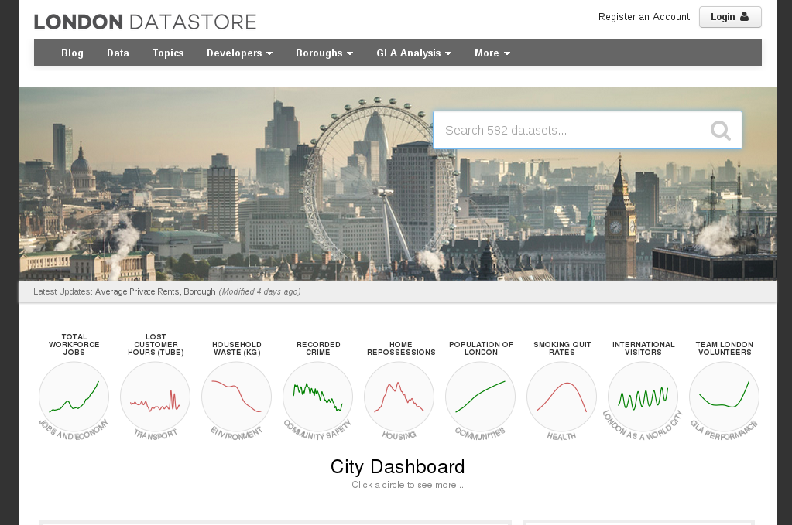
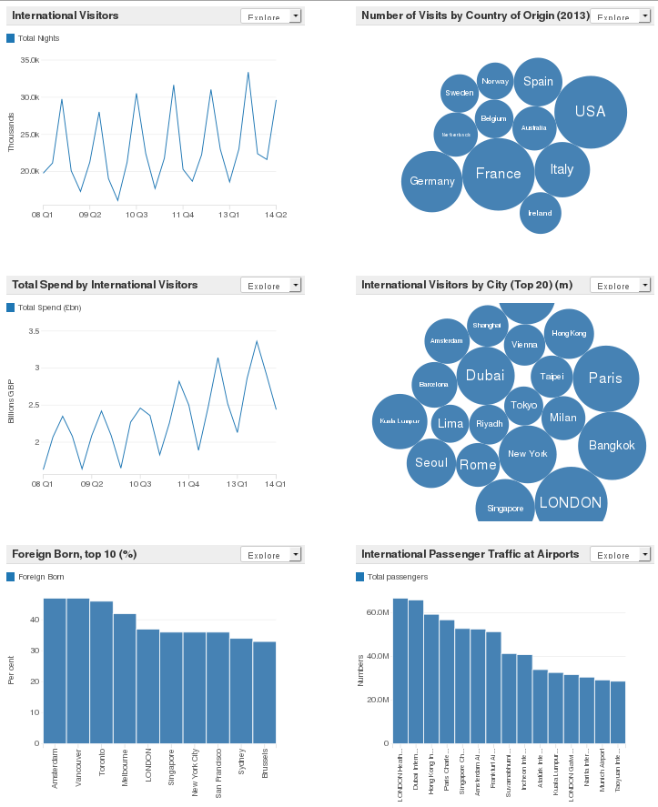
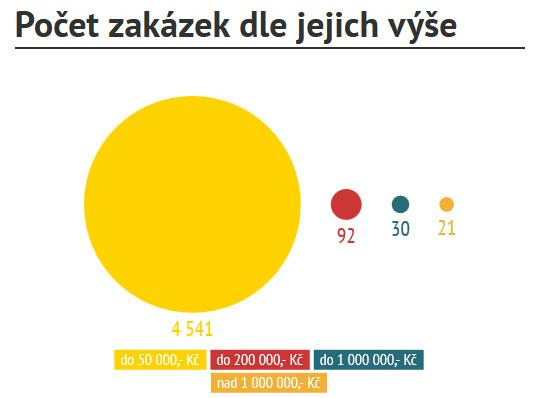
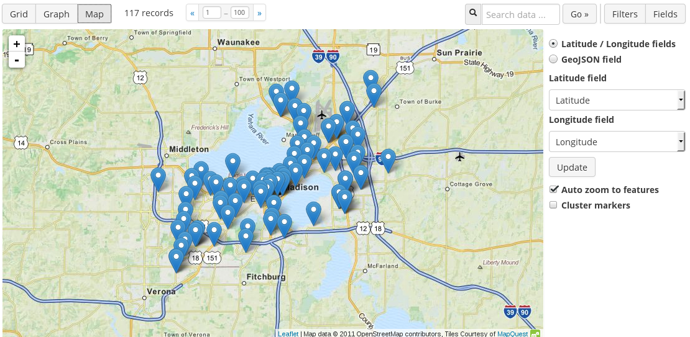
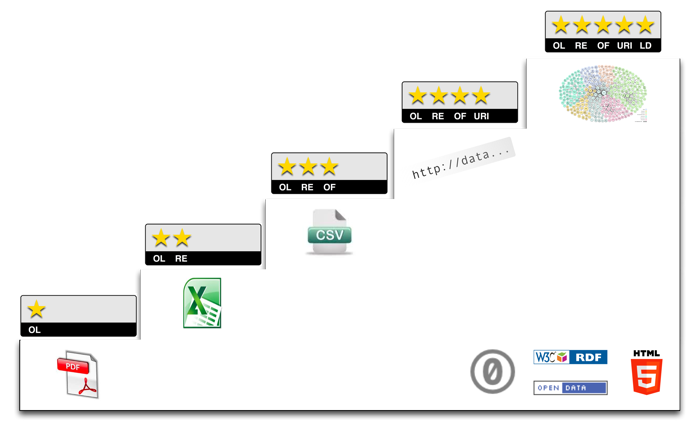
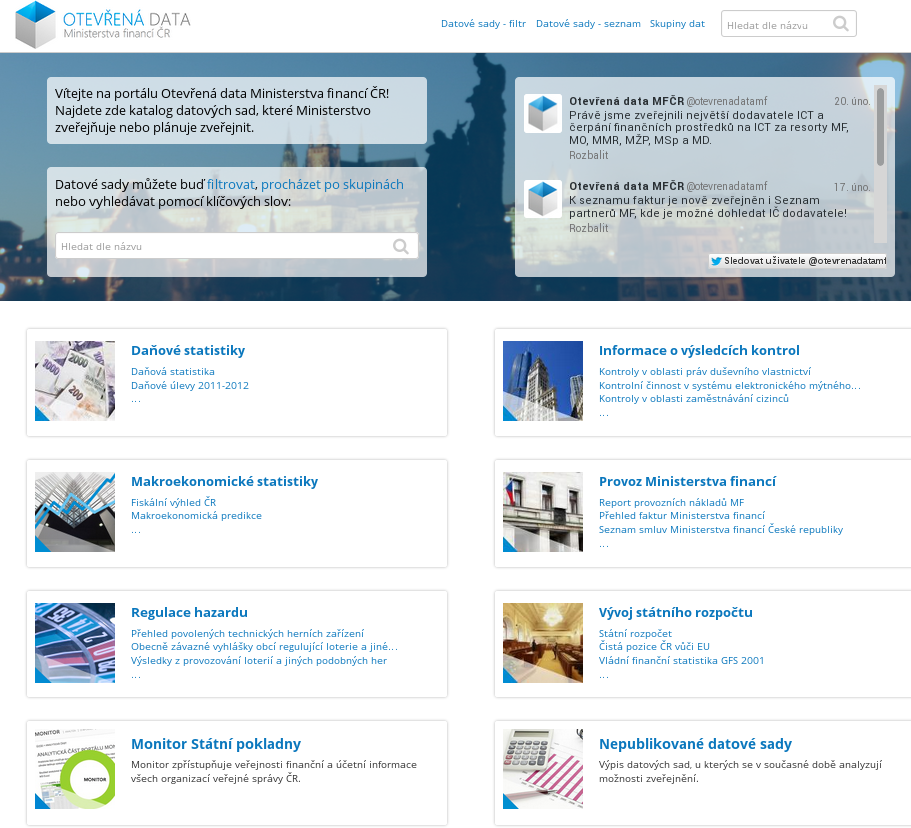

Opendata Praha - studie
=======================

### Záměr

V programovém prohlášení Rady hl. m. Prahy[^1] i komise ICT RHMP[^2] jsou OpenData (a dokonce i OpenSource) silně podpořena. Navíc jsou k realizaci přizváni Piráti a spolupracuje se s ministerstvem financí (Lukáš Wagenknecht). Z toho vyplývá, že je opravdu velká šance k úspěšné realizaci otevření pražských dat.

Tento dokument je úvodním stanovením toho, co zveřejnovat, jak to technicky provést a odkud data získat (zodpovědná osoba, informační systém etc.).

Též v úvahách zahrneme jednotlivé městské části (MČ), jelikož počítáme s projektem celopražských otevřených dat.

Budu velmi rád za věcné připomínky, nápady a i další způsoby věcné kritiky textu (nebojte se napsat, že něčemu nerozumíte! Chyba je většinou v překladu).

OpenData musí být:

1. Veřejná (dostupná, bez licenčního zatížení)

2. Strojově čitelná (otevřený formát, strojově zpracovatelný)

3. Uspořádány v daném schématu (přístup přes dané rozhraní - API, to zajistí celoměstský portál)

4. zpřístupněna za jasně definovaných podmínek užití dat s minimem omezení

### Proč OpenData?

Otevřená data je myšlenka, že by k určitým datům mohl mít přístup každý, mohl je sdílet a mohl s nimi dále pracovat. Např. tvořit statistiky, datamining apod. Což může napomoci veřejné kontrole a dokonce i komerčnímu sektoru. Důsledné dodržování metodiky navíc pomůže i samotné instituci, která dnes mnohdy nemá klíčová data ve vhodném formátu (zvláště pak starší data).

Díky otevřenosti mohou vznikat desítky nástrojů, která např. data vizualizují a podobně, což jsou obvykle formy zpracování, které úřad samotný nedělá.

Krásným příkladem je, že navrhované řešení umí zobrazit údaje na mapě. Čili pokud zveřejníme seznam škol, který bude obsahovat údaje o poloze, tak máme automaticky i mapu s vyznačenými školami. A to je samozřejmě jen zlomek možných využití. Vizualizace jsou přiloženy v příslušné kapitole dále.

Více: [http://www.otevrenadata.cz/otevrena-data/](http://www.otevrenadata.cz/otevrena-data/)

#### Londýn

Velmi kvalitním příkladem otevřených dat je [Londýn](http://data.london.gov.uk/), který má dokonce tvrdá čísla k prospěšnosti OpenDat. 

#### Děčín

Děčín byl jedním z prvních průkopníků otevřených dat v ČR. Bohužel zájem o ně není příliš velký.
Což je způsobeno dvěma faktory: 
1) atraktivita severočeského města není taková jako světových metropolí, 
2) vývojáři s\ otevřenými daty nepočítají, čili nevznikají aplikace.

Na druhou stranu můžeme říci, že to Děčín nějak nezatížilo, nepřineslo problémy ani nic podobného.

Výraznější úspěch měla [vizualizace](http://www.mmdecin.cz/images/verejny_zakazky_2013.jpg) rozložení cen veřejných zakázek, která zcela jednoznačně ukázala, že většina zakázek se zadává pod limitem.

Děčín v současnosti přechází z vlastního řešení na DKAN.

Více: [http://www.mmdecin.cz/component/k2/item/552](http://www.mmdecin.cz/component/k2/item/552)

#### IPR Praha

Institut plánování a rozvoje Praha otevřel geografická data Prahy, která předtím prodával.
Díky tomu je volně dostupné velké množství geografických dat v několika různých formátech.

Více: [http://opendata.iprpraha.cz](http://opendata.iprpraha.cz) 

### Technické řešení

Řešením [MFČR](http://data.mfcr.cz) a [MSČR](http://data.justice.cz), což je opensource CMS [Drupal](http://drupal.com/) s modulem [DKAN](http://nucivic.com/dkan/), se pouze inspirujeme. Tento systém bohužel nemá zapisovatelné API, které je třeba pro budoucí automatizaci.

Namísto toho zvolíme principiálně a funkčně velmi podobné opensource řešení [**CKAN**](http://ckan.org).

Takto postavený systém nevyžaduje žádné extrémní nároky (stačí běžný LAPP: Linux, Apache, [Python 2](https://www.python.org), [PostgreSQL](http://www.postgresql.org), [SOLR](http://lucene.apache.org/solr) - engine nad [Lucene](http://lucene.apache.org), design [Bootstrap](http://getbootstrap.com)), je podporovaný komunitou v dostatečném rozsahu. Zároveň je pro uživatele dostatečně přívětivý.

Jedna instance bude stačit pro MHMP, MČ i příspěvkové organizace. Technickým správcem bude odbor informatiky MHMP (INF). Věcným správcem zatím není určen.

Výhodou je, že tím na MČ nepřeneseme téměř žádné nároky. Navíc data budou na jednom místě (s množstvím dat stoupá jejich atraktivita).

Jediné náklady budou na provoz serveru a čas zaměstnanců. Vzhledem k rozsahu IT infrastruktury MHMP to jsou však zcela zanedbatelné náklady.

Je samozřejmě třeba dořešit věci jako monitorování přístupů (oblíbenosti, využívání) a jak tato data distribuovat zpět dalším subjektům.

#### Formáty a typy dat

Nejprve si definujme 3 skupiny dat:

1. **Souhrná data**: Seznamy údajů vhodné pro statistické zpracování. Např. seznam faktur, seznam škol, ...

2. **Vnitřní tvorba**: Textové dokumenty tvořené přímo v rámci úřadu. Např. výroční zprávy odborů, právní stanoviska. Zde by bylo dobré, kdyby se z dokumentů vypreparovala statisticky použitelná data (tabulky) a ta se zveřejnila v rámci kategorie I.

3. **Vnější tvorba**: Dokumenty zpracované u dalších subjektů. Např. audity, výroční zprávy etc.

Jak vidíme, tak jen kategorie I. jsou data určená pro rozsáhlý datamining. Zatímco kategorie II. a III. jsou zpracovatelné jen pomocí fulltextového vyhledávání. Nicméně i to je ohromný krok vpřed.

Technické řešení (CKAN) příjímá data ve formátech CSV, XSLX, XML, ODF, DOCX, popřípadě PDF. Pro kategorie I. je ideální CSV, pro kategorii II. a III. pak DOCX, strojově čitelné PDF (dle toho, co lze sehnat).

Výstupní formát je shodný se vstupním (nahraju-li csv, dostanu csv). Navíc však CKAN zpracuje u vybraných formátů dle příslušných ontologií formáty RDF a JSON, což jsou nejpoužívanější a nejpraktičtější formáty pro OpenData. DKAN též umí data vizualizovat. Buďto pomocí různých druhů grafů, anebo vyznačit na mapě.

DKAN se automaticky stará o persistentnost odkazů, verzování a vytváří API dle zadaných pravidel.

##### Vizualizace

Ukázky defaultní vizualizace dat v modulu CKAN.

#### Workflow

Workflow opět využijeme stejné jako na MFČR. Namísto automatizace zaneseme interně do povinností kurátorů datavých sad, aby data zkompletovali a nahráli v daném termínu. V praxi se nebude jednat o velkou zátěž, jelikož většina dat vzniká prostým exportem z IS (cca. 4 kliknutí, následně nahrání daného souboru). Popřípadě se dokonce data odesílají již dnes, ale pouze interně (což lze následně zrušit a interně čerpat z OpenDat).

Do budoucna se jistě počítá s automatizací tam, kde to bude možné. Ale v současnosti nemá cenu se tím zdržovat. Instituce i odbory samozřejmě mohou práci optimalizovat dle uvážení - mají přístup přes webové rozhraní i skrz API.

### Licence

Je nezbytné, aby data byla uvolněna pod nerestriktivní licencí. MFČR má podmínky různé pro každou sadu. Nicméně většina z nich je uvedena jako "Volné dílo".

Více: [http://opendatacommons.org](http://opendatacommons.org)

### Datové sety

Přimárně chceme zveřejnit již dnes zveřejněná data, popř. data, která všichni považovali za nezajímavá. Tím, že data budou strojově čitelná, vznikají zcela nové možnosti, jak s nimi pracovat.

Datové sady též podrobně předpřipravilo [ministerstvo vnitra](http://opendata.gov.cz/vzor:start).

### Kvalita dat (pětihvězdičkový model)

Pětihvězdičkový model je dnes již klasický model hodnocení kvality otevřených dat. Značí (každý další stupeň obsahuje předešlé):

1. Jakákoliv data pod otevřenou licencí (sken)

2. Strukturovaná data (excel)

3. Strukturovaná data v otevřeném formátu (csv, xslx)

4. Každý datový set má URI / systém obsahuje API

5. Data jsou prolinkovaná (obsahují kontext)

Praha aspiruje na 4. až 5. hvězdu. Propojení zatím bude jen formou jednoznačných identifikátorů (ID) v daném datasetu.

Více: [http://5stardata.info](http://5stardata.info)

 

### Rozvoj

Nejméně v prvním roce bude třeba rozšiřovat datové sady a dohlížet na jejich řádné propojení. Též bude třeba komunikovat s dalšími institucemi, které mají cenná data (např. MČ, DPP, ROPID …), aby je otevřely. 

#### Automatizace

Automatizace je přirozený další krok. Je však náročný v tom, že je potřeba vytvořit mnoho konektorů na různé systémy. Nicméně tento krok lze rozložit do delšího časového období, dle priorit.

#### Smlouvy

Státní instituce dnes smlouvy nad 500 000 Kč povinně zveřejňují na [portálu veřejné správy](https://portal.gov.cz). Příslušný zákon a s ním i registr se v současnosti novelizuje. Do budoucna se předpokládá stejná povinnost pro samosprávy. 

V rámci projektu Otevřená města vzniká opensource centrální registr smluv, který je přímo zaměřen na potřeby obcí. Obsahuje přímo specifikaci metadat smlouvy etc. Hotový by měl být v létě 2015. Předpokládá následnou migraci do centrálního státní registru. 

#### Národní katalog

MVČR připravuje metodiku (definici datových setů) pro orgány státní správy. Do budoucna snad i samosprávy. Z předběžných jednání je jasné, že bude počítat se systémy DKAN a CKAN (data se mají centrálně sbírat do jednoho katalogu).

Stejně tak lze uvažovat o zapojení do celoevropských otevřených dat jako např. [PublicDataEU](http://publicdata.eu). 

### Seznam použitých zkratek

| Zkratka |     Význam						|   Poznámka         |
|---------|---------------------------------|--------------------|
| HMP     | Hlavní město Praha			 	| 	|
| MHMP    | Magistrát HMP					|	|
| ZHMP	  | Zastupitelstvo HMP				|	|
| RHMP	  | Rada HMP						|	|
| MČ	  | Městská část					|	|
| ÚMČ	  | Úřad MČ							|	|
| MP	  | Městská policie					|	|
| MFČR	  | Ministerstvo financí ČR			|	|
| MVČR	  | Ministerstvo vnitra ČR			|	|
| MSČR	  | Ministerstvo spravedlnosti ČR	|	|
| TSK	  | Technická správa komunikací		| Je držitelem většiny informací o automobilové dopravě v Praze |
| PID	  | Pražská integrovaná doprava		|	|
| ROPID	  | Regionální organizátor PID		|	|
| DPP     | Dopravní podnik Praha a.s.		|	|
| IPR     | Institut plánování a rozvoje	| Bývalý ÚRM (útvar rozvoje města)			 					|
| INF     | Odbor informatiky MHMP			| 	|
| OVO     | Odbor volených orgánů MHMP		|	|
| CMS     | Content Managment System		| Systém pro správu obsahu webových stránek 					|
| LAMP    | Linux Apache Mysql PHP/Python	| Velmi běžná kombinace nastavení serveru pro webové aplikace. 	|
| LAPP    | Linux Apache PostgreSQL PHP/Python| Běžná kombinace nastavení serveru pro webové aplikace\\ (obecně vzato profesionálnější než LAMP)      | 
| IS      | Informační systém				|	| |

### Zdroje

* Otevřená data: [http://www.otevrenadata.cz](http://www.otevrenadata.cz) 
* Pět hvezdičkový model kvality OpenDat: [http://5stardata.info](http://5stardata.info)
* Licence k OpenData: [http://opendatacommons.org](http://opendatacommons.org)
* CKAN: [http://ckan.org](http://ckan.org) 
* Drupal: [http://drupal.com](http://drupal.com) 
* DKAN: [http://nucivic.com/dkan](http://nucivic.com/dkan)
* DKAN demo: [http://demo.getdkan.com](http://demo.getdkan.com) 
* OpenData MFČR: [http://data.mfcr.cz](http://data.mfcr.cz)
* Public data EU: [http://publicdata.eu](http://publicdata.eu)
* Portál veřejné správy: [https://portal.gov.cz](https://portal.gov.cz)
* London OpenData: [http://data.london.gov.uk](http://data.london.gov.uk) 
* OpenCity App: [http://opencityapps.org](http://opencityapps.org) 
* Prezentace k OpenData v Praze: [http://www.slideshare.net/ondrejprofant/open-data-praha](http://www.slideshare.net/ondrejprofant/open-data-praha) 
* Velmi pěkně zpracované souhrné PDF: [http://bit.ly/1NCDipy](http://bit.ly/1NCDipy)
* Data v dopravě: [http://www.ioda.cz](http://www.ioda.cz) a [http://www.vyrocenky.cz](http://www.vyrocenky.cz) 

### Přílohy

### Implementace

\newpage

[^1]: [Programové prohlášení RHMP](http://www.praha.eu/public/9f/ba/8e/2011700_570389_Programove_prohlaseni__RADA.pdf).
[^2]: Komise ICT RHMP schválila projektový záměr opendat 16. 5. 2015
