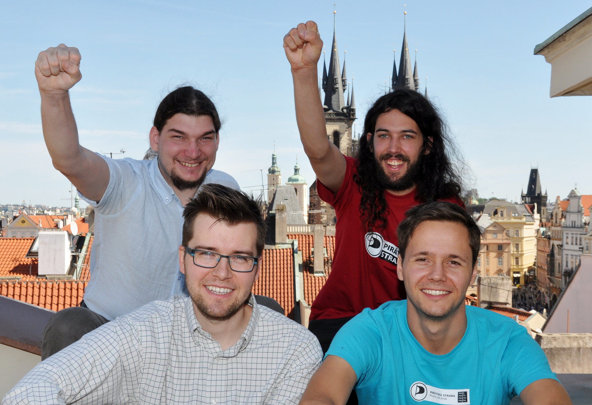
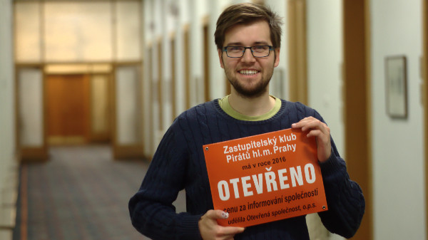
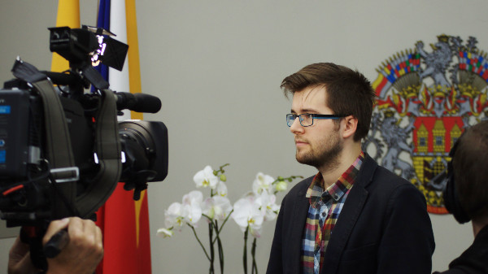
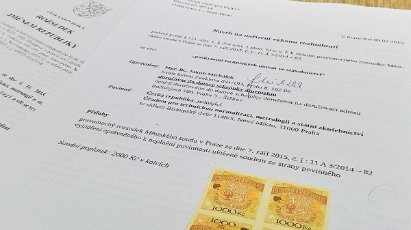
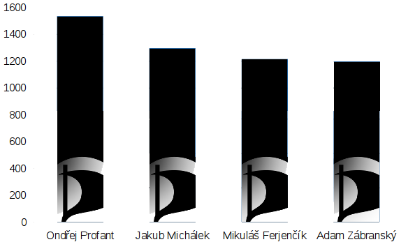
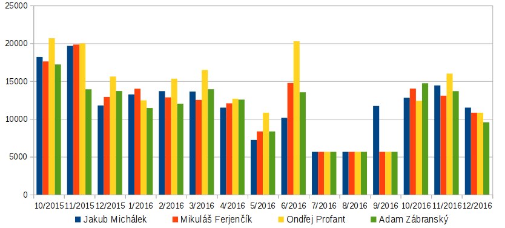
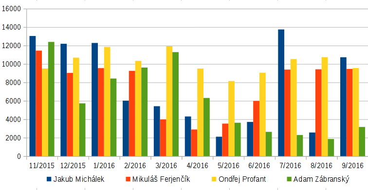
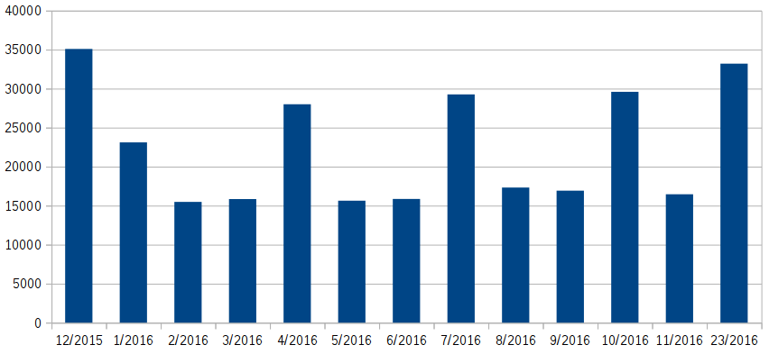
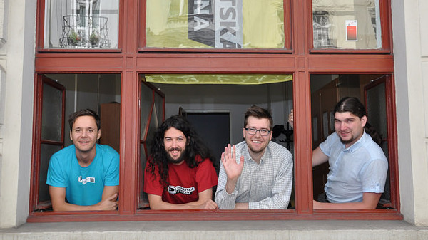

# Výroční zpráva

o činnosti Pirátů v Zastupitelstvu hl. m. Prahy za říjen 2015 až prosinec 2016

# Úvodní slovo předsedy klubu

<a name="uvodni-slovo"/>

Milí Pražané!

Již druhým rokem jsme v Zastupitelstu hlavního města Prahy. Přestože se na podzim roku 2015 rozpadla koalice ANO, ČSSD a Trojkoalice, **odmítli jsme lukrativní funkce v Radě hlavního města Prahy a zůstali v opozici.** Na každém zasedání zastupitelstva kontrujeme ty nejhorší návrhy současné koalice. [Bojujeme za záchranu buskingu](https://praha.pirati.cz/omezeni-buskingu.html), pomohli jsme zachránit Libeňský most před jeho nahrazením dálničním mostem a zveřejnili jsme čtvrt milionu faktur Magistrátu. [Upozorňujeme na politické trafiky](https://praha.pirati.cz/odmena-moniky-krobove-hasove.html), kterými si koalice nakupuje další zastupitele. Nemáme problém jít do křížku i s velkými subjekty (např. developery), pokud hrozí, že by z Prahy byly vyváděny peníze. V kontrolním a finančním výboru důsledně dohlížíme na to, aby vedení Prahy dodržovalo platné zákony.

Na podzim 2015 se rozpadla vládnoucí koalice. Vyzvali jsme proto TOP 09, Trojkoalici a Nezávislé k jednání o možném novém vedení Prahy. Jak jsme očekávali, jednání skončila bojem o udržení starých struktur. Přestože jsme důrazně odmítli jednání s pravomocně odsouzeným podvodníkem Karlem Březinou, na společné jednání o nové koalici si jej nakonec všechny strany přivedly. Proto jsme se rozhodli se jednání dále neúčastnit. Se šíbry se nejedná!

Byla tak obnovena koalice ANO, ČSSD a Trojkoalice. **Do funkcí v Radě a ve výborech byli dosazeni naprosto nedůvěryhodní politici.** Jan Slezák, který rozháněl demonstranty během Palachova týdne, řídí výbor pro územní plánování. Karel Březina, který neoprávněně pobíral odměny v Dopravním podniku hl. m. Prahy, je předsedou Výboru pro správu majetku. [Přeběhlice](https://praha.pirati.cz/prebehlictvi.html) Monika Krobová Hášová je členkou výboru pro boj proti korupci. Chybí jen pověstný Rumburak.

Po volbách v říjnu 2014 nám ANO i TOP 09 nabídly funkce radních v nové pražské Radě. Nám nešlo o to, abychom získali funkce, ale aby Praha přestala být doupě korupce. 

I nadále pracujeme velmi otevřeně. Zveřejňujeme [naše majetková přiznání](https://github.com/pirati-cz/KlubPraha/tree/master/priznani), informace [o schůzkách](https://redmine.pirati.cz/projects/praha/issues?query_id=13) i odměny. Pracujeme ve veřejně přístupném informačním systému [Redmine](https://redmine.pirati.cz/projects/praha/issues), kde se každý může podívat, co aktuálně děláme. 

**Nenechali jsme se koupit a tvrdě pracujeme. Korupční praktiky a nekalé chování odhalujeme, bez ohledu na to, ze které je strany. Stojíme na svých principech. Bojujeme za informace. Neděláme politické obchody.**

[Mgr. Bc. Jakub Michálek](https://praha.pirati.cz/jakub-michalek.html)  
předseda klubu Pirátů v Zastupitelstvu hl. m. Prahy

**Děkujeme všem občanům a kolegům, kteří na tom s námi pracovali!**

# Nejlepší a nejhorší za první rok

<a name="nejlepsi-a-nejhorsi"/>

## Adam Zábranský

* Povedlo se: Dokázali jsme zveřejnit faktury pražského Magistrátu. Každý se tak může podívat, jak úřad hospodaří.
* Nepovedlo se: Praha bohužel neschválila pravidla pro transparentní obsazování dozorčích rad městských firem. [Provozuje i nadále politické trafiky](https://praha.pirati.cz/dozorci-rady.html).

## Mikuláš Ferjenčík

* Povedlo se: Zveřejnili jsme připravovaný Metropolitní plán Prahy. 
* Nepovedlo se: V čele výboru pro územní plánování sedí stále Jan Slezák.

## Ondřej Profant

* Povedlo se: Praha má úspěšně fungující portál Otevřených dat, upozornili jsme na nezabezpečení radiové sítě. 
* Nepovedlo se: Majetková politika a informační strategie. Poté, co jsme připravili Teze informační strategie se s námi vedení města přestalo bavit. Rozpracovat Teze digitální strategie do řádné koncepce informatiky.

## Jakub Michálek

* Povedlo se: Získali jsme cenu Otevřeno, a to za hypetransparentní vedení zastupitelského klubu. 
* Nepovedlo se: Chtěli jsme svolat mimořádné jednání Zastupitelstva k Metru D a Pražskému okruhu. Krnáčová to odmítla jako „plýtvání penězi.“ Sama přitom kvůli vlastní neschopnosti nedokáže realizaci těchto staveb posunout kupředu.

# Politické rozložení sil v zastupitelstvu

## Naše místo v opozici

Již před volbami v roce 2014 jsme deklarovali, že odmítáme účast v koalici, kterou by podporovala Březinova ČSSD, nebo ODS spojená s politickými kmotry minulosti. Rozhodli jsme se, že budeme proto působit z opozičních lavic. Poté, co se v listopadu 2015 pražská koalice ANO, ČSSD a Trojkoalice rozpadla, jsme iniciovali jednání o možné koalice TOP 09, Pirátů a Nezávislých s podporou ODS. Protože si však TOP 09 pozvala na jednání pravomocně odsouzeného podvodníka Karla Březinu, rozhodli jsme se i nadále v jednáních nepokračovat. Na jaře 2016 byla rekonstruována původní koaliční vláda nad Prahou, na které se nepodílíme. Na každém jednání zastupitelstva nicméně předkládáme naše návrhy, předjednáváme je s koaličními zastupiteli a dáváme je do výborů. Pomohli jsme například prosadit některé klíčové body do protikorupční strategie; prosadili jsme usnesení o obsazování dozorčích rad a zveřejňování smluv.

# Zastupitelstvo, výbory, komise

## Docházka

Účastnili jsme se všech zasedání Zastupitelstva v období od října 2015 do září 2016. Jedinou výjimkou byla neúčast Jakuba Michálka na zasedání pražského Zastupitelstva v květnu 2016.

## Výbory

Jsme aktivní v řadě výborů. Účastníme se i jednání těch výborů, kde své zástupce nemáme. 

**Jakub Michálek** je členem kontrolního výboru. Inicioval dohledání majetkových přiznání Pavla Béma a Petra Hulinského, které Magistrát hlavního města Prahy po skončení volebního období obou pánů [ztratil](https://praha.pirati.cz/problemy-s-priznanimi.html). Apeloval na dodržování zákona o hl. městě Praze vždy tehdy, dochází-li k jeho porušování (např. v případě finančního výboru). Jakub Michálek je od roku 2016 i členem Výboru pro evropské fondy, kde dohlíží na jejich správné přidělování. 

**Mikuláš Ferjenčík** je členem výboru pro územní plánování, kde sleduje navrhované změny pražského územního plánu. Upozornil na případy, kdy soukromý investor koupí louku za městem, následně zatlačí na pražské zastupitele a nechá si jí změnit na stavební parcelu. Louka za několik milionů tak může získat hodnotu několika set milionů korun. Takové případy se uskutečnily [např. v Čakovicích](https://praha.pirati.cz/pole-v-cakovicich.html), kde se Mikulášovi Ferjenčíkovi podařilo zastavit nebezpečnou změnu, nebo na Šabatce v Komořanech, kde však vládnoucí koalice změnu územního plánu nakonec prosadila. Mikuláš Ferjenčík rovněž navštěvuje i jednání výboru pro životní prostředí a infrastrukturu.

**Ondřej Profant** je členem komise Rady hlavního města pro Smart Cities a komise ICT. Zde kritizuje nekoncepční řešení, jako jsou např. chytré lavičky, nebo neustálé prodlužování [nevýhodných smluv](https://praha.pirati.cz/praha-rezignovala-na-boj-se-zavislosti-na-dodavateli-ucetnictvi.html) na software se společností Gordic, ale i dalšími. Upozornil na projekty s cenou okolo několika desítek milionů korun, které mají sice z Prahy učinit formálně „Smart City“, ve skutečnosti je ale nikdo nepotřebuje. K čemu snad může být pražanům lavička s obrazovkou, na které běží reklamy nebo předpověď počasí? Ondřej Profant je také členem výboru pro správu majetku. Účastní se také jednání výboru pro bezpečnost a dopravu.

**Adam Zábranský** je členem legislativního výboru a výboru pro sport a volný čas. Kritizoval především naprosto děsivé praktiky v oblasti rozdělování sportovních dotací, apeloval na vznik pravidel pro transparentní obsazování dozorčích rad a dodržování zákona o zveřejňování smluv hlanvím městěm Prahou. 

## Aktivity celospolečenského významu

# Mediální výstupy

<a name="medialni-vystupy"/>

Pravidelně jsme v uvedeném období vydávali tiskové zprávy o tom, co se v pražské politice děje. Za celý rok 2016 jsme vydali 84 článků na blogu pirati.praha.cz a minimálně pět desítek tiskových zpráv. Kromě toho jsme na řadě tiskových konferencích poukázali na aktuální problémy Prahy: např. na dopravní odbavování, k svolání mimořádného zastupitelstva a spoluorganizovali jsme tiskovou konferneci k problematice opravy Libeňského mostu. 

# V boji o informace nepolevujeme

* Zjistili jsme odměny vedoucích úředníků Městské části Praha 10.
* Získali jsme technické normy ve stavebnictví, které nám Úřad pro technickou normalizaci poskytl teprve až poté, co jsme na něj podali výkon rozhodnutí a soud mu nepravomocně udělil tři stotisícové pokuty za porušování zákona o svobodném přístupu k informacím.
* Získali jsme čtvrt milionu faktur MHMP a zveřejnili je. Úřad nám od té doby přístup k účetnictví města odpírá pod různými většinou nezákonnými důvody (odvoláváme se proti nim, Ministerstvo vnitra dává odvoláním za pravdu). 
* Zjistili jsme, že se majetkové přiznání Pavla Béma a Petra Hulinského „ztratilo“. Informovali jsme Státní oblastní archiv v Praze, aby v tomto případě zjednal ve vztahu s Prahou nápravu. 
* Zjistili jsme roční odměny přeběhlice Moniky Krobové Hášové (1 167 000 Kč) za její členství v dozorčí radě.
* Na základě průlomového rozsudku Adama Zábranského musí městské společnosti [poskytovat informace](https://praha.pirati.cz/poskytovani-informaci-mestskymi-firmami.html).

# Vybraná témata

<a name="vybrana-temata"/>

## Trafiky v městských firmách

* Upzornili jsme na [přeběhlictví Moniky Krobové Hášové](https://github.com/pirati-cz/KlubPraha/blob/master/spisy/2016/128-neeticke-prijimani-prebehliku-v-cssd/main.pdf) a její roli v Pražské energetice
* Podali jsme [trestní oznámení na Radmilu Kleslovou](https://praha.pirati.cz/kleslova.html)
* Zažádali jsme o informace o odměnách členů dozorčích rad městských firem

## Pronájmy

* Systematicky sledujeme, jak Praha hospodaří se svým majetkem
* Kritizujeme [nízké nájmy](https://praha.pirati.cz/farmarske-trhy.html), které jsou spojené s vládnoucími politiky (např. radní Hodek)
* Dále se snažíme dohledat, [kdo je odpovědný](https://praha.pirati.cz/skoduv-palac-2.html) za kauzu Škodův palác
* [Zastali jsme se](https://praha.pirati.cz/pisnicti-pres-palubu.html) občanů sídliště v Písnici, které bylo prodáno developerovi.

## Územní plánování

* Zarazili jsme změnu v Čakovicích, na které se měl napakovat Karel Březina (a zažalovali nás za to)

## Technické normy

* Získali jsme technické normy z Úřadu pro technickou normalizaci.

## Metropolitní plán

* V květnu 2016 jsme [zveřejnili](https://praha.pirati.cz/metropolitni-plan.html) [Metropolitní plán](https://mup.pirati.cz/cs/metropolitni-plan.html).

## Libeňský most

* [Zachránili jsme Libeňský most](https://praha.pirati.cz/zastupitelstvo-unor-2016.html) před zbouráním a nahrazením betonovým monstrem, které by sloužilo jako dálnice z Holešovic do Libně.

## Nezabezpečené rádio

* Upozornili jsme, že [kdokoliv může odposlouchávat](https://praha.pirati.cz/odposlouchavani.html) radiový systém Tetra, který slouží Praze pro komunikaci s bezpečnostními složkami.

## Majetková přiznání

* Kontrolní výbor se rozhodl, že bude všechna majetková přiznání zastupitelů digitalizovat, aby se již nikdy nestalo, že originální papír s přiznáním zmizí. 
* Nahlédli jsme do majetkových přiznání současných pražských zastupitelů, dohledali chyby a vyzvali úřad, aby zjednal nápravu. 

# Zpráva o odměňování

Zprovoznili jsme nový [repozitář odměn](https://github.com/pirati-cz/transparence/). Centralizujeme přehled o tom, jak jsou odměňováni zastupitelé, ale i jiní pracovníci Pirátské strany (například psavci, nebo koordinátoři dobrovolníků).

## Odpracovaný čas

V říjnu 2014 uzavřeli pirátští zastupitelé mandátní smlouvy s Pirátskou stranou. Jedna z podmínek této smlouvy stanoví, že se zastupitelé mají věnovat činnosti pro zastupitelský klub 30 hodin týdně, tedy v přepočtu 6 hodin denně. Průměrně za měsíc odpracují zastupitelé cca 80 hodin měsíčně, maximální množství odpracovaného času u jednoho zastupitele bylo 200 hodin za měsíc.

Za podzim roku 2015 a rok 2016 odvedli zastupitelé celkem okolo 5200 hodin. za rok 2016 je to 1533 hodin u Ondřeje Profanta, 1294 hodin u Jakuba Michálka, 1195 u Adama Zábranského a 1213 u Mikuláše Ferjenčíka.

## Příjmy zastupitelů

<a name="prijmy-zastupitelu"/>

Příjem zastupitele za Piráty v Zastupitelstvu hl. m. Prahy je tvořen z následujících zdrojů:

* [A. Peníze od města](#penize-od-mesta)
   * [A.1 Paušální odměna](#pausalni-odmena)
   * [A.2 Náhrada výdělku](#nahrada-vydelku)
* [B. Peníze od strany](#penize-od-strany)
   * [B.1 Pevná složka smluvní odměny](#pevna-slozka)
   * [B.2 Proměnlivá složka smluvní odměny](#promenliva-slozka)

Jednotliví zastupitelé vykazují svojí aktivitu v systému [redmine][redmine]. V tomto systému měříme výkonnost a kontrolujeme plnění úkolů. Podle nich je každý měsíc určena výše odměny. Všechny tyto údaje jsou shrnuty v měsíčních výkazech odměňování. Výkazy odměňování zveřejňujeme v [repozitáři odměn][repo-odmen].

[redmine]: https://redmine.pirati.cz/projects/praha
[repo-odmen]: https://github.com/pirati-cz/KlubPraha/tree/master/odmeny/2016/

Celková výše **hrubých** příjmů (před zaplacením daní a pojistného) včetně průměru za období říjen 2015 až prosinec 2016 je uvedena v následující tabulce.

Příjemce              | Příjmy od města        | Příjmy od strany     |        Součet příjmů
------                | -------:               | ---:                 | ----:
**Adam Zábranský**    | 171586                 | 91131                | 262717
  čili měsíčně        | 11439                  | 6075                 | 17514
**Jakub Michálek**    | 180831                 | 124655               | 305486
  čili měsíčně        | 12055                  | 8310                 | 20365
**Mikuláš Ferjenčík** | 179768                 | 109672               | 289440
  čili měsíčně        | 11984                  | 7311                 | 19296
**Ondřej Profant**    | 200505                 | 145506               | 346011
  čili měsíčně        | 13367                  | 9700                 | 23067
**měsíční průměr**    | 12211                  | 7849                 | 20060

<!--
Od strany:
J M O A
10/2015 12562 10306 11168 11511
11/2015 13036 11445 9509 12394
12/2015 12193 9029 10690 5729
1/2016 12278 9548 11851 8419
2/2016 6018 9254 10338 9612
3/2016 5418 3981 11934 11285
4/2016 4302 2889 9507 6313
5/2016 2108 3530 8150 3623
6/2016 3713 5995 9054 2634
7/2016 13742 9392 10534 2291
8/2016 2562 9424 10741 1858
9/2016 10728 9464 9555 3165
10/2016 12634 10368 11638 6854
11/2016 14758 9191 12844 7763
12/2016 11165 6162 9161 9191
-->

<!--
Od města (náhrada výdělku):
J M O A
10/2015 12712,5 12127 15187 11722
11/2015 14175 14355 14512 8437
12/2015 6300 7425 10125 8212
1/2016 7762,5 8509 6975 5962
2/2016 8032,5 7200 9675 6367
3/2016 7974 6862 10831 8280
4/2016 5850 6412 7020 6907
5/2016 1575 2700 5175 2700
6/2016 4500 9112 14625 7875
7/2016 0 0 0 0
8/2016 0 0 0 0
9/2016 6066 0 0 0
10/2016 7155 8361 6750 9072
11/2016 8775 7425 10350 8032
12/2016 5850 5175 5175 3915
-->

<!--
Od města (paušálně):
J M O A
10/2015 5486 5486 5486 5486
11/2015 5486 5486 5486 5486
12/2015 5486 5486 5486 5486
1/2016 5486 5486 5486 5486
2/2016 5651 5651 5651 5651
3/2016 5651 5651 5651 5651
4/2016 5651 5651 5651 5651
5/2016 5651 5651 5651 5651
6/2016 5651 5651 5651 5651
7/2016 5651 5651 5651 5651
8/2016 5651 5651 5651 5651
9/2016 5651 5651 5651 5651
10/2016 5651 5651 5651 5651
11/2016 5651 5651 5651 5651
12/2016 5651 5651 5651 5651
-->

: Roční a měsíční příjmy zastupitelů v klubu Pirátů

### A. Příjmy od města

<a name="penize-od-mesta"/>

#### A.1 Paušální odměna

<a name="pausalni-odmena"/>

**Paušální odměna** je pravidelná měsíční částka, kterou hlavní město Praha vyplácí každému neuvolněnému zastupiteli. Její výše činí 5486 Kč hrubého měsíčně (do 1. února 2016) a 5651 Kč hrubého měsíčně (po 1. únoru 2016).

Následující graf ukazuje výši příjmů jednotlivých zastupitelů v jednotlivých měsících:

[Paušální odměna v tabulce](data.csv)

#### A.2 Náhrada výdělku

<a name="nahrada-vydelku"/>

**Náhrada výdělku** je částka, kterou zastupiteli hlavní město Praha nahrazuje ušlý výdělek za dobu jednání Zastupitelstva, výborů a komisí, účast na seminářích, pracovní cesty a plnění oficiálních úkolů pro město. Její výše činí u zastupitelů, kteří nejsou v pracovním poměru, 450 Kč hrubého za hodinu, nejvýše však 60 hodin měsíčně.

Následující graf ukazuje výši příjmů jednotlivých zastupitelů v jednotlivých měsících:

V [repozitáři odměn][repo-odmen] si lze prohlédnout výčetky zastupitelů za každý měsíc. V nich je vždy rozpis konkrétní činnosti zastupitele, za který odměna náleží.

### B. Příjmy od strany

<a name="penize-od-strany"/>

**Smluvní odměna** podle mandátní smlouvy je částka, kterou Česká pirátská strana odměňuje své zastupitele, aby se volené funkci mohli věnovat více času, ideálně 35 hodin týdně. Částka se skládá z pevné a proměnlivé složky. Výši odměny schvaluje každý měsíc krajské předsednictvo pražského sdružení Pirátů.

Následující grafy ukazují výši příjmů jednotlivých zastupitelů v jednotlivých měsících po složkách smluvní odměny:

Pevná složka náleží zastupiteli podle rozsahu odvedené práce pro stranu. Za dohodnutý rozsah práce náleží zastupiteli částka 8500 Kč hrubého měsíčně. Odměna však zastupiteli nenáleží za oficiální jednání, za které má nárok na náhradu výdělku. Proměnlivá složka náleží zastupiteli za splnění významných úkolů, za práci přesčas a za jiné výkony hodné zvláštní odměny. Proměnlivá složka může dosáhnout až částky 5000 Kč hrubého měsíčně.

[Náhrada výdělkua a příjmy od Pirátské strany v tabulce](data.csv)

V [repozitáři odměn][repo-odmen] si lze prohlédnout výkaz odměňování za každý měsíc. V něm je odkaz na výkaz odpracovaného času a jsou v něm uvedeny významné úkoly.

## Příjmy zaměstnanců

<a name="prijmy-zamestnancu"/>

**Příjem zaměstnance** je měsíční plat, který zaměstnanci vyplácí Magistrát hl. m. Prahy. Tento plat může být zvýšen o odměny, jejichž výši určuje Magistrát hl. m. Prahy. Klub Pirátů má jednoho zaměstnance.

Následující graf ukazuje výši příjmů zaměstnanců v jednotlivých měsících:

[Platy zaměstnanců v tabulce](data-zamestnanec.csv)

Zaměstnanec vykazuje odpracovaný čas v systému [redmine][redmine].

# Odkazy

- web: <http://praha.pirati.cz>
- blog: <http://praha.pirati.cz/blog.html>
- redmine: <http://redmine.pirati.cz/projects/praha/issues>
- github: <http://github.com/pirati-byro/transparence>
- facebook: <http://facebook.com/CeskaPiratskaStranaPraha>

**Děkujeme za zájem a těšíme se na viděnou!**

Klub Pirátů v Zastupitelstvu hl. m. Prahy  
Mariánské nám. 2, Praha 1, přízemí, místnost č. 40
