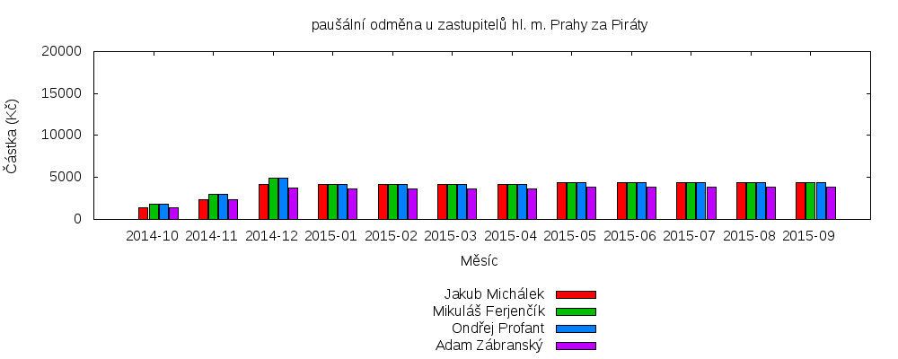
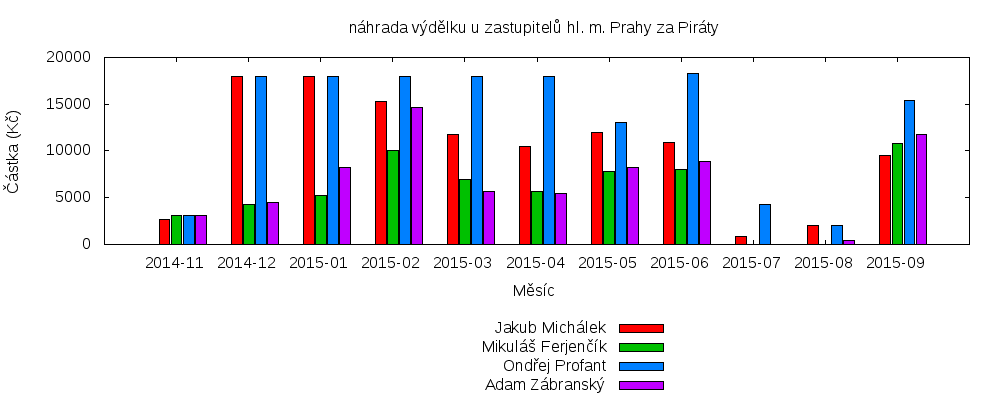
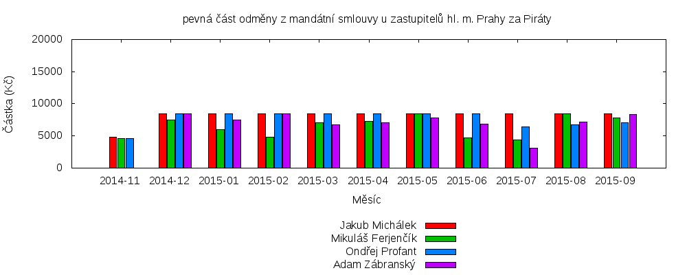
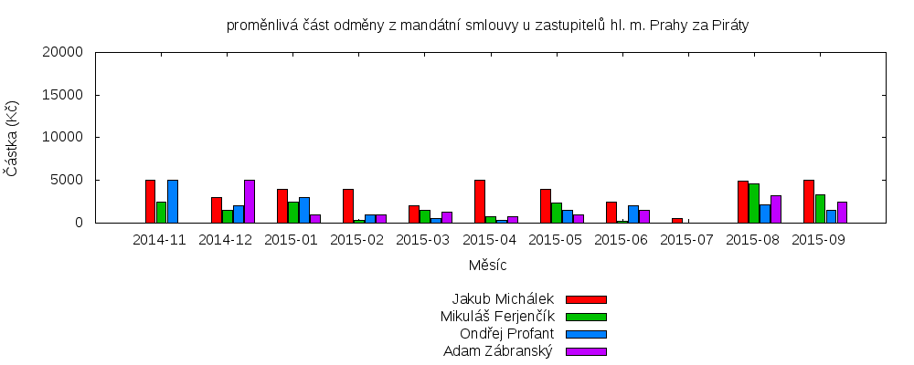

# První rok Pirátů v pražském zastupitelstvu

Výroční zpráva o působení Pirátů v Zastupitelstvu hl. m. Prahy od října 2014 do září 2015

Zastupitelský klub Pirátů ve složení (zleva) Jakub Michálek, Mikuláš Ferjenčík, Adam Zábranský, Ondřej Profant

----

[První rok Pirátů v pražském zastupitelstvu](#prvni-rok)
	- [Úvodní slovo předsedy klubu](#uvodni-slovo)
	- [Hlavní úspěchy Pirátů v prvním volebním roce](#hlavni-uspechy)
	- [Politické rozložení sil v zastupitelstvu](#politicke-rozlozeni-sil)
	- [Činnost zastupitelů](#cinnost-zastupitelu)
	- [Mediální výstupy](#medialni-vystupy)
	- [Fungování klubu a odměňování](#fungovani-klubu)
	- [Nejlepší a nejhorší za první rok](#nejlepsi-a-nejhorsi)
	- [Odkazy](#odkazy)

----

## Úvodní slovo předsedy klubu

<a name="uvodni-slovo"/>

Milí Pražané!

Média označují působení Pirátů v Zastupitelstvu hl. m. Prahy za „nezvyklý úkaz“. Nejen média, ale zejména staré politické struktury si budou muset začít zvykat. :-)

Po volbách v říjnu 2014 nám ANO i TOP09 nabídly funkce radních v nové pražské vládě. My jsme podmínili jakoukoliv podporu 10 požadavky, aby Praha byla skutečně otevřená (např. zprůhlednění městských firem, veto na velké projekty). Koalice ANO, ČSSD a Trojkoalice se však obešla bez naší podpory a tím jsme se zařadili do opozice.

Úlohou opozice v parlamentní demokracii je kontrolovat vládu a předkládat vlastní návrhy řešení. Jako opoziční zastupitelé jsme odmítli sedět v lavici a soustředit se jen na rétorická cvičení. Kvůli tomu jsme mandát od Pražanů nedostali.

Cílem našeho působení je, aby naše opoziční práce měla pro občany co největší přínos. Proto jsme **konstruktivní opozicí**. Práci na magistrátu se věnujeme (na rozdíl od zbytku opozice) na plný úvazek, a to díky zákonné odměně zastupitele a příspěvku od Pirátské strany na naši činnost. Děláme přitom přesně to, co od nás čekají občané a naši voliči:

 - Ptáme se na informace, které dosud nebyly veřejně dostupné, a tyto informace zveřejňujeme, získáváme podklady a hloubkově analyzujeme významné kauzy (např. odpovědnost za Opencard, smlouvy na SMS jízdenky, pronájem Škodova paláce za 4 mld. korun, projednání stavebních předpisů, příjmy Radmily Kleslové z městských firem).

 - Bombardujeme koalici našimi připomínkami k tomu, co by měla dělat (např. v oblasti informatiky, protikorupční strategii, k řízení městských společností, ke kontrolám apod.) Koalice některé naše návrhy přijímá za vlastní (např. open source je poprvé v programovém prohlášení!), některé odkládá (lepší zveřejňování smluv, povinné předkládání velkých zakázek do zastupitelstva) a některé ignoruje (požadavek zveřejňování majetkových přiznání, živý přenos schůzí Rady).

Piráti se drží toho, co na nás voliči oceňují a v čem nám nemohou ostatní strany konkurovat: **Naprostá otevřenost.** Zveřejňujeme naše majetková přiznání, informace o schůzkách s lobbisty, odměny i výkazy práce.

Pokud chcete dělat poctivou politiku, budu rád, když se k nám přidáte!

Mgr. Bc. Jakub Michálek  
předseda klubu Pirátů  
v Zastupitelstvu hl. m. Prahy

## Hlavní úspěchy Pirátů v prvním volebním roce

<a name="hlavni-uspechy"/>

* Donutili jsme šedou eminenci Radmilu Kleslovou, která brala statisíce z městských firem měsíčně, k rezignaci, a odvolali její spojence z Rady
* Prosadili jsme Teze digitální strategie včetně podpory open source a otevřených dat; spustili jsme pražská otevřená data
* Donutili jsme Magistrát poskytovat občanům informace o výši mimořádných odměn úředníků
* Přesvědčili jsme Radu, aby schválila náš návrh usnesení k lepšímu zveřejňování smluv
* Zdokumentovali jsme několik machinací s územním plánem, kde šlo o stovky milionů, a podali jsme trestní oznámení
* Napsali a vydali jsme Pirátské listy

## Politické rozložení sil v zastupitelstvu

<a name="politicke-rozlozeni-sil"/>

Současné rozložení hlasů v Zastupitelstvu hl. m. Prahy je na následujícím obrázku:

Od voleb konaných v říjnu 2014 se odlišuje tím, že zastupitelka Monika Krobová Hášová nedlouho po volbách vystoupila z klubu TOP09 a je nezařazenou zastupitelkou, která hlasuje s ČSSD (je také mj. členkou dozorčí rady městské společnosti Pražská energetika, a.s.). Vedle toho se od klubu TOP09 v dubnu 2014 vyčlenili zastupitelé Tomáš Hudeček (bývalý primátor), Eva Vorlíčková a Milan Růžička, kteří utvořili klub nezávislých.

### Koalice
Z výše uvedeného je patrné, že po většinu prvního roku koalice ANO + ČSSD + Trojkoalice (SZ + Stan + KDU-ČSL) hlasovala o všech svých návrzích zcela jednotně. Koalice nepřipouští zásadně jakékoliv rozumné návrhy opozice, ani návrhy na doplnění dalších bodů na program zasedání. Podle představitelů koalice musí být nejprve návrh Pirátů zamítnut a pak ho koalice musí předložit jakoby sama jako vlastní návrh.

### Opozice
Opozice hlasuje prakticky jednotně v klíčových tématech, jako je například návrh Pirátů na zveřejňování smluv, návrhy na zařazení dalších bodů na program jednání, zřízení funkce radního pro IT, projednání personálních změn (zda vůbec bude zařazeno odvolání primátorky na program zasedání), proti megazakázce na svoz odpadu za 13 mld. korun. Všechny koaliční a opoziční strany s výjimkou Pirátů mají své zástupce v dozorčích radách městských podniků.

### Destruktivní opozice
Druhým početným celkem jsou intenzivně spolupracující TOP 09 a ODS, které spolu například podaly žádost o svolání mimořádného zastupitelstva k projednání návrhu na odvolání primátorky Adriany Krnáčové. ODS podle vyjádření Alexandry Udženije nepodpoří žádný návrh Pirátů, zřejmě kvůli tomu, jak Piráti kritizují předchozí působení ODS na magistrátu.

ODS a TOP09 často vystupují proti koalici i ve věcech, které podle nás dělá dobře. Piráti také např. principiálně odmítli, aby byly příjmy z privatizace bytů rozpuštěny v rozpočtu, jak požadovala ODS. Zatímco ODS v minulosti nedělalo problém schválit dotace soukromé firmě na tyčinky, vadilo jí dotování knihovny na Praze 2. To je důvod, proč Piráti nemohou být ve stejném hlasovacím bloku jako ODS.

Cílem TOP09 bylo odvolat radní a rozštěpit Radu, což se jí na zasedání zastupitelstva v říjnu 2015 skutečně podařilo. Piráti podpořili návrh na odvolání neschopné radní Novákové (ČSSD), radního Haška (ANO) a radní Ropkové (ČSSD). Piráti nesouhlasili s odvoláním náměstka Stropnického (Zelení), kterým rozpad koalice započal. Po prvním roce vládnutí máme tedy jako výsledek polorozpadlou koalici s Radu, která má 7 členů z 11.

### Konstruktivní opozice
Zbývá tedy poslední blok, který tvoří politické strany, které podporují vybrané kroky koalice a jiné její návrhy věcně kritizují. Okruh podporovaných návrhů se však u nich různí. Např. KSČM na rozdíl od Pirátů loajálně podpořila koalici v hlasování o přerušení prvního zasedání, proti projednání odvolání primátorky a proti návrhu Pirátů na zveřejňování majetkových přiznání. KSČM rovněž nepodpořila odvolání radních za ČSSD s výjimkou radní Novákové.

Blízkost na grafu vyplývá z toho, že KSČM systematicky podporuje v hlasování, aby Piráti vedli kontrolní výbor (jako jediná další strana v zastupitelstvu) a dalších drobnějších hlasováních. Na rozdíl od TOP 09 a ODS podporují Piráti a KSČM i některé rozumné návrhy koalice, např. návrh náměstka Stropnického, aby výnos z privatizace bytů nebyl příjmem rozpočtu, ale byl vyčleněn do zvláštního fondu.

Byť zastupitelé KSČM často hlasují jako Piráti, není to kvůli ideové blízkosti, ale podle konkrétních témat projednávaných zastupitelstvem. Pirátům tato konstelace vyhovuje, protože návrhy, které považují za dobré, tak mají dvojnásobnou podporu.

### SWOT analýza

Tato SWOT analýza se zabývá tím, jaké jsou plusy a minusy aktuální pozice pirátských zastupitelů v Zastupitelstvu hl. m. Prahy, kdy fungují jako konstruktivní opozice, která na konkrétních tématech spolupracuje s Radou hl. m. Prahy.

| Výhody        | Nevýhody           | Příležitosti | Hrozby |
|:-------------:|:-------------:|:-------------:|:-------------:|
| Zkušenosti, informace, know how | Piráti nenesou mediální odpovědnost za věci, které neřídí | Šance prosadit Pirátský návrh | Spolupracovníci mohou Piráty diskreditovat |
| Šance něco konkrétního zrealizovat | Zabírá to čas, nízká efektivita | Pozitivní medializace úspěchů | Mediální odpovědnost za chyby v IT |
| Mediální pozornost (Opencard) | Nutnost koordinovat komunikaci | Větší šance odhalit průsery | Vcucne je systém |
| Získávání respektu | Nevyjasněná, nečitelná pozice | Prostor vytvořit a propracovat návrhy do budoucna | Nic se nepodaří - budou za užitečné idioty |
| Získávání koaličního potenciálu | Terč ODS | ODS jako protivník | Upadnou do zapomnění |
| Vzniká sít lidí, se kterými Piráti na něčem pracovali | | Možnost vyřešit problémy s Opencard |
| Není potřeba dělat kompromisy | | Piráti si nezavírají dveře pro budoucí spolupráci |
| Piráti nejsou zavaleni agendou | | |
| Dobrý pocit ze smysluplné činnosti | | |
| Posouvání Overton window | | |
| Lze zcela promítnout program do hlasování | | |
| Přístup k vládnoucím představitelům | | |

## Činnost zastupitelů

<a name="cinnost-zastupitelu"/>

### Aktualizace povolební strategie

Dne 21. srpna jsme požádali v souvislosti s tehdejším vývojem v pražské politice o aktualizaci povolební strategie. Obsahem této aktualizace byla především žádost pirátských zastupitelů o mandát k případnému vyjednávání o možné koalici. Smyslem tohoto postupu bylo oslabit vliv Karla Březiny a Radmily Kleslové. Když Piráti účast v koalici odmítali, značně tím rozšiřovali prostor pro tyto šedé struktury.

Nezbytné podmínky pro jakoukoliv podporu Rady či účast na Radě byly dány požadavky z [dokumentu 10 bodů](http://praha.pirati.cz/10-klicovych-bodu.html) s přihlédnutím k [Roadmapě](https://redmine.pirati.cz/projects/praha/roadmap) a [Magistrátu bez megaztrát](https://praha.pirati.cz/jak-na-magistrat-bez-megastrat.html)
Krajské fórum tuto aktualizaci schválilo.

### Plán prosazování programu

Zastupitelský klub Pirátů si schválil plán činnosti na první rok fungování, který je dostupný na Redmine. Na webu je také dostupný program, kde si můžete zobrazit aktuální stav plnění programového bodu.

### Docházka

Piráti měli za první rok stoprocentní účast na zasedáních Zastupitelstva hl. m. Prahy (které se koná jednou měsíčně kromě letních prázdnin, kdy se nekoná vůbec). Z koalice musejí mít stoprocentní účast všichni, protože tam záleží na každém hlasu. Z ostatních opozičních klubů se ale téměř vždy někteří zastupitelé zasedání nezúčastní.

Každý pirátský zastupitel je členem alespoň jednoho výboru:

* Jakub Michálek je členem výboru kontrolního,
* Mikuláš Ferjenčík výboru pro územní plánování,
* Ondřej Profant výboru pro správu majetku,
* Adam Zábranský je členem výboru pro sport a volný čas, a dále také výboru legislativního.
* nečlen zastupitelstva z řad Pirátů Viktor Mahrik (první nečlen zastupitelstva ve výboru po 22 letech) je řádným členem finančního výboru a účastní se jeho schůzí.

Zastupitelé Pirátů mají na jednáních výborů 100% účast a mají také velmi dobrou účast na výborech, kde nejsou členy. Viktor Mahrik má také dobrou účast na finančním výboru (2 omluvené absence). Piráti mají jednoznačně nejlepší účast na jednání výborů Zastupitelstva ze všech klubu v Zastupitelstvu. Podrobné informace o výborech jsou v samostatné části zprávy.

### Aktivita ve výborech a komisích

- **Kontrolní výbor** - Jakub Michálek nebyl přes opakovanou pětinásobnou kandidaturu zvolen ani předsedou ani místopředsedou kontrolního výboru, neboť hlasy koalice byli zvoleni Jaroslava Janderová (ODS) a Jiří Hrabák (TOP09). Jakub Michálek je přes to jedním z nejaktivnějších členů kontrolního výboru, prověřuje pochybení v kauze Opencard, provedl historicky první kontrolu Magistrátu (poskytování informací o odměnách),  poskytování informací o majetkových přiznání zastupitelů, řeší kauzu Škodova paláce apod.
- **Finanční výbor** - Pirátský člen finančního výboru (Viktor Mahrik) se podílel na analýze rozpočtu hlavního města a Piráti k němu předložili konkrétní pozměňovací návrhy. Koaliční hlasovací mašina však nejen že usilovně odmítala jeden pirátský návrh za druhým, neumožnila dokonce ani diskuzi k rozpočtu jako takovému. Členové finančního výboru byly v této situaci v podstatě postaveni před hotovou věc.
- **Výbor pro sport** - Adam Zábranský bojoval proti složení grantové komise pro sport a volný čas, které navrhovala (od 22. října 2015 již bývalá) radní Nováková (ČSSD). Nic se mu ale změnit nepodařilo. Předsedou komise se stal Karel Březina, který byl před několika měsíci pravomocně odsouzen za trestný čin podvodu kvůli místu v dozorčí radě Dopravního podniku. Zbytek komise je obsazen čistě politicky, mezi členy je např. i nejvýznamnější zákulisní hráčka ANO (dříve ČSSD) Radmila Kleslová. Adamovi proto přijde problémové hlasovat pro jakékoliv granty, které z této komise vzejdou. Dále z pozice člena výboru sleduje přípravu akce Praha - Evropské hlavní město sportu 2016, kdy chce, aby to byla spíše nízkonákladová, nikoliv megalomanská akce. Rozpočet na sport se ale bohužel má v roce 2016 o několik desítek milionů navýšit.
- **Výbor pro legislativu a protikorupční opatření** - Adam Zábranský na prvním jednání výboru představil pirátský návrh na zveřejňování smluv. Výbor nakonec doporučil Radě, aby zlepšila stav zveřejňování smluv v souladu s tímto návrhem. Rada tak nakonec po půl roce udělala a schválila východiska zveřejňování smluv, která v současnosti rozpracovává Magistrát. Legislativní výbor se také podílí na tvorbě protikorupční strategie, kterou Piráti významně ovlivnili. Na konečný návrh ale budeme muset ještě počkat. Výbor toho jinak moc neřeší, protože primátorka Krnáčová také ne.
- **Výbor pro majetek** - Na výbor jsou předkládány velmi provozní tisky (např. prodej / nákup pár metrů čtverečních). Významnější tisky jsou předkládány bez širšího kontextu (prodej rozvojových parcel v Karlíně, velká výměna pozemků s ČSOB). To vše je důsledkem absence koncepce. Ondřej Profant opakovaně žádal předsedu výboru i radního pro majetek o více koncepčních jednání, popř. o projednávání tisků v kontextu. Koncepční jednání byly přislíbeny, avšak zatím se žádné neodehrálo. Jedinou světlou výjimkou je *Návrh pravidel pro rozhodování o prodejích a pronájmech veřejných prostranství sídlišť* (6. jednání, bod 5.1), kterou si z iniciativy nám. primátora Matěje Stropnického výbor vyžádal. Majetkové podíly se doposud neřešily vůbec.

	Náš zástupce ve výboru otevřel témata pronájmu "Maršmeloun" a "[Sixti](https://github.com/pirati-cz/KlubPraha/tree/master/spisy/2015/140-sixti)". Maršmeloun má nyní pozastavené stavební povolení. U druhé kauzy byla představena petice a Ondřej Profant přednesl úvodní slovo. Zbytek výboru však nechtěl téma projednat bez podkladů od odboru. Téma bylo zařazeno na další jednání, avšak to neproběhlo z důvodů nízké účastí - to je obecně dlouhodobý problém tohoto výboru. Ondřej Profant též pravidelně a zodpovědně připomínkuje zápisy výboru.
- **Výbor pro územní rozvoj a uzemní plán** - Mikuláš Ferjenčík už pro druhé zasedání výboru připravil shrnutí největších problémů územního plánování v Praze, následně ho prodiskutoval s předsedou výboru Slezákem, který k němu poslal připomínky. Před výborem potom prochází všechny jednotlivé změny územního plánu a zaujímá k nim stanovisko. Pokud chcete pomáhat, obraťte se na něj. Proběhl i seminář o změnách územního plánu od neziskové organizace Arnika, v neposlední řadě Mikuláš pravidelně konzultoval s kanceláří Matěje Stropnického, náměstka primátorky s gescí uzemní plánování. Aktuálně Mikuláš vede zásadní spor o seznam podnětů na změnu územního plánu, kde dosáhl (se značnou pomocí Adama Zábranského) [úspěchu u ministerstva vnitra](https://praha.pirati.cz/tabulka-podnetu.html). Pro organizaci Arnika připomínkoval příručku Územní plán pro občany, která je [ke stažení na webu](http://arnika.org/uzemni-plan-prirucka-pro-obcany).
- **Komise ICT** - Ondřej Profant a Jakub Michálek jsou členy komise Rady hl. m. Prahy pro ICT. Tato komise schválila důležité projektové záměry na OpenData a Mepnet a Teze digitální strategie. Tyto dokumenty jsou zodpovědně prodiskutováy a kvalitně připraveny. Mepnet je nově pojmut jako rámcová smlouva s minitendry a tím se stává mnohem více tržně otevřeným. Zastupitelstvo tento návrh (po opravě od O. Profanta) schválilo na zářijovém jednání. Po připomínkách Pirátů nebyla schválena velkorysá integrace Marbesu na další městské části. Opendata byla úspěšně spuštěna a rozrůstají se. Naši zástupci navrhli, aby se podklady (s výjimkou odůvodněných případů) zveřejňovaly, avšak to neprošlo přes zbytek komise.

	[Teze digitální strategie](https://praha.pirati.cz/rada-digitalni-strategie.html) jsou velmi pokrokový dokument zohledňující moderní trendy a především opensource. Inspiruje se takovými dokumenty jako [Government Digital Service](https://www.gov.uk/design-principles). Dokument schválila 15. 9. Rada HMP.k
	
	Ondřej Profant se též intenzivně věnuje běžnému provozu odboru informatiky, kde se podílí na množství dílčích diskusí nad problémy, aby se věci řešily rovnou správně (a ne až po neschválením komisí apod.)
	
	Krom magistrátu se věnoval i městským částem. Spolupodílel se na obnově IT na Praze 7 a především se věnoval Praze 10. Tam koalice Vlasta (jejiž součástí jsou Piráti) zpochynila [superzakázku na outsourcing IT](http://www.zaostrenona10.cz/mimoradne-zastupitelstvo-bylo-vskutku-mimoradne/). Zastupitelstvo Prahy 10 následně tuto zakázku odmítlo. Od dubna se pak vedla intenzivní jednání, vybrala se konzultanská firma a skupina expertů se shodla na dalším postupu. Bohužel konzultantská firma podstřelila cenu (i když VŘ byla 60:40) a viditelně pracovala ve prospěch původní zakázku. To se projevilo ve středu 21. 10., kdy zastupitelstvo Prahy 10 opět odmítlo připravený tisk (nedoporučený našimi experty).

### Žádosti o informace

Piráti velmi často žádají o informace podle zákona o svobodném přístupu k informacím a zákona o hl. m. Praze. Bez informací totiž zastupitelé nemohou kvalifikovaně rozhodovat. Jen v roce 2014 podal zastupitelský klub Pirátů 24 žádostí o informace. Od ledna do konce října 2015 podali pirátští zastupitelé dalších více než 200 žádostí o informace. Žádosti jsou evidovány ve spisové službě na Githubu, aktuální stavy jednotlivých žádostí pak v Redmine.

Prostřednictvím těchto žádostí se Pirátští zastupitelé dověděli například:

- aktuální výše marží na SMS jízdenky v krajských městech ČR, z nichž Praha má v současné době suverénně nejvyšší (24,11 %),
- že řada zastupitelů v minulém volebním období čekala třeba 3 roky a nechávala si vyplácet náhradu výdělku za 3 roky zpětně,
- že Praha by měla podle fiskální analýzy usilovat o zvýšení daně z nemovitosti a zvýšení investičních výdajů (rezervy v porovnání s ostatními evropskými metropolemi),
- o pokutě uložené Úřadem pro ochranu hospodářské soutěže ve výši 500 000 Kč, kterou Praha zaplatila v souvislosti s kauzami ohledně smlouvy Opencard, za kterou nikdo nenese odpovědnost,
- výši úroku (pohybující se okolo 0,5 %), za který má Praha uložené své peníze na účtech u PPF, která neodpovídá rizikovosti vkladu, přičemž Praha má s PPF velice úzké vazby (drží v ní 10% podíl),
- jak vypadá audit Dopravního podniku Prahy, který vyhotovil Václav Láska.
- za jaké ceny a komu Praha pronajímá nemovitosti,
- že podle analýzy Institutu plánování a rozvoje Praha pronajímá nebytové prostory nehospodárně,
- jak probíhají jednání Rady hl. m. Prahy; díky těmto záznamům jsme odhalili zákulisní jednání v kuchyňce,
- jaké městské firmy pro Prahu spravují nemovitý majetek v hodnotě vyšší než 100 miliard korun.
- jaké mají výdaje městské části v oblasti informatiky.
- jaké účetní systémy používají jednotlivé kraje a jejich příspěvkové organizace; kolik je měsíčně stojí.
- majetková přiznání některých zastupitelů

Podle § 5 odst. 3 zákona o svobodném přístupu k informacím musí všechny veřejné instituce, přesněji povinné subjekty, poskytnuté informace zveřejňovat. Poskytnutí informace na žádost tak získává vlastně i podobu zveřejnění dané informace. Piráti bojují usilovně o to, aby byl tento paragraf důsledně dodržován, a aby tedy veřejné instituce všechny informace zveřejňovaly tímto způsobem. Sami Piráti doplňují tento cíl sami prostřednictvím vlastního githubového repozitáře, kde jsou veřejně k dispozici všechny materiály týkající se žádostí o informace, odpovědí, odvolání a stížností, které pirátští zastupitelé posílali.

### Boj o informace

Magistrát (nejčastější příjemce pirátských žádostí o informace) by teoreticky měl informace poskytovat ve lhůtě 15 dnů. Zatímco přednášející na školeních úřadu tvrdí, že "nedodržení lhůty je možné ze strany úřadu jen v případě živelné pohromy", skutečnost je ale mnohdy jiná. V některých odstrašujících případech dochází k tomu, že není žádost o informace vyřízená z důvodu jejího zapomenutí, ztracení, dovolené či propuštění magistrátního pracovníka, nekomunikace mezi jednotlivými odbory Magistrátu apod.

Žádání o informace ne vždy vede k úspěchu. Povinné subjekty (tj. instituce, kterým jsou žádosti adresovány) často hledají různé možnosti, jak informace Pirátům odepřít. Například Magistrát pirátským zastupitelům opakovaně nechtěl poskytnout informace, na které mají nárok (audit Dopravního podniku, nájmy městských nemovitostí, seznam podnětů na změnu územního plánu atd.). Piráti se ale pravidelně odvolávají k Ministerstvu vnitra, které rozhodnutí Magistrátu o odepření informací většinou zruší pro nezákonnost. Problém je ale i s městskými částmi (Adam Zábranský již přes půl roku vede boj s Prahou 1 o poskytnutí informací o nájmech svěřených nemovitostí) a městskými či státními firmami (většina z nich tvrdí, že nejsou povinnými subjekty a informace tak poskytovat nemusí).

Piráti neuspěli v získání například následujících informací:

- doklad o vzdělání bývalého ředitele legislativního odboru, magistra práva Františka Kotalíka, který patrně vystudoval na Zakarpatské univerzitě v Užhorodu, diplom měl nostrifikovaný na Plzeňských právech a sám vydával ve vlastní věci rozhodnutí o odepření informace s tím, že jeho vzdělání se netýká výkonu jeho funkce,
- zvukový záznam z jednání Rady, který úřad nechal po žádosti Pirátů zničit,
- odměny členů představenstva a dozorčí rady několika městských firem,
- smlouvy státních firem s Radmilou Kleslovou.
- způsoby užívání open source v České poště
- dokumentace k vzniku Pražských stavebních předpisů, kterou nemá ani hlavní město Praha, ani Institut plánování a rozvoje
- účetní dokumentace z interního systému magistrátu, který je užíván pro evidenci majetku

Adam Zábranský již kvůli neposkytnutí informací zažaloval 4 společnosti s majetkovou účastí hl. m. Prahy. Vzhledem k tomu, že státní firmy rovněž neposkytují informace, bude se tento seznam nejspíše rozšiřovat.

### Akce

Piráti pravidelně každý týden pořádají zastupitelské úterky v Pirátském centru (Řehořova 19, Praha 3, vždy od 18:00). Jednotliví zastupitelé, kteří se tam každý týden střídají, si vždy vybírají jiné téma, o kterém hovoří. Daná témata se vždy dotýkají aktuální politické situace na pražském magistrátu. V rámci večera je plno prostoru pro zvědavce, kteří zastupitelům mohou klást nejrůznější otázky ohledně jejich činnosti.

V prosinci roku 2014 Piráti v Praze uspořádali Piratecon, celostátní pirátskou konferenci, která byla zaměřená na zastupitele obcí, ale třeba i městských částí. Přijela minimálně stovka účastníků a přednášky stály za to. V lednu pirátští zastupitelé zorganizovali akci s Islandskou poslankyní Pirátů Birgittou Jonsdóttir. Vystoupili rovněž na mezinárodním Pirateconu v květnu 2015 v Mariánských lázních, kde sdíleli své zkušenosti i s mezinárodními Piráty. Od podzimu 2015 pořádají i turné po městských částech, kde se scházejí s občany jednotlivých částí Prahy v přátelské neformální atmosféře.

### Aktivity celospolečenského významu

Pirátští zastupitelé nežijí jen komunální politikou. Pomohli například zabránit zrušení svobody panoramatu na celoevropské úrovni, významně se podíleli na zformulování [stanoviska Pirátů](https://www.pirati.cz/stanoviska/piratske_stanovisko_k_vlne_uprchliku_-_jednotne_azylove_rizeni_v_evrope_plan_na_integraci_uprchliku_v_cesku) k uprchlické krizi. V rámci expertního týmu MPO lobbují za zachování digitálních práv v rámci připravované dohody [TTIP](https://praha.pirati.cz/ttip.html). Angažují se ve snaze zastavit cenzuru Internetu z dílny Andreje Babiše a obecně se snaží podporovat činnost Pirátské strany i v oblastech přesahujících pražské zastupitelstvo.

## Mediální výstupy

<a name="medialni-vystupy"/>

Během svého ročního působení vydali pirátští zastupitelé minimálně 50 tiskových zpráv a 106 článků na webu praha.pirati.cz/blog.  Pravidelně o nás vycházejí novinové články, a to nejen v pražských, ale i v celostátních médiích. Například v sobotu 24. října byla Pirátská strana zmíněna na titulní straně Mladé fronty dnes v souvislosti s koncem Radmily Kleslové. Odhadem generujeme minimálně polovinu všech novinových článků o Pirátech v republice za poslední rok.

Při příležitosti sto dní rady Piráti uspořádali tiskovou konferenci, na které byl zhodnocen přístup Rady k některým ožehavým problémům města. Dále Jakub Michálek vystoupil na tiskové konferenci k Opencard, kde prezentoval v přímém přenosu na České televizi seznam pochybení předchozích politických reprezentací v kauze Opencard. V červnu 2015 jsme upozornili na kauzu tzv. eurozákazu fotografování ₋ kde hrozilo značným způsobem omezení práv Pražanů svobodně šířit své fotografie. Rovněž jsme také odkryli netransparentní zákulisí rozhodování pražské Rady (tzv. aféra kuchyňka), vyzvali Karla Březinu, aby odešel jako odsouzený podvodník do politického důchodu a v neposlední řadě odsoudili trafiky pražských politiků. Právě poslední uvedený výstup vedl ke kvalitativní změně a rezignaci Radmily Kleslové, bývalé agentky komunistické vojenské kontrarozvědky, z řady funkcí. Značnou mediální pozornost si získalo i rozhodnutí krajského sdružení Pirátů umožnit nám jako zastupitelům jednat o případné koalici. Tuto pozornost jsme využili k prezentaci vnitrostranické demokracie a našich programových požadavků.

Prostor pro zlepšení je zejména u prezentace témat v oblasti ICT, naposledy se nám nepodařilo úspěšně prezentovat projekt spuštění portálu pro opendata.

### Významná témata

- **Opencard** - Jakub Michálek a Ondřej Profant jsou primátorkou pověřeni k jednání ve věci Opencard. V současném volebním období je to poprvé, kdy se s kauzou podařilo pohnout. Praha už není v kleštích jednoho dodavatele EMS, na kterém byla závislá. Možnost používat vedle Opencard i papírové průkazky byla přijata, aby Praha nepřesáhla počet zakoupených licencí a měla alternativu při jednání s EMS. Piráti tak výrazně snížili riziko dalších žalob, neboť nedochází k překračování počtu licencí. Zdokumentovali kroky a odpovědnost za kroky v kauze Opencard, kdy se jí údajně předchozí politická reprezentace snažila hasit, ale ve skutečnosti situaci spíše zhoršovala. Nyní jsou dokončeny znalecké posudky, takže může pokračovat jednání o servisu systémů, které je vhodné, aby Opencard mohla pokračovat po přechodné období 3 až 4 let. Podařilo se jim prosadit, aby nové řešení bylo postaveno jako multikanálové, skutečně otevřené. Je třeba se přizpůsobit poptávce, která je segmentovaná. Každá skupina tak bude mít takový nosič jízdenky, který jí vyhovuje. Podle našeho názoru nemá smysl zavádět novou čipovou kartu s elektronickou peněženkou, ale kdo bude chtít, bude moci používat bankovní kartu nebo mobil. Cestující s bezplatným jízdným nebo studenti cestující na ISIC mohou mít nadále papírové kupóny. Multikanálový systém (market) by měl být zaveden do roku 2018. Jakub Michálek dále zpracoval čtyřicetistránkovou analýzu vzniku projektu Opencard a klub Pirátů poté vyzval Radu Prahy, aby Pavla Béma a další zodpovědné osoby zažalovala o náhradu škody. Prozíravost znovuzavedení papírových kuponů se znovu ukázala v říjnu, kdy EMS začala blokovat vydávání nových karet.
- **SMS jízdenky** - V průběhu roku 2012 médii prošla kauza okolo vysokých marží soukromých společností, které poskytují SMS jízdenky v krajských městech. Ukázalo se, že společnosti jsou vzájemně propojené a v podstatě neexistuje konkurenční prostředí. Piráti se rozhodli prostřednictvím žádostí o informace zjistit, jaká je v současné době situace na trhu SMS jízdenek. Závěry byly sepsány do komplexního textu. Ukázalo se, že s výjimkou Prahy, kde společnost Erika a.s. získává marži 24 %, jsou ve všech krajských městech marže nižší - zhruba v rozmezí 10-20 %. Je tomu hlavně díky vstupu nových subjektů na trh (Airtoy, Materna Communications), které donutily i původní společnost Erika a.s. snížit ceny (marže klesly z průměrných 25-30 % na pro město příznivých 10-20 %)  a jednak zavést férovější podmínky (žádná exkluzivita, nelegální ustanovení, pokuty v případě zveřejnění smlouvy aj). Díky ustanovení § 5 odst. 3. Zákona č. 106/1999 Sb. Piráti zveřejnili na svém githubovém profilu (téměř) všechny aktuálně platné smlouvy na službu SMS jízdenek v krajských městech v České republice.
- **Škodův palác** - Škodův palác je sídlem více než 1000 úředníků magistrátu. Budova je obrovská a splňuje řada specifických kritérií pro soustředění úředníků v jednom místě. Praha si ho v roce 2006 pronajala za částku přes 4 mld. korun na 20 let. Firma, od které si ho pronajala, ho o pár let před tím koupila za cca 800 mil. korun a opravila za 500 mil. korun. Celkem tedy pronajímatel pan Pawlowski (vlastník obchodního domu Quadrio) na pronájmu Škodova paláce vydělal značnou sumu. Pavel Bém v roce 2006 sliboval, že se přesunem úředníků město ušetří peníze, protože nebude muset pronajímat jiné prostory. Ve skutečnosti však každý měsíc rok prodělává desítky milionů. Nájemné ve Škodově paláci je cca 2krát vyšší než tržní nájemné. Praha má podle smlouvy za 5 let právo dům koupit za tržní cenu, ale není jisté, zda bude pronajímatel schopen ho Praze prodat, protože palác je zastaven u banky a není jisté, že pronajímatel své dluhy splatí (firmu vlastnící palác prodal miliardář Pawlowski lucemburskému holdingu). Spis Piráti podrobně prostudovali. Zástupkyně nového pronajímatele paní Schaeffer se na výzvu člena kontrolního výboru Jakuba Michálka zaručila, že palác budou schopni za 5 let prodat, aniž by byl zatížen zástavním právem. Jakub Michálek se dále domáhal nahlédnutí do účetnictví pronajímatele, aby zjistil, zda byly z firmy vyváděny prostředky, ale předsedkyně kontrolního výboru ho v diskusi přerušila. Piráti usilují o to, aby se Praha rozhodla, zda chce palác pronajímat i nadále anebo aby si město postavilo novou budovu.
- **Zveřejňování smluv** - Adam Zábranský a Jakub Michálek už před prosincovým zasedáním zastupitelstva připravili návrh na zlepšení stavu zveřejňování smluv v hl. m. Praze. V současnosti jsou totiž smlouvy zveřejňovány tím způsobem, že v systému je téměř nemožné se orientovat, a smlouvy navíc nezveřejňují příspěvkové organizace ani firmy ovládané městem. Zastupitelstvo se návrhem ovšem odmítlo zabývat. Piráti proto své štěstí zkusili na výboru pro protikorupční opatření, který nakonec návrh odkázal Radě. Rada nakonec po půl roce schválila relativně dobrá [východiska zveřejňování smluv](https://praha.pirati.cz/zverejnovani-smluv-rada.html). Magistrát by na jejich základě měl připravit konkrétní pravidla, zatím tak ale přes uplynutí lhůty neučinil. Budoucnost zveřejňování smluv v Praze je proto stále ve hvězdách.
- **Schvalování závazků nad 50 mil. Kč** - Jakub Michálek připravil návrh na to, aby si rozhodnutí o závazcích nad 50 milionů korun vyhradilo zastupitelstvo. Nemohl by se tak opakovat pronájem Škodova paláce za 4,5 miliardy, o kterém rozhodla v samostatné působnosti Rada. Mikuláš návrh předjednal s koalicí a medializoval. Koalice předběžně slíbila podporu návrhu Pirátů, ten pak ale prošel úřednickým kolečkem a koalice nakonec přišla s návrhem trochu jiným, pro který jsme ale stejně hlasovali jako pro krok správným směrem. Zastupitelstvo si vyhradilo rozhodnutí o nájmech s plněním vyšším než 10 milionů za první rok.
- **Open Data** - Opendata byla schválena v květnu. Ondřej Profant připravil projektový záměr pro komisi a stal se koordinátorem projektu. V říjnu 2015 je [portál otevřených dat Prahy](http://opendata.praha.eu/) úspěšně spuštěn, průběžně přibývají nové datové sady. Řešení je celé opensource (včetně implementace). Projekt je velmi ambiciozně koncipován jako celoměstský - na dobrovolné bázi jsou zapojeny městské části, příspěvkové organizace i akciovky. Tím má potenciál napomoci transparenci nejen na magistrátu, ale i v celé Praze. V současnosti je zapojeno 12 organizací a uvolněno 97 datových sad.
- **Otevřená města** - Jakub Michálek ve spolupráci se spolkem Oživení koordinuje projekt otevřeného registru smluv pro města a obce. Na spolupráci se účastní několik měst a obcí (Brno, Praha 6 apod.). Společně v říjnu 2015 založily organizaci Otevřená města, která si klade za cíl pomáhat otevřenému fungování radnic. Rovněž má sloužit jako platforma pro společný vývoj open source softwaru pro města a obce, sbírání příkladů dobré praxe, přístup k informacím a všeho co se týká otevřeného fungování. Další informace byly zveřejněny na [webu nově založené organizace](http://www.otevrenamesta.cz/), na kterém se podíleli Václav Klecanda a Jakub Michálek.
- **Megazakázka na odpad** - Zastupitelstvo v lednu 2015 schválilo odůvodnění zakázky na komplexní nakládání s komunálním odpadem v hl. m. Praze (Piráti hlasovali proti). Zakázka má být na deset let a její odhadovaná hodnota je 13 miliard korun. Adam Zábranský a Ondřej Profant se už před jejím schválením snažili přesvědčit gesční radní Plamínkovou (Trojkoalice), aby zvážila dobu trvání zkrátit a zakázku „rozdělit“ na části (ovšem ne v běžně používaném smyslu tohoto slova, kdy se zakázka rozdělí na několik menších, aby se vešla pod limit na vypsání otevřenějšího řízení!) a umožnila tak uchazečům podávat nabídky pouze např. na svoz určité oblasti, na svoz tříděného odpadu či na následné nakládání s odpadem. Umožnila by se tím větší hospodářská soutěž a nižší výsledné ceny, navíc by se nezakonzervovalo monopolní prostředí na tak dlouhou dobu. Zakázka zatím nebyla vypsána. Přes opakované požadavky Pirátů radní Plamínková nepředložila analýzu zvažující jiné možnosti než jednu velkou zakázku. Je to mimo jiné jeden z důvodů rozkolu v koalici, protože ANO chce zakázku rozdělit.
- **Fungování městských firem a trafiky v dozorčích radách** - Adam Zábranský shromažďuje informace o obchodních společnostech, ve kterých má Praha majetkovou účast. Zmapoval, kdo sedí v dozorčích radách a představenstvech těchto firem a jejich dceřiných, popř. vnukovských firem, a kolik za to tito lidé berou. V několika případech identifikoval podezřelé trafiky (např. dosazení syna tehdejší radní Novákové z ČSSD do dozorčí rady Pražské teplárenské Holding) Analýza je dodnes hojně citovaná v tisku, poté co Adam šťoural dále, objevil i odměny Radmily Kleslové, prominentky ANO v městských firmách. Zveřejnění těchto dat a naše další kroky v této věci výrazně přispěly k zásadnímu oslabení pozice Radmily Kleslové v pražské politice. Adam také doporučil Radě opatření pro větší transparentnost a lepší správu městských firem, nicméně příslušný radní Hašek (ANO) je nijak nerealizoval.
- **Nájmy v lukrativních pražských nemovitostech** - Adam Zábranský po vyhraném sporu o informace s Magistrátem získal seznam nájmů městských nemovitostí. Zároveň získal od Institutu plánování a rozvoje analýzu hospodaření Prahy s nebytovým majetkem, která poukazuje na nehospodárné nájmy. Magistrát přitom dosud analýzu nezveřejnil. V současnosti Adam toto velké množství informací zpracovává. Zároveň už půl roku vede boj o podobné informace s Prahou 1.
- **Turnikety pro vstup do magistrátu** - Jakub Michálek sepsal pirátské výhrady proti projektu opevnění magistrátu turnikety, které mají stát 20 milionů korun. Piráti požadovali, aby v případě zavedení bezpečnostních rámů a turniketů pro kontakt se zastupiteli byl jejich zastupitelský klub vyčleněn. Mikuláš téma medializoval. Projekt se podařilo v tuto chvíli pozastavit..
- **Informace o platech úředníků** - Jakub Michálek si posvítil na utajování informací o platech úředníků, které probíhalo v rozporu s judikaturou Nejvyššího správního soudu. Magistrát původně trval na tom, že informace poskytovat nebude a teprve velice pozvolna začíná akceptovat povinnost tyto informace žadatelům poskytovat. Jakub Michálek se v tomto ohledu obrátil na kontrolní výbor, protože některým žadatelům byly informace odepřeny třeba již patnáckrát. Od října 2014 již Praha přišla v soudních sporech kvůli neposkytování informací zatím o 70 000 Kč, a toto není ani zdaleka konečná suma. Magistrát předložil Radě velice restriktivní a nekvalitně zpracovaná pravidla poskytování informací, nicméně díky odporu Pirátů byla tato pravidla vrácena k přepracování. Jakub Michálek navíc uskutečnil v rámci kontrolního výboru zastupitelstva kontrolu ohledně poskytování a utajování informací a interpeloval primátorku. Nakonec Rada schválila usnesení, že se Magistrát musí řídit stanoviskem Ministerstva vnitra a informace o odměnách úředníků poskytovat.
- **Majetková přiznání politiků** - Podle platného a závazného etického kodexu mají zastupitelé hlavního města Prahy povinnost přiznat svůj movitý i nemovitý majetek a uvést jej v tzv. majetkovém přiznání. Ta jsou veřejně k dispozici uložena u kontrolního výboru. Jak je tomu ale v případě přiznání zastupitelů z předchozích volebních období? Piráti poukázali na špatnou praxi: Majetková přiznání byla uložena v Archivu hlavního města Prahy, kam je veřejnosti přístup omezen. Na základě podnětu Pirátů byla majetková přiznání z volebního období 2010-2014 přesunuta do trezoru předsedkyně Kontrolního výboru. Majetková přiznání z dalších minulých volebních období (především let 2002-2006 a 2006-2010) však k dispozici nejsou, neboť nebyla v odpovídající době po skončení mandátu zastupitelů archivována vůbec. Ministerstvo vnitra ve svém rozhodnutí z 26. října přikázalo hlavnímu městu Praze, aby Pirátům poskytla alespoň majetková přiznání Pavla Béma a Petra Hulinského. Je však otázkou, jestli vůbec nějaká dostaneme, neboť je hlavní město velmi pravděpodobně ztratilo.
- **Zákaz buskingu** - Mikuláš se intenzivně věnoval novele vyhlášky o buskingu. Podle všeho se Pirátům nakonec nepodaří zabránit plošnému zákazu zesilovačů a hlasitých nástrojů, omezení se ale budou týkat pouze centra města. Busking se zřejmě omezí na liché hodiny na jednom břehu řeky a sudé na břehu druhém. Toto považujeme za přijatelný kompromis v centru Prahy, ale na celém území města nám návrh příjde příliš přísný.
- **Mariánský sloup** ₋ Pirátští zastupitelé zaujali stanovisko, ve kterém odmítli znovuvztyčení mariánského sloupu na Staroměstském náměstí tak, jak jej prosazovala KDU-ČSL, a především radní za kulturu Wolf. Projekt nyní není financován z městských peněz, ale i nadále postupuje vpřed.
- **Milionová louka** ₋ Mikuláš Ferjenčík na konkrétním případě ukázal, jak fungují změny územního plánu, které hrají do karet spekulantům s pozemky a v řadě případů poškozují Pražany.
- **Eurozákaz fotografování** ₋ Adam Zábranský a Jakub Michálek poukázali na chystané riziko zákazu šíření fotografií architektury, které projednával Evropský parlament.
- **Březina musí skončit**  ₋ Jakub Michálek a Mikuláš Ferjenčík podali trestní oznámení na Karla Březinu pro podezření z machinací se změnami územního plánu, to jsme zveřejnili na tiskové konferenci, která doplnila řadu našich mediálních výstupů ke kauzám Karla Březiny.
-**Stavební předpisy projednané v kuchyňce** ₋ Zveřejnili jsme zvukový záznam Rady z projednání pražských stavebních předpisů. Ten byl natolik skandální, že se kvůli němu otřásla pozice primátorky Krnáčové. Náš krok měl širokou mediální publicitu. Kromě primátorky, které vadil, ale už ho nyní bere, si na nás stěžoval jeden občan kontrolnímu výboru Zastupitelstva, že ohrožujeme společensko-politické zřízení.

### Pirátské listy

Vydali jsme tištěné [Pirátské listy](https://praha.pirati.cz/piratske-listy-2015.html) v nákladu 80 000 ks. Dosud se nám z nich podařilo rozdistrubovat tři čtvrtiny. Pirátské listy tentokrát nebyly volební, informovaly však o naší činnosti v zastupitelstvu za uplynulý rok. Příprava pirátských listů byla náročná, nicméně jejich distribuce, která byla zcela dobrovolnická, se dařila velice dobře. Zapojili jsme do rozdávání novin dobrovolníky jak z řad Pirátské strany, tak i odjinud. Do rozdávání listů se zapojilo přinejmenším 31 členů Pirátské stany, 15 příznivců, a čtyři pražští zastupitelé. S roznosem nám pomáhají dokonce i příznivci TOP 09 nebo KSČM.

## Fungování klubu

<a name="fungovani-klubu"/>

### Odpracovaný čas

V říjnu 2014 uzavřeli pirátští zastupitelé příkazní smlouvy s Pirátskou stranou. Jedna z podmínek této smlouvy stanoví, že se zastupitelé mají věnovat činnosti pro zastupitelský klub v době 30 hodin týdně, tedy v přepočtu 6 hodin denně. Průměrně za měsíc odpracují zastupitelé 100-150 hodin měsíčně, maximální množství odpracovaného času u jednoho zastupitele je 200 hodin za měsíc.

Za rok své činnosti odvedli zastupitelé celkem okolo 5700 hodin. K říjnu 2015 je to 1500 hodin u Ondřeje Profanta, 1900 hodin u Jakuba Michálka, 1200 u Adama Zábranského a 1100 u Mikuláše Ferjenčíka.

### Odměňování

Zastupitelé za Piráty v Zastupitelstvu hl. m. Prahy jsou odměňováni celkem ze tří zdrojů:

1. Paušální částkou, kterou platí město (její výše činí 5486 Kč)
2. Náhradou výdělku, kterou město platí za čas strávený na výborech anebo plněním úkolů z pověření orgánů Zastupitelstva či Rady.
3. Odměnou podle mandátní smlouvy, kterou Česká pirátská strana odměňuje své zastupitele, aby se činnosti mohli věnovat prakticky na plný úvazek.

Celkový průměrný příjem jednoho zastupitele Pirátů z těchto zdrojů činil **19875 Kč měsíčně hrubého**.

#### Paušální částka

Zastupitelé hlavního města Prahy se dělí na tzv. uvolněné a neuvolněné zastupitele. Uvolnění (koaliční) zastupitelé pobírají normální plat jako jiní politici (například v poslanecké sněmovně, ve výši 80 až 100 tisíc Kč měsíčně) anebo mají příjmy z dozorčích rad. Neuvolnění zastupitelé jako Piráti dostávají pouze paušální odměnu ve výši 5486 Kč hrubého (stanoveno nařízením vlády a usnesením Zastupitelstva). Paušální částku daní hl. m. Praha jako příjem ze závislé činnosti.

#### Náhrada výdělku

Za účast na jednání zastupitelstva, výboru, komise, semináře, plnění úkolu uloženého Radou, výborem Zastupitelstva anebo uvolněným členem zastupitelstva a za jiné aktivity mají zastupitelé podle zákona nárok na náhradu ušlé mzdy ve výši 450 Kč hrubého na hodinu (výše je stanovená usnesením Zastupitelstva). Takto mohou uplatnit až 60 hodin měsíčně. Piráti se dobrovolně rozhodli, že budou uplatňovat náhrady maximálně ve výši 40 hodin měsíčně. Piráti také navrhli snížení náhrady výdělku na částku 280 Kč na hodinu, ale Zastupitelstvo tento návrh nepřijalo. V případě Pirátů největší část náhrad pochází z účasti na jednání Zastupitelstva a jeho výborů, menší část pak odborné semináře a plnění úkolů (výkon kontroly z pověření kontrolního výboru, řešení Opencard a informatiky z pověření primátorky, účast na jednání školské rady apod.).

#### Mandátní smlouva

Aby se mohli zastupitelé Pirátů věnovat své práci naplno, rozhodla se Pirátská strana své čtyři zastupitele „uvolnit“, tedy s nimi uzavřít tzv. mandátní smlouvy. V rámci nich získávají pirátští zastupitelé odměnu až 8500 Kč z pevné složky a až 5000 Kč z proměnlivé složky. Pomocí systému Redmine, kde jednotliví zastupitelé vykazují svojí aktivitu, je pak měřena výkonnost a kontrolováno plnění úkolů, podle nichž je určena výše odměny. Výši odměny schvaluje krajské předsednictvo pražského sdružení Pirátů.

Každý měsíc vyhotovujeme výkaz odměňování, který obsahuje souhrnné informace, předkládá se na vědomí krajskému fóru a předsednictvu a zveřejňujeme ho na webu.

### Stážisté a dobrovolníci

Aby Piráti posílili svůj tým, vypsali na začátku března poptávku po stážistech. Ze 4 přihlášených prozatím na místa stážistů přijali 3 lidi.
- Terezu Hronovou, která zpracovává rešerši projektu Metra D,
- Karla Vlasáka, který by měl v budoucnu sledovat výbor pro životní prostředí, a
- Dana Řezníčka, který s O. Profantem pracuje na [personální mapě](https://github.com/pirati-cz/goverMap) pražského zastupitelstva a magistrátu.
- Alexandra Herzog, která mapovala Prahu z [pohledu truisty](https://praha.pirati.cz/projekt-turistika-praha.html) a přinesla důležitý pohled z venku. 
Další stážisté jsou vítáni.

### Zveřejňovač

Zveřejňovač je jediný pracovník, kterého mají od hlavního města pirátští zastupitelé k dispozici. Od listopadu 2014 je zveřejňovačem pro zastupitelský klub Jan Loužek.

Úkoly zveřejňovače jsou evidovány, stejně jako jeho činnost, v interním systému [Redmine](https://redmine.pirati.cz/projects/praha/issues?query_id=14) Zveřejňovač zajišťuje veškerou administrativní i jinou podporu pro zastupitelský klub; připravuje rozpis tisků k jednání zastupitelstva a zajišťuje vedení spisové služby. Mimo jiné připravuje fotodokumentaci z jednání zastupitelstva i jiných aktivit.

### Byro

Připravili jsme open source software [Byro](https://github.com/pirati-cz/byro/). Jedná se o nástroj pro automatizaci kancelářských prací (převody, OCR, spisová služba, el. podpis, generování výčetek, ...). Našemu zastupitelskému klubu již šetří množství práce a pomáhá nám udržet vysokou úroveň transparence (dokumenty v markdownu se dobře šíří, indexují etc.).

## Nejlepší a nejhorší za první rok

<a name="nejlepsi-a-nejhorsi"/>

- **Adam Zábranský**: Mám radost z toho, že jsme přesvědčili Radu hl. m. Prahy, aby schválila dobrá východiska pro zveřejňování smluv, a že jsme významně ovlivnili přípravu protikorupční strategie Prahy, která se tak ubírá správným směrem. Bohužel kvůli různým zdržovacím akcím bude ještě nějakou dobu trvat, než se tato práce projeví (a není vyloučeno, že se neprojeví vůbec). Jsem také moc rád, že jsme sehráli klíčovou roli v odstupu Radmily Kleslové z městských firem, když jsem zveřejnil, že si v nich přijde dohromady na 360 tisíc korun měsíčně. Naopak mě štve, že v oblasti transparence se Praha za rok nikam neposunula, a přitom je tolik možností co dělat, například v oblasti majetku či městských firem.

- **Mikuláš Ferjenčík**: Jsem rád, že se mi podařilo přispět k tomu, abychom byli mediálně i reálně viditelná politická strana v Praze. Ve všech významných pražských médiích jsou lidé, na které se můžeme telefonicky obrátit, když máme nějaké téma, které stojí za publikaci a podařilo se nám vydat vlastní tištěné Pirátské listy. Nejhorší pro mě je atmosféra v zastupitelstvu, kdy jen velkou menšinu konkurenčních zastupitelů zajímá, jak se věci skutečně vyřeší.

- **Ondřej Profant**: Velice mě potěšily úspěchy OpenDat a schvílení Tezí digitální strategie. Naopak mě mrzí, že odbor informatiky je v tak špatném stavu, že projekty nejde prosazovat rychleji a že nám není schopný poskytnout odborné zázemí pro nové projekty. Zároveň považuji za tragickou situaci v oblasti majetku.

- **Jakub Michálek**: Jsem rád, že klub funguje tak jak má, že je inspirací pro ostatní Piráty po celé republice a pro ostatní politické strany (z neuvolněných zastupitelů máme patrně největší aktivitu i účast na zasedáních a jednáních, z opozice jako jediní předkládáme konstruktivní a někdy i úspěšné návrhy). Jsme fajn parta, která dostala od voličů a strany možnost realizovat své ideály. Vadí mi způsob myšlení magistrátních úředníků a pokrytectví a morální úpadek některých politiků.

## Odkazy

- web: <http://praha.pirati.cz>
- blog: <http://praha.pirati.cz/blog.html>
- redmine: <http://redmine.pirati.cz/projects/praha/issues>
- github: <http://github.com/pirati-cz/KlubPraha>
- facebook: <http://facebook.com/CeskaPiratskaStranaPraha>
