Zastupitelstvo hl. m. Prahy  
Klub České pirátské strany

# První rok Pirátů v Zastupitelstvu hl. m. Prahy

Výroční zpráva o působení Pirátů v Zastupitelstvu hl. m. Prahy za říjen 2014 až září 2015

Zastupitelský klub Pirátů ve složení (zleva) Jakub Michálek, Mikuláš Ferjenčík, Adam Zábranský, Ondřej Profant

----

## Obsah

  - [Úvodní slovo předsedy klubu](#uvodni-slovo)
  - [Hlavní úspěchy v prvním roce](#hlavni-uspechy)
  - [Politické rozložení sil v zastupitelstvu](#politicke-rozlozeni-sil)
  - [Činnost zastupitelů](#cinnost-zastupitelu)
  - [Mediální výstupy](#medialni-vystupy)
  - [Vybraná témata](#vybrana-temata)
  - [Fungování klubu](#fungovani-klubu)
  - [Zpráva o odměňování](#zprava-o-odmenovani)
  - [Nejlepší a nejhorší za první rok](#nejlepsi-a-nejhorsi)
  - [Odkazy](#odkazy)

----

## Úvodní slovo předsedy klubu

<a name="uvodni-slovo"/>

Milí Pražané!

Po volbách v říjnu 2014 nám ANO i TOP09 nabídly funkce radních v nové pražské Radě. Nám nešlo o to, abychom získali funkce, ale aby Praha přestala být doupě korupce. Jakoukoliv podporu jsme podmínili seznamem 10 požadavků, zejména aby **Praha hospodařila skutečně průhledně** (např. zprůhlednění městských firem, zveřejňování smluv).

Koalice ANO, ČSSD a Trojkoalice tyto požadavky nezkousla. Raději v Zastupitelstvu sestavili křehkou většinu 33 hlasů (většina jednoho hlasu). V koalici udávali tón **zcela nedůvěryhodní politici**, a to pravomocně odsouzený podvodník Karel Březina (ČSSD) a bývalá důstojnice komunistické rozvědky Radmila Kleslová (ANO).

S takovými lidmi jsme nechtěli být v koalici, takže jsme se stali **konstruktivní opozicí**. Úlohou opozice v parlamentní demokracii je kontrolovat vládu a předkládat vlastní návrhy řešení. My Piráti jsme se v prvním roce věnovali oběma úkolům vrchovatě.

**Posvítili jsme si** na celou řadu kauz jako je Opencard, smlouvy na SMS jízdenky, pronájem Škodova paláce, schválení stavebních předpisů „v kuchyňce“, příjmy Radmily Kleslové z městských firem, zabránili jsme turniketům na radnici, odhalili jsme několik podezřelých změn územního plánu a podali několik trestních oznámení. Pražskou předsedkyni hnutí ANO Radmilu Kleslovou jsme donutili k rezignaci na politické trafiky v městských firmách, kde si zajistila příjem 360 tisíc měsíčně.

**Prosadili jsme** i několik vlastních návrhů: Rada schválila usnesení k lepšímu zveřejňování smluv, Rada odsouhlasila novou strategii v informatice včetně použití open source, Magistrát prověřuje nároky na náhradu škody v kauze Opencard proti Pavlu Bémovi, dostali jsme spoustu dobrých nápadů do zadání protikorupční strategie a spustili jsme pražská otevřená data.

Jako předseda klubu se snažím, aby se náš klub držel toho, co na nás voliči oceňují a v čem nám nemohou ostatní strany konkurovat: **Naprostá otevřenost.** Zveřejňujeme [naše majetková přiznání](https://github.com/pirati-cz/KlubPraha/tree/master/priznani), informace [o schůzkách](https://redmine.pirati.cz/projects/praha/issues?query_id=13), odměny i výkazy práce.

**Pražská politika nemusí být jenom svinstvo! Záleží to jen na nás. Chcete se podílet na poctivé správě našeho krásného města? Kontaktujte nás a přispějte svojí troškou do mlýna.**

[Mgr. Bc. Jakub Michálek](https://praha.pirati.cz/jakub-michalek.html)  
předseda klubu Pirátů  
v Zastupitelstvu hl. m. Prahy

## Hlavní úspěchy Pirátů v prvním roce

<a name="hlavni-uspechy"/>

  
Ivan Centéš: [Novoroční ohňostroj](https://flic.kr/p/qCDN9J), CC-BY-NC 2.0

* Donutili jsme k **rezignaci šedou eminenci Radmilu Kleslovou**, která brala 360 tisíc měsíčně z městských firem, a odvolali její spojence z Rady
* Prosadili jsme *Teze digitální strategie* včetně **podpory open source a otevřených dat**; spustili jsme pražská otevřená data
* Donutili jsme Magistrát poskytovat občanům **informace o výši mimořádných odměn úředníků**, které od roku 2013 neoprávněně utajoval
* Přesvědčili jsme Radu, aby schválila usnesení k **lepšímu zveřejňování smluv**
* Analyzovali jsme vznik **kauzy Opencard** v roce 2006 a přesvědčili Radu, aby prověřila nárok na náhradu škody vůči bývalému primátoru Pavlu Bémovi
* Zasadili jsme se o prosazení teze, aby bylo jízdné **nezávislé na dodavateli**, a naopakovaly se tak problémy s Opencard
* Prosadili jsme **zveřejňování materiálů na 12 výborů Zastupitelstva** předem na Internetu
* Zdokumentovali jsme několik **machinaci s územním plánem**, kde šlo o stovky milionů, a podali jsme trestní oznámení
* Napsali, vydali a rozdali jsme občanům **Pirátské listy** v nákladu 80 tisíc výtisků

**Děkujeme všem občanům a kolegům, kteří  na tom s námi pracovali!**

## Politické rozložení sil v zastupitelstvu

<a name="politicke-rozlozeni-sil"/>

> Členové zastupitelstva hlavního města Prahy jsou povinni vykonávat svůj mandát osobně v souladu se svým slibem a nejsou přitom vázáni žádnými příkazy.
>
>   — zákon o hlavním městě Praze

Typické rozložení hlasů v Zastupitelstvu hl. m. Prahy v prvním roce je na následujícím obrázku:

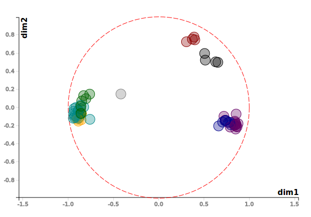

Od voleb konaných v říjnu 2014 se odlišuje tím, že zastupitelka Monika Krobová Hášová nedlouho po volbách vystoupila z klubu TOP09 a je nezařazenou zastupitelkou, která hlasuje s ČSSD (je také mj. členkou dozorčí rady městské společnosti Pražská energetika, a.s.). Vedle toho se od klubu TOP09 v dubnu 2014 vyčlenili zastupitelé Tomáš Hudeček (bývalý primátor), Eva Vorlíčková a Milan Růžička, kteří utvořili klub nezávislých.

### Koalice

Z výše uvedeného je patrné, že po většinu prvního roku koalice ANO + ČSSD + Trojkoalice (SZ + Stan + KDU-ČSL) hlasovala o všech svých návrzích zcela jednotně. Zásadní věci schvalovala buldozerem 33 hlasů. Koalice nepřipouštěla zásadně jakékoliv rozumné návrhy opozice, ani návrhy na doplnění dalších bodů na program zasedání. Podle představitelů koalice musely být nejprve návrhy Pirátů zamítnuty a pak je koalice předložila jako vlastní návrhy.

### Opozice
Opozice hlasovala prakticky jednotně v klíčových tématech, jako je například návrh Pirátů na zveřejňování smluv, návrhy na zařazení dalších bodů na program jednání, zřízení funkce radního pro IT, projednání personálních změn (zda vůbec bude zařazeno odvolání primátorky na program zasedání), proti megazakázce na svoz odpadu za 13 mld. korun. Obecně se však opozice skládala ze značně nesourodých stran, což se projevilo i v jejím rozštěpení na konstruktivní a destruktivní opozici. Všechny koaliční a opoziční strany s výjimkou Pirátů mají své zástupce v dozorčích radách městských podniků.

### Destruktivní opozice
Druhým početným celkem jsou intenzivně spolupracující TOP 09 a ODS, které spolu například podaly žádost o svolání mimořádného zastupitelstva k projednání návrhu na odvolání primátorky Adriany Krnáčové. Cílem bloku TOP09 a ODS bylo jakýmkoliv způsobem rozbít existující koalici, což se jim nakonec podařilo.

ODS a TOP09 často vystupovaly proti koalici i ve věcech, které podle nás dělá dobře. Piráti principiálně odmítli, aby byly příjmy z privatizace bytů rozpuštěny v rozpočtu, jak požadovala ODS. Zatímco ODS v minulosti nedělalo problém schválit dotace soukromé firmě na tyčinky, vadilo jí dotování knihovny na Praze 2. To jsou otázky, ve kterých se Piráti a ODS rozcházejí, byť v některých tématech se i shodnou (např. peníze pro městské části, představenstva městských firem bez politiků).

Cílem TOP09 bylo odvolat radní a rozštěpit Radu, což se jí na zasedání Zastupitelstva v říjnu 2015 skutečně podařilo. Piráti podpořili návrh na odvolání neschopné radní Novákové (ČSSD), radního Haška (ANO) a radní Ropkové (ČSSD). Piráti nesouhlasili s odvoláním náměstka Stropnického (Zelení), kterým rozpad koalice započal. Po prvním roce vládnutí máme tedy jako výsledek polorozpadlou koalici s Radu, která má 7 členů z 11.

### Konstruktivní opozice
Zbývá tedy poslední blok, který tvoří politické strany, které podporují vybrané kroky koalice a jiné její návrhy věcně kritizují. Okruh podporovaných návrhů se však u nich různí. Např. KSČM na rozdíl od Pirátů loajálně podpořila koalici v hlasování o přerušení prvního zasedání, proti projednání odvolání primátorky a proti návrhu Pirátů na zveřejňování majetkových přiznání. KSČM rovněž nepodpořila odvolání radních za ČSSD s výjimkou radní Novákové.

Blízkost na grafu vyplývá i z toho, že KSČM systematicky podporuje v hlasování, aby Piráti vedli kontrolní výbor (jako jediná další strana v Zastupitelstvu) a dalších drobnějších hlasováních. Na rozdíl od TOP 09 a ODS podporují Piráti a KSČM i některé rozumné návrhy koalice, např. návrh, aby výnos z privatizace bytů nebyl příjmem rozpočtu, ale byl vyčleněn do zvláštního fondu sociálního bydlení.

### SWOT analýza

Tato SWOT analýza se zabývá tím, jaké jsou plusy a minusy **konstruktivní opozice**:

| Výhody        | Nevýhody           | Příležitosti | Hrozby |
|:-------------:|:-------------:|:-------------:|:-------------:|
| Zkušenosti, informace, know how | Piráti nenesou mediální odpovědnost za věci, které neřídí | Šance prosadit Pirátský návrh | Spolupracovníci mohou Piráty diskreditovat |
| Šance něco konkrétního zrealizovat | Zabírá to čas, nízká efektivita | Pozitivní medializace úspěchů | Mediální odpovědnost za chyby v IT |
| Mediální pozornost (Opencard) | Nutnost koordinovat komunikaci | Větší šance odhalit průsery | Vcucne nás systém |
| Získávání respektu | Nevyjasněná, nečitelná pozice | Prostor vytvořit a propracovat návrhy do budoucna | Nic se nepodaří - budeme za užitečné idioty |
| Získávání koaličního potenciálu | | Vymezení se proti destruktivním stranám | Nevýrazné a neprůrazné vystupování |
| Vzniká sít lidí, se kterými Piráti na něčem pracovali | | Možnost vyřešit problémy s Opencard | |
| Není potřeba dělat kompromisy | | Piráti si nezavírají dveře pro budoucí spolupráci | |
| Piráti nejsou zavaleni agendou | | | |
| Dobrý pocit ze smysluplné činnosti | | | |
| Posouvání Overton window | | | |
| Lze zcela promítnout program do hlasování | | | |
| Přístup k vládnoucím představitelům | | |  | |

## Činnost zastupitelů

<a name="cinnost-zastupitelu"/>

### Aktualizace povolební strategie

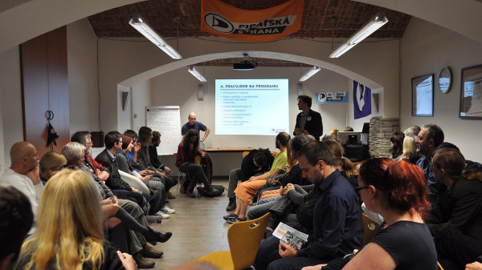

V srpnu 2015, kdy to poprvé vypadalo rozpad koalice, jsme požádali krajské fórum o aktualizaci povolební strategie. Dostali jsme silný mandát 70 % hlasů k vyjednávání o podpoře koalice i účasti v ní (pokud v ní nebude ODS, ČSSD nebo KSČM). Tato změna vylepšila naši pozici, protože když jsme před tím  jakoukoliv účast v koalici kategoricky odmítali, značně jsme tím posilovali vyjednávací možnosti Karla Březiny a Radmily Kleslové.

Nezbytné podmínky pro jakoukoliv podporu Rady či účast na Radě byly dány požadavky z [dokumentu 10 bodů](http://praha.pirati.cz/10-klicovych-bodu.html) s přihlédnutím k [plánu činnosti](https://redmine.pirati.cz/projects/praha/roadmap) a [doporučením k fungování Magistrátu](https://praha.pirati.cz/jak-na-magistrat-bez-megastrat.html).

### Plán činnosti

Zastupitelský klub Pirátů si schválil plán činnosti na první rok fungování, který je dostupný na [redmine](https://redmine.pirati.cz/projects/praha/roadmap). Na webu je také dostupný program, kde si můžete zobrazit aktuální stav plnění programového bodu.

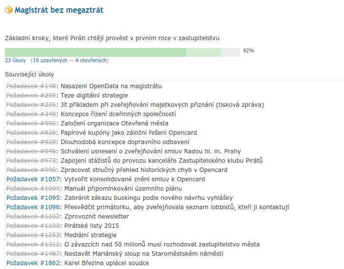

### Docházka

**Zastupitelé Pirátů mají jednoznačně nejlepší účast na jednání Zastupitelstva a jeho výborů ze všech klubu v Zastupitelstvu.**

Piráti měli za první rok stoprocentní účast na zasedáních Zastupitelstva hl. m. Prahy (které se koná jednou měsíčně kromě letních prázdnin, kdy se nekoná vůbec). Z koalice musejí mít stoprocentní účast všichni, protože tam záleží na každém hlasu. Z ostatních opozičních klubů se ale téměř vždy někteří zastupitelé zasedání neúčastní.

Zastupitelé Pirátů mají na jednáních výborů 100% účast a mají také velmi dobrou účast na výborech, kde nejsou členy. Viktor Mahrik má také dobrou účast na finančním výboru (2 omluvené absence).

### Aktivita ve výborech a komisích

#### Kontrolní výbor

* Pirátský člen kontrolního výboru Jakub Michálek nebyl přes opakovanou pětinásobnou kandidaturu zvolen ani předsedou ani místopředsedou kontrolního výboru, neboť hlasy koalice byli zvoleni Jaroslava Janderová (ODS) a Jiří Hrabák (TOP09).
* Jakub Michálek je přes to jedním z nejaktivnějších členů kontrolního výboru, prověřuje pochybení v kauze Opencard, provedl historicky první kontrolu Magistrátu (poskytování informací o odměnách),  poskytování informací o majetkových přiznání zastupitelů, řeší kauzu Škodova paláce apod.

#### Finanční výbor

* Pirátský člen finančního výboru (Viktor Mahrik) se podílel na analýze rozpočtu hlavního města a Piráti k němu předložili konkrétní pozměňovací návrhy. Koaliční hlasovací mašina však nejen že usilovně odmítala jeden pirátský návrh za druhým, neumožnila dokonce ani diskuzi k rozpočtu jako takovému. Členové finančního výboru byly v této situaci v podstatě postaveni před hotovou věc.

#### Výbor pro sport
* Pirátský člen výboru pro sport Adam Zábranský bojoval proti složení grantové komise pro sport a volný čas, které navrhovala (od 22. října 2015 již bývalá) radní Nováková (ČSSD). Nic se mu ale změnit nepodařilo. Předsedou komise se stal Karel Březina, který byl pravomocně odsouzen za trestný čin podvodu kvůli místu v dozorčí radě Dopravního podniku. Zbytek komise je obsazen čistě politicky, mezi členy je např. i nejvýznamnější zákulisní hráčka ANO (dříve ČSSD) Radmila Kleslová.
* Adamu Zábranskému proto přijde problémové hlasovat pro jakékoliv granty, které z této komise vzejdou. Dále z pozice člena výboru sleduje přípravu akce Praha ₋ Evropské hlavní město sportu 2016, kde chce, aby to byla spíše nízkonákladová, nikoliv megalomanská akce. Rozpočet na sport se ale bohužel má v roce 2016 o několik desítek milionů navýšit.

#### Výbor pro legislativu, veřejnou správu, protikorupční opatření a informatiku

* Pirátský člen výboru pro legislativu Adam Zábranský na prvním jednání výboru představil návrh Pirátů na zveřejňování smluv. Výbor nakonec doporučil Radě, aby zlepšila stav zveřejňování smluv v souladu s tímto návrhem. Rada tak nakonec po půl roce udělala a schválila východiska zveřejňování smluv, která v současnosti rozpracovává Magistrát.
* Legislativní výbor se také podílí na tvorbě protikorupční strategie, kterou Piráti významně ovlivnili. Na konečný návrh ale budeme muset ještě počkat.

#### Výbor pro majetek

* Na výbor jsou předkládány provozní tisky (např. prodej či nákup pár metrů čtverečních). Významnější tisky jsou předkládány bez širšího kontextu (prodej rozvojových parcel v Karlíně, velká výměna pozemků s ČSOB). To vše je důsledkem absence koncepce.
* Pirátský člen výboru pro majetek Ondřej Profant opakovaně žádal předsedu výboru i radního pro majetek o jednání o obecné koncepci hospodaření s majetkem. Koncepční jednání byly přislíbeny, avšak zatím se žádné neodehrálo.
* Jedinou světlou výjimkou je *Návrh pravidel pro rozhodování o prodejích a pronájmech veřejných prostranství sídlišť* (6. jednání, bod 5.1), kterou si z iniciativy nám. primátora Matěje Stropnického výbor vyžádal. Majetkové podíly se doposud neřešily vůbec.
* Ondřej Profant ve výboru otevřel témata pronájmu *Maršmeloun* a [Sixti](https://github.com/pirati-cz/KlubPraha/tree/master/spisy/2015/140-sixti). Maršmeloun má nyní pozastavené stavební povolení. U druhé kauzy byla představena petice a Ondřej Profant přednesl úvodní slovo. Zbytek výboru však nechtěl téma projednat bez podkladů od odboru. Téma bylo zařazeno na další jednání, avšak to neproběhlo z důvodů nízké účastí – to je obecně dlouhodobý problém tohoto výboru.

#### Výbor pro územní rozvoj a uzemní plán

* Pirátský zástupce ve výboru Mikuláš Ferjenčík už pro druhé zasedání výboru připravil shrnutí největších problémů územního plánování v Praze, následně ho prodiskutoval s předsedou výboru Slezákem, který k němu poslal připomínky.
* Před výborem potom prochází všechny jednotlivé změny územního plánu a zaujímá k nim stanovisko. Pokud chcete pomáhat, obraťte se na něj.
* Proběhl i seminář o změnách územního plánu od neziskové organizace Arnika, v neposlední řadě Mikuláš pravidelně konzultoval s kanceláří Matěje Stropnického, do října 2015 náměstka primátorky s gescí uzemní plánování.
* Aktuálně Mikuláš vede zásadní spor o seznam podnětů na změnu územního plánu, kde dosáhl [úspěchu u ministerstva vnitra](https://praha.pirati.cz/tabulka-podnetu.html). Pro organizaci Arnika připomínkoval příručku Územní plán pro občany, která je [ke stažení na webu](http://arnika.org/uzemni-plan-prirucka-pro-obcany).

#### Komise ICT

* Ondřej Profant a Jakub Michálek jsou členy komise Rady hl. m. Prahy pro ICT. Tato komise schválila důležité projektové záměry na *OpenData* a *Mepnet* a *Teze digitální strategie*. Tyto dokumenty jsou zodpovědně prodiskutováy a kvalitně připraveny.
* Mepnet je nově pojmut jako rámcová smlouva s minitendry a tím se stává mnohem více tržně otevřeným. Zastupitelstvo tento návrh (po opravě od O. Profanta) schválilo na zářijovém jednání.
* Po připomínkách Pirátů nebyla schválena velkorysá integrace Marbesu na další městské části.
* Opendata byla úspěšně spuštěna a rozrůstají se.
* Naši zástupci navrhli, aby se podklady (s výjimkou odůvodněných případů) zveřejňovaly, avšak to neprošlo přes zbytek komise.
* Pirátští zástupci také byli v koordinační skupině pro řešení Opencard, která připravila doporučení k dalšímu postupu.
* [Teze digitální strategie](https://praha.pirati.cz/rada-digitalni-strategie.html) jsou velmi pokrokový dokument zohledňující moderní trendy a především opensource. Inspiruje se takovými dokumenty jako [Government Digital Service](https://www.gov.uk/design-principles). Dokument schválila 15. 9. Rada HMP.k
* Ondřej Profant se též intenzivně věnuje běžnému provozu odboru informatiky, kde se podílí na množství dílčích diskusí nad problémy, aby se věci řešily rovnou správně (a ne až po neschválení komisí apod.)

### Boj o informace

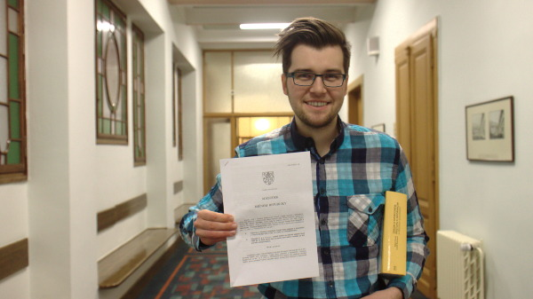

Piráti velmi často žádají o informace podle zákona o svobodném přístupu k informacím a zákona o hl. m. Praze. Bez informací totiž zastupitelé nemohou kvalifikovaně rozhodovat. Jen v roce 2014 podal zastupitelský klub Pirátů [24 žádostí o informace](https://github.com/pirati-cz/KlubPraha/tree/master/spisy/2014). Od ledna do konce října 2015 podali pirátští zastupitelé dalších [více než 200 žádostí o informace](https://github.com/pirati-cz/KlubPraha/tree/master/spisy/2015). Žádosti jsou evidovány ve spisové službě na Githubu, aktuální stavy jednotlivých žádostí pak v [redmine](https://redmine.pirati.cz/projects/praha/issues?query_id=17).

Prostřednictvím těchto žádostí se Pirátští zastupitelé dověděli například:

- aktuální výše marží na SMS jízdenky v krajských městech ČR, z nichž Praha má v současné době suverénně nejvyšší (24,11 %),
- že řada zastupitelů v minulém volebním období čekala třeba 3 roky a nechávala si vyplácet náhradu výdělku za 3 roky zpětně,
- že Praha by měla podle fiskální analýzy usilovat o zvýšení daně z nemovitosti a zvýšení investičních výdajů (rezervy v porovnání s ostatními evropskými metropolemi),
- o pokutě uložené Úřadem pro ochranu hospodářské soutěže ve výši 500 000 Kč, kterou Praha zaplatila v souvislosti s kauzami ohledně smlouvy Opencard, za kterou nikdo nenese odpovědnost,
- výši úroku (pohybující se okolo 0,5 %), za který má Praha uložené své peníze na účtech u PPF, která neodpovídá rizikovosti vkladu, přičemž Praha má s PPF velice úzké vazby (drží v ní 10% podíl),
- jak vypadá audit Dopravního podniku Prahy, který vyhotovil Václav Láska,
- za jaké ceny a komu Praha pronajímá nemovitosti, jaké městské firmy pro Prahu spravují nemovitý majetek v hodnotě vyšší než 100 miliard korun a že podle analýzy *Institutu plánování a rozvoje* Praha pronajímá nebytové prostory nehospodárně,
- jak probíhají jednání Rady hl. m. Prahy; díky těmto záznamům jsme odhalili zákulisní jednání o stavebních předpisech v kuchyňce,
- jaké mají výdaje městské části v oblasti informatiky, jaké účetní systémy používají jednotlivé kraje a jejich příspěvkové organizace; kolik je měsíčně stojí,
- majetková přiznání některých zastupitelů.

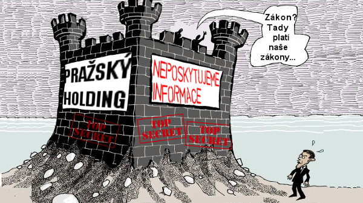

Magistrát pirátským zastupitelům opakovaně nechtěl poskytnout informace, na které mají nárok (audit Dopravního podniku, nájmy městských nemovitostí, seznam podnětů na změnu územního plánu atd.). Některé informace Magistrát dokonce zničil (např. o přípravě stavebních předpisů). Piráti se ale pravidelně odvolávají k Ministerstvu vnitra, které rozhodnutí Magistrátu o odepření informací většinou zruší pro nezákonnost.

### Akce

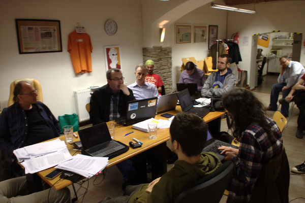

* Piráti pravidelně každý týden pořádají **zastupitelské úterky** v Pirátském centru (Řehořova 19, Praha 3, vždy od 18:00). Jednotliví zastupitelé, kteří se tam každý týden střídají, si vždy vybírají jiné téma, o kterém hovoří. Daná témata se vždy dotýkají aktuální politické situace na pražském magistrátu. V rámci večera je plno prostoru pro zvědavce, kteří zastupitelům mohou klást nejrůznější otázky.
* V prosinci roku 2014 jsme uspořádali **Piratecon**, celostátní pirátskou konferenci, která byla zaměřená na zastupitele obcí, ale třeba i městských částí. Přijela minimálně stovka účastníků a přednášky stály za to.
* V lednu pirátští zastupitelé zorganizovali akci s Islandskou poslankyní Pirátů **Birgittou Jonsdóttir**.
* Vystoupili jsme rovněž na **mezinárodním Pirateconu** v květnu 2015 v Mariánských lázních, kde sdíleli své zkušenosti i s mezinárodními Piráty.
* Od podzimu 2015 pořádají i turné po městských částech, kde se scházejí s občany jednotlivých částí Prahy v přátelské neformální atmosféře.

### Podpora zastupitelů v městských částech

* Zastupitel Ondřej Profant se spolupodílel na obnově IT na Praze 7 a především se věnoval Praze 10. Tam koalice Vlasta (jejíž součástí jsou Piráti) zpochynila [superzakázku na outsourcing IT](http://www.zaostrenona10.cz/mimoradne-zastupitelstvo-bylo-vskutku-mimoradne/).
* Zastupitel Jakub Michálek pomáhá zastupitelům na městských částech s žádostmi o informace.
* Zastupitel Mikuláš Ferjenčík konzultuje s lidmi v městských částech aktuální změny územního plánu.

### Aktivity celospolečenského významu

Pirátští zastupitelé nežijí jen komunální politikou:

* Pomohli jsme například [zabránit zrušení svobody panoramatu](https://praha.pirati.cz/reforma-copyrightu-evropa.html) na celoevropské úrovni ve spolupráci s Pirátskou europoslankyní Julií Reda.
* Významně jsme se podíleli na zformulování [stanoviska Pirátů](https://www.pirati.cz/stanoviska/piratske_stanovisko_k_vlne_uprchliku_-_jednotne_azylove_rizeni_v_evrope_plan_na_integraci_uprchliku_v_cesku) k uprchlické krizi.
* V rámci expertního týmu MPO lobbujeme za zachování digitálních práv v rámci připravované dohody [TTIP](https://praha.pirati.cz/ttip.html).
* Jakub Michálek uspěl u Nejvyššího správního soudu s žalobou na Ministerstvo průmyslu a obchodu, které odmítá zveřejnit technické normy ve stavebnictví ([tisková zpráva](https://www.pirati.cz/tiskove-zpravy/diky_piratum_usetri_stavari_miliony._normy_budou_dostupne_zdarma)).
* Angažujeme se ve snaze zastavit cenzuru Internetu z dílny Andreje Babiše a obecně se snažíme podporovat činnost Pirátské strany i v oblastech přesahujících pražské Zastupitelstvo.

## Mediální výstupy

<a name="medialni-vystupy"/>

Během svého ročního působení vydali pirátští zastupitelé minimálně 50 tiskových zpráv a 106 článků na webu [praha.pirati.cz/blog](praha.pirati.cz/blog). Pravidelně o nás vycházejí novinové články, a to nejen v pražských, ale i v celostátních médiích. Odhadem generujeme minimálně polovinu všech novinových článků o Pirátech v republice za poslední rok.

Při příležitosti sto dní Rady Piráti uspořádali tiskovou konferenci, na které byl zhodnocen přístup Rady k některým ožehavým problémům města. Dále Jakub Michálek vystoupil na tiskové konferenci k Opencard, kde prezentoval v přímém přenosu na České televizi seznam pochybení předchozích politických reprezentací v kauze Opencard. V červnu 2015 jsme upozornili na kauzu tzv. eurozákazu fotografování ₋ kde hrozilo značným způsobem omezení práv Pražanů svobodně šířit své fotografie. Rovněž jsme také odkryli netransparentní zákulisí rozhodování pražské Rady (tzv. aféra kuchyňka), vyzvali Karla Březinu, aby odešel jako odsouzený podvodník do politického důchodu a v neposlední řadě odsoudili trafiky pražských politiků. Právě poslední uvedený výstup vedl ke kvalitativní změně a rezignaci Radmily Kleslové, bývalé agentky komunistické vojenské kontrarozvědky, z řady funkcí. Značnou mediální pozornost si získalo i rozhodnutí krajského sdružení Pirátů umožnit nám jako zastupitelům jednat o případné koalici. Tuto pozornost jsme využili k prezentaci vnitrostranické demokracie a našich programových požadavků.

Prostor pro zlepšení je zejména u prezentace témat v oblasti ICT, naposledy se nám nepodařilo úspěšně prezentovat projekt spuštění portálu pro opendata.

## Vybraná témata

<a name="vybrana-temata"/>

### Opencard

* Jakub Michálek a Ondřej Profant jsou primátorkou pověřeni k jednání ve věci Opencard. V současném volebním období je to poprvé, kdy se s kauzou podařilo pohnout. Praha už není v kleštích jednoho dodavatele EMS, na kterém byla závislá.
* Možnost používat vedle Opencard i papírové průkazky byla přijata, aby Praha nepřesáhla počet zakoupených licencí a měla alternativu při jednání s EMS. Piráti tak výrazně snížili riziko dalších žalob, neboť nedochází k překračování počtu licencí. Prozíravost znovuzavedení papírových kuponů se znovu ukázala v říjnu, kdy EMS začala blokovat vydávání nových karet.
* Zdokumentovali jsme kroky a odpovědnost v kauze Opencard, kdy se jí údajně předchozí politická reprezentace snažila hasit, ale ve skutečnosti situaci spíše zhoršovala. Podařilo se jim prosadit, aby nové řešení bylo postaveno jako multikanálové, skutečně otevřené. Každá skupina tak bude mít takový nosič jízdenky, který jí vyhovuje.
* Podle našeho názoru nemá smysl zavádět novou čipovou kartu s elektronickou peněženkou, ale kdo bude chtít, bude moci používat bankovní kartu nebo mobil. Cestující s bezplatným jízdným nebo studenti cestující na ISIC mohou mít nadále papírové kupóny. Multikanálový systém (market) by měl být zaveden do roku 2018.
* Jakub Michálek dále zpracoval čtyřicetistránkovou analýzu vzniku projektu Opencard a klub Pirátů poté vyzval Radu Prahy, aby Pavla Béma a další zodpovědné osoby zažalovala o náhradu škody.

### SMS jízdenky

* V průběhu roku 2012 médii prošla kauza okolo vysokých marží soukromých společností, které poskytují SMS jízdenky v krajských městech. Ukázalo se, že společnosti jsou vzájemně propojené a v podstatě neexistuje konkurenční prostředí.
* Piráti se rozhodli prostřednictvím žádostí o informace zjistit, jaká je v současné době situace na trhu SMS jízdenek. Závěry byly sepsány do komplexního textu. Ukázalo se, že s výjimkou Prahy, kde společnost Erika a.s. získává marži 24 %, jsou ve všech krajských městech marže nižší – zhruba v rozmezí 10-20 %.
* Piráti zveřejnili na svém githubovém profilu (téměř) všechny aktuálně platné smlouvy na službu SMS jízdenek v krajských městech v České republice.

### Zveřejňování smluv
* Adam Zábranský a Jakub Michálek už před prosincovým zasedáním Zastupitelstva připravili návrh na zlepšení stavu zveřejňování smluv v hl. m. Praze. V současnosti jsou totiž smlouvy zveřejňovány tím způsobem, že v systému je téměř nemožné se orientovat, a smlouvy navíc nezveřejňují příspěvkové organizace ani firmy ovládané městem.
* Zastupitelstvo se návrhem ovšem odmítlo zabývat. Piráti proto své štěstí zkusili na výboru pro protikorupční opatření, který nakonec návrh odkázal Radě. Rada nakonec po půl roce schválila relativně dobrá [východiska zveřejňování smluv](https://praha.pirati.cz/zverejnovani-smluv-rada.html).
* Magistrát by na jejich základě měl připravit konkrétní pravidla, zatím tak ale přes uplynutí lhůty neučinil. Budoucnost zveřejňování smluv v Praze je proto stále ve hvězdách.

### Open Data
* Opendata byla schválena v květnu. Ondřej Profant připravil projektový záměr pro komisi a stal se koordinátorem projektu. V říjnu 2015 je [portál otevřených dat Prahy](http://opendata.praha.eu/) úspěšně spuštěn, průběžně přibývají nové datové sady.
* Řešení je celé open source (včetně implementace). Projekt je velmi ambiciozně koncipován jako celoměstský – na dobrovolné bázi jsou zapojeny městské části, příspěvkové organizace i akciovky. Tím má potenciál napomoci transparenci nejen na magistrátu, ale i v celé Praze.
* V současnosti je zapojeno 12 organizací a uvolněno 97 datových sad.

### Otevřená města

* Jakub Michálek navrhl založení organizace Otevřená města pro sdružování územních samospráv, které prosazují otevřené fungování a zveřejňování informací. Projekt koordinovalo občanské sdružení Oživení a podílel se na něm Ondřej Profant.
* Společně v říjnu 2015 Brno, Praha 5, Praha 6, Černošice a Nové město na Moravě a další města založily organizaci Otevřená města, která si klade za cíl pomáhat otevřenému fungování radnic.
* Rovněž má sloužit jako platforma pro společný vývoj open source softwaru pro města a obce, sbírání příkladů dobré praxe, přístup k informacím a všeho co se týká otevřeného fungování. Další informace byly zveřejněny na [webu nově založené organizace](http://www.otevrenamesta.cz/), na kterém se podíleli Václav Klecanda a Jakub Michálek.

### Politické trafiky v městských firmách

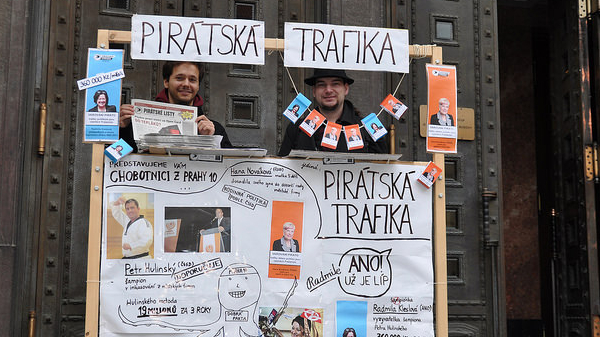

* Zastupitel Adam Zábranský shromažďuje informace o obchodních společnostech, ve kterých má Praha majetkovou účast. Zmapoval, kdo sedí v dozorčích radách a představenstvech těchto firem a jejich dceřiných, popř. vnukovských firem, a kolik za to tito lidé berou.
* Aby bylo jasno, nejsme proti tomu, aby zastupitelé kontrolovali městské firmy, ale jejich výběr by měl být transparentní, měli by být patřičně kvalifikovaní a neměli by hromadit řadu funkcí. Odměna by měla odpovídat vykonané práci, neměla by být ani malá jako v dopravním podniku, ani přemrštěná jako v energetických podnicích.
* V několika případech identifikoval podezřelé trafiky (např. dosazení syna tehdejší radní Novákové z ČSSD do dozorčí rady Pražské teplárenské Holding) Analýza je dodnes hojně citovaná v tisku, poté co Adam šťoural dále, objevil i odměny Radmily Kleslové, prominentky ANO v městských firmách.
* Zveřejnění těchto dat a rezignace Radmily Kleslové výrazně přispěly k zásadnímu oslabení její pozice v pražské politice. Adam Zábranský také doporučil Radě opatření pro větší transparentnost a lepší správu městských firem, nicméně příslušný radní Hašek (ANO) je nijak nerealizoval.
* Piráti připravili návrh na transparentní obsazování dozorčích rad, ale jak to s ním dopadne, to se dozvíte až další rok!

### Nájmy v lukrativních pražských nemovitostech

* Adam Zábranský po vyhraném sporu o informace s Magistrátem získal seznam nájmů městských nemovitostí. Zároveň získal od Institutu plánování a rozvoje [analýzu hospodaření Prahy s nebytovým majetkem](https://github.com/pirati-cz/KlubPraha/blob/master/materialy/najmy/Analyza-hospodareni-nebyty-IPR.pdf), která poukazuje na nehospodárné nájmy.
* Magistrát přitom dosud analýzu nezveřejnil. V současnosti Adam toto velké množství informací zpracovává. Zároveň už půl roku vede boj o podobné informace s Prahou 1.

### Informace o platech úředníků

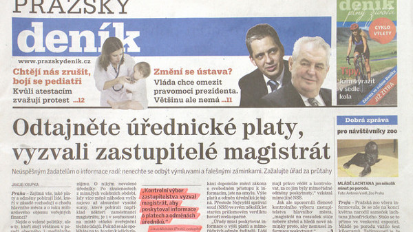

* Zastupitel Jakub Michálek si posvítil na utajování informací o platech úředníků, které probíhalo v rozporu s judikaturou Nejvyššího správního soudu. Magistrát původně trval na tom, že informace poskytovat nebude a teprve velice pozvolna začíná akceptovat povinnost tyto informace žadatelům poskytovat.
* Jakub Michálek se v tomto ohledu obrátil na kontrolní výbor, protože některým žadatelům byly informace odepřeny třeba již patnáctkrát. Od října 2014 již Praha přišla v soudních sporech kvůli neposkytování informací zatím o 70 000 Kč, a toto není konečná suma.
* Jakub Michálek navíc uskutečnil v rámci kontrolního výboru zastupitelstva kontrolu ohledně poskytování a utajování informací a interpeloval primátorku. Nakonec Rada schválila usnesení, že se Magistrát musí řídit stanoviskem Ministerstva vnitra a informace o odměnách úředníků poskytovat.

### Stavební předpisy projednané v kuchyňce

* Piráti zveřejnili zvukový záznam Rady z projednání pražských stavebních předpisů. Ten byl natolik skandální, že se kvůli němu otřásla pozice primátorky Krnáčové.
* Krok pirátských zastupitelů měl širokou mediální publicitu. Kromě primátorky, které vadil, ale už ho nyní bere, si na stěžoval jeden občan kontrolnímu výboru Zastupitelstva, že Piráti ohrožují společensko-politické zřízení.

### Pirátské listy

* Vydali jsme tištěné [Pirátské listy](https://praha.pirati.cz/piratske-listy-2015.html) v nákladu 80 000 ks. Dosud se nám z nich podařilo rozdistrubovat tři čtvrtiny. Pirátské listy tentokrát nebyly volební, informovaly však o naší činnosti v Zastupitelstvu za uplynulý rok.
* Do rozdávání listů se zapojilo přinejmenším 31 členů Pirátské stany, 15 příznivců, a čtyři pražští zastupitelé. S roznosem nám pomáhají dokonce i příznivci TOP 09 nebo KSČM.

## Fungování klubu

<a name="fungovani-klubu"/>

### Metodické vedení

Je to poprvé, co máme klub v Zastupitelstvu. Proto se snažíme nastavit transparentní pravidla fungování klubu. Za tímto účelem vydává předseda klubu [metodiky](https://redmine.pirati.cz/projects/praha/wiki) (například pro danění příjmů, majetková přiznání, odměňování, přípravu zasedání Zastupitelstva, psaní zápisů, vedení spisové služby, vedení seznamu schůzek apod.). Vedle toho máme také schválenou mediální strategii a připravujeme koncepci zapojení dobrovolníků.

### Stážisté a dobrovolníci

Aby Piráti posílili svůj tým, vypsali na začátku března poptávku po stážistech:
- Terezu Hronovou, která zpracovává rešerši projektu Metra D,
- Karla Vlasáka, který by měl v budoucnu sledovat výbor pro životní prostředí,
- Dana Řezníčka, který se zastupitelem Ondřejem Profantem pracuje na [personální mapě](https://github.com/pirati-cz/goverMap) pražského zastupitelstva a magistrátu.
- Alexandra Herzog, která mapovala Prahu z [pohledu turisty](https://praha.pirati.cz/projekt-turistika-praha.html) a přinesla důležitý pohled z mezinárodní perspektivy.

**Další stážisté jsou samozřejmě vítáni!**

### Zveřejňovač

Zveřejňovač je jediný pracovník, kterého mají od hlavního města pirátští zastupitelé k dispozici. Od listopadu 2014 je zveřejňovačem pro zastupitelský klub Jan Loužek vybraný v otevřeném tříkolovém výběrovém řízení.

Úkoly zveřejňovače jsou evidovány, stejně jako jeho činnost, v interním systému [redmine](https://redmine.pirati.cz/projects/praha/issues?query_id=14) Zveřejňovač zajišťuje veškerou administrativní i jinou podporu pro zastupitelský klub; připravuje rozpis tisků k jednání zastupitelstva a zajišťuje vedení spisové služby. Mimo jiné připravuje fotodokumentaci z jednání zastupitelstva i jiných aktivit.

### Byro

Připravili jsme open source software [Byro](https://github.com/pirati-cz/byro/). Jedná se o nástroj pro automatizaci kancelářských prací (převody, OCR, spisová služba, elektronický podpis, generování výčetek, ...). Našemu zastupitelskému klubu již šetří množství práce a pomáhá nám udržet vysokou úroveň transparence (dokumenty ve formátu markdown se dobře šíří, indexují etc.).

### Odpracovaný čas zastupitelů

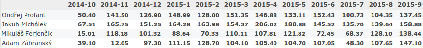

V říjnu 2014 uzavřeli pirátští zastupitelé mandátní smlouvy s Pirátskou stranou. Jedna z podmínek této smlouvy stanoví, že se zastupitelé mají věnovat činnosti pro zastupitelský klub 30 hodin týdně, tedy v přepočtu 6 hodin denně. Průměrně za měsíc odpracují zastupitelé 100-150 hodin měsíčně, maximální množství odpracovaného času u jednoho zastupitele je 200 hodin za měsíc.

Za rok své činnosti odvedli zastupitelé celkem okolo 5700 hodin. K říjnu 2015 je to 1500 hodin u Ondřeje Profanta, 1900 hodin u Jakuba Michálka, 1200 u Adama Zábranského a 1100 u Mikuláše Ferjenčíka.

## Zpráva o odměňování

<a name="zprava-o-odmenovani"/>

V této zprávě zveřejňujeme přehled o příjmech zastupitelů a zaměstnanců.

> Naší ambicí je vnést **sluneční svit** do odměňování ve veřejné správě a dosáhnout spravedlivého odměňování lidí – podle jejich nasazení a prokazatelně odvedené práce.
>
>  — [Jakub Michálek](https://praha.pirati.cz/jakub-michalek.html), předseda klubu

Zdrojová data, podle nichž se vytváří tato zpráva, data byla automaticky získána z [autoritativní tabulky příjmů](http://raw.githubusercontent.com/pirati-cz/KlubPraha/master/odmeny/new/data/odmeny.csv).

### Obsah zprávy

* [Příjmy zastupitelů](#prijmy-zastupitelu)
* [Příjmy zaměstnanců](#prijmy-zamestnancu)

## Příjmy zastupitelů

<a name="prijmy-zastupitelu"/>

Příjem zastupitele za Piráty v Zastupitelstvu hl. m. Prahy je tvořen z následujících zdrojů:

* [A. Peníze od města](#penize-od-mesta)
  * [A.1 Paušální odměna](#pausalni-odmena)
  * [A.2 Náhrada výdělku](#nahrada-vydelku)
* [B. Peníze od strany](#penize-od-strany)
  * [B.1 Pevná složka smluvní odměny](#pevna-slozka)
  * [B.2 Proměnlivá složka smluvní odměny](#promenliva-slozka)

Jednotliví zastupitelé vykazují svojí aktivitu v systému [redmine][redmine]. V tomto systému měříme výkonnost a kontrolujeme plnění úkolů. Podle nich je každý měsíc určena výše odměny. Všechny tyto údaje jsou shrnuty v měsíčních výkazech odměňování. Výkazy odměňování zveřejňujeme v [repozitáři odměn][repo-odmen].

[redmine]: https://redmine.pirati.cz/projects/praha
[repo-odmen]: https://github.com/pirati-cz/KlubPraha/tree/master/odmeny/2015/

Celková výše **hrubých** příjmů (před zaplacením daní a pojistného) včetně průměru za období říjen 2014 až září 2015 je uvedena v následující tabulce.

Příjemce	            | Příjmy od města	              | Příjmy od strany            |	Celkem
------                | -------                       | ---                         |
Adam Zábranský	      | 130968 Kč (10914 Kč měsíčně)  |  88844 Kč (7404 Kč měsíčně) |	219812 Kč (18318 Kč měsíčně)
Jakub Michálek	      | 171626 Kč (14302 Kč měsíčně)  | 129732 Kč (10811 Kč měsíčně)|	301358 Kč (25113 Kč měsíčně)
Mikuláš Ferjenčík	    | 122762 Kč (10230 Kč měsíčně)  |  90811 Kč (7568	Kč měsíčně) | 213573 Kč	(17798 Kč měsíčně)
Ondřej Profant	      | 207011 Kč (17251 Kč měsíčně)  | 103384 Kč (8615 Kč měsíčně) | 310395 Kč (25866 Kč měsíčně)
průměr na zastupitele | 13174 Kč měsíčně	            |   8599 Kč měsíčně           | 21773 Kč měsíčně

Poznámka: zastupitelé dostávají příjem od strany od listopadu 2014 s výjimkou Adama Zábranského, který ho dostává od prosince 2015 z důvodu pozdějšího nástupu.

Lze shrnout, že průměrný člen Zastupitelstva hl. m. Prahy za Piráty obdržel od města **13 tis. korun hrubého měsíčně**. Z toho cca 5 tisíc korun je stálá odměna a zbytek nahrazuje město zastupiteli výdělek podle hodin strávených oficiálním jednáním. Dalších **8,6 tis. korun hrubého měsíčně** mu vyplatí Česká pirátská strana. Celkový průměrný příjem jednoho zastupitele z obou zdrojů tak činí necelých **22 tisíc korun hrubého**, což je o šest tisíc korun méně než medián průměrných mezd v Praze (28 tisíc Kč) a o 13 tisíc korun méně než průměrná mzda v Praze (35,8 tisíc Kč).

Všichni zastupitelé **dohromady** obdrželi od města v prvních 12 měsících působení celkem částku 632 tisíc Kč, od strany 413 tisíc Kč hrubého. Strana tak využila na odměňování zastupitelů 43 % příspěvku na mandát pražských zastupitelů od státu, který činí 950 tisíc Kč ročně. Statistické údaje vycházejí z [dat publikovaných Ministerstvem práce a sociálních věcí](http://zpravy.aktualne.cz/ekonomika/kde-si-vydelate-vic-nez-v-praze-nasli-jsme-raje-v-regionech/r~2882a2a0dddf11e4a66e0025900fea04/).

Srovnání průměrného příjmu člena Zastupitelstva hl. m. Prahy za Piráty s dalšími funkcemi politiků v rámci hl. m. Prahy a průměrnými mzdami obsahuje následující tabulka. Z ní je patrné, že Piráti díky dobré docházce na výbory a plnění oficiálních úkolů berou více než neaktivní zastupitelé, ale **pouze zlomek toho, co uvolnění zastupitelé**, resp. politici s některou výnosnou **dozorčí radou městské firmy**.

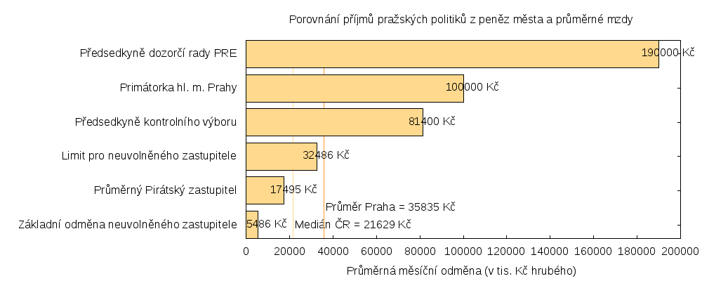

### A. Příjmy od města

<a name="penize-od-mesta"/>

#### A.1 Paušální odměna

<a name="pausalni-odmena"/>

**Paušální odměna** je pravidelná měsíční částka, kterou hlavní město Praha vyplácí každému neuvolněnému zastupiteli. Její výše činí přibližně 5000 Kč hrubého měsíčně.

Následující graf ukazuje výši příjmů jednotlivých zastupitelů v jednotlivých měsících:

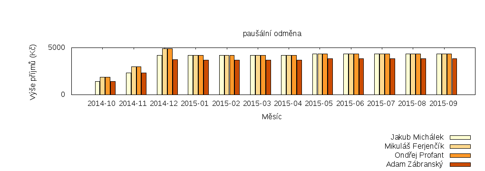

[Paušální odměna v tabulce](pausalni-odmena/data.csv)

#### A.2 Náhrada výdělku

<a name="nahrada-vydelku"/>

**Náhrada výdělku** je částka, kterou zastupiteli hlavní město Praha nahrazuje ušlý výdělek za dobu jednání Zastupitelstva, výborů a komisí, účast na seminářích, pracovní cesty a plnění oficiálních úkolů pro město. Její výše činí u zastupitelů, kteří nejsou v pracovním poměru, 450 Kč hrubého za hodinu, nejvýše však 60 hodin měsíčně.

Následující graf ukazuje výši příjmů jednotlivých zastupitelů v jednotlivých měsících:

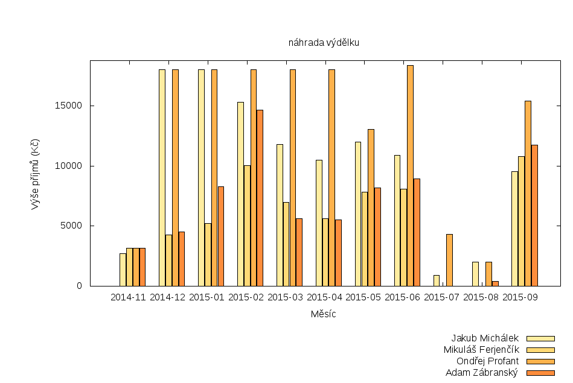

[Náhrada výdělku v tabulce](nahrada-vydelku/data.csv)

V [repozitáři odměn][repo-odmen] si lze prohlédnout výčetky zastupitelů za každý měsíc. V nich je vždy rozpis konkrétní činnosti zastupitele, za který odměna náleží.

### B. Příjmy od strany

<a name="penize-od-strany"/>

**Smluvní odměna** podle mandátní smlouvy je částka, kterou Česká pirátská strana odměňuje své zastupitele, aby se volené funkci mohli věnovat více času, ideálně 35 hodin týdně. Částka se skládá z pevné a proměnlivé složky. Výši odměny schvaluje každý měsíc krajské předsednictvo pražského sdružení Pirátů ([podrobnosti][mandatni-smlouvy]).

[mandatni-smlouvy]: https://praha.pirati.cz/zastupitele-piratu-pracuji-naplno.html

Následující grafy ukazují výši příjmů jednotlivých zastupitelů v jednotlivých měsících po složkách smluvní odměny:

#### B.1 Pevná složka smluvní odměny

<a name="pevna-slozka"/>

**Pevná složka** náleží zastupiteli podle rozsahu odvedené práce pro stranu. Za dohodnutý rozsah práce náleží zastupiteli částka 8500 Kč hrubého měsíčně. Odměna však zastupiteli nenáleží za oficiální jednání, za které má nárok na náhradu výdělku.

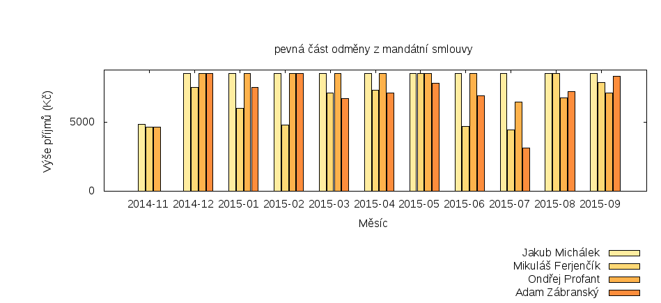

[Pevná složka smluvní odměny v tabulce](pevna-cast-odmeny-z-mandatni-smlouvy/data.csv)

#### B.2 Proměnlivá složka smluvní odměny

<a name="promenliva-slozka"/>

**Proměnlivá složka** náleží zastupiteli za splnění významných úkolů, za práci přes čas a za jiné výkony hodné zvláštní odměny. Proměnlivá složka může dosáhnout až částky 5000 Kč hrubého měsíčně.

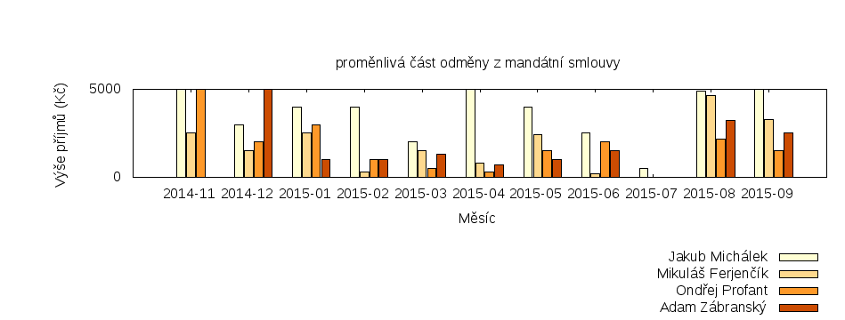

[Proměnlivá složka smluvní odměny v tabulce](promenliva-cast-odmeny-z-mandatni-smlouvy/data.csv)

V [repozitáři odměn][repo-odmen] si lze prohlédnout výkaz odměňování za každý měsíc. V něm je odkaz na výkaz odpracovaného času a jsou v něm uvedeny významné úkoly.

Celkově byla v proměnlivé složce smluvní odměny vyplacena částka 95751 Kč, která činí 38 % z maximální roční částky schválené krajským fórem 250 tis. Kč (viz [usnesení č. 38/2014](https://forum.pirati.cz/krajske-forum-praha-f349/ks-pha-38-2014-placena-funkce-zastupitelu-hlasovani-t27019.html#p363546)).

## Příjmy zaměstnanců

<a name="prijmy-zamestnancu"/>

**Příjem zaměstnance** je měsíční plat, který zaměstnanci vyplácí Magistrát hl. m. Prahy. Tento plat může být zvýšen o odměny, jejichž výši určuje Magistrát hl. m. Prahy. Klub Pirátů má jednoho zaměstnance.

Následující graf ukazuje výši příjmů zaměstnanců v jednotlivých měsících:

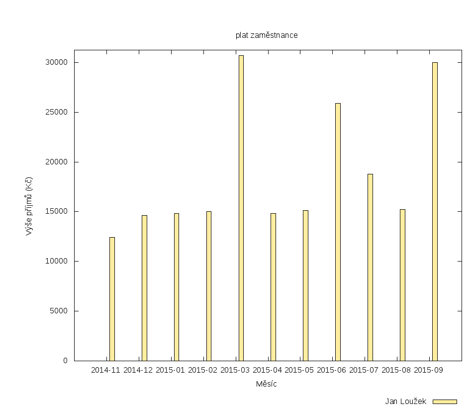

[Platy zaměstnanců v tabulce](plat-zamestnance/data.csv)

Zaměstnanec vykazuje odpracovaný čas v systému [redmine][redmine].

## Nejlepší a nejhorší za první rok

<a name="nejlepsi-a-nejhorsi"/>

### Adam Zábranský

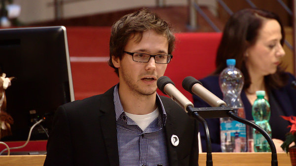

* Mám radost z toho, že jsme přesvědčili Radu hl. m. Prahy, aby schválila dobrá východiska pro zveřejňování smluv, a že jsme významně ovlivnili přípravu protikorupční strategie Prahy, která se tak ubírá správným směrem. Bohužel kvůli různým zdržovacím akcím bude ještě nějakou dobu trvat, než se tato práce projeví (a není vyloučeno, že se neprojeví vůbec). Jsem také moc rád, že jsme sehráli klíčovou roli v odstupu Radmily Kleslové z městských firem, když jsem zveřejnil, že si v nich přijde dohromady na 360 tisíc korun měsíčně.
* Naopak mě štve, že v oblasti transparence se Praha za rok nikam neposunula, a přitom je tolik možností co dělat, například v oblasti majetku či městských firem.

### Mikuláš Ferjenčík

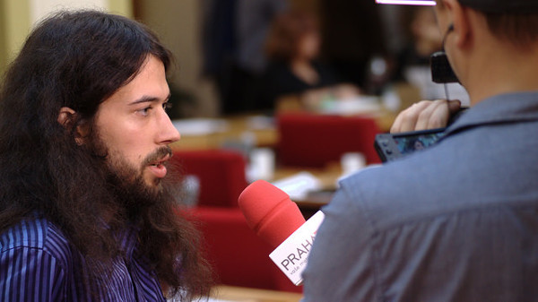

* Jsem rád, že se mi podařilo přispět k tomu, abychom byli mediálně i reálně viditelná politická strana v Praze. Ve všech významných pražských médiích jsou lidé, na které se můžeme telefonicky obrátit, když máme nějaké téma, které stojí za publikaci a podařilo se nám vydat vlastní tištěné Pirátské listy.
* Nejhorší pro mě je atmosféra v Zastupitelstvu, kdy jen velkou menšinu konkurenčních zastupitelů zajímá, jak se věci skutečně vyřeší.

### Ondřej Profant

* Velice mě potěšily úspěchy OpenDat a schválení Tezí digitální strategie.
* Naopak mě mrzí, že odbor informatiky je v tak špatném stavu, že projekty nejde prosazovat rychleji a že nám není schopný poskytnout odborné zázemí pro nové projekty. Zároveň považuji za tragickou situaci v oblasti majetku.

### Jakub Michálek

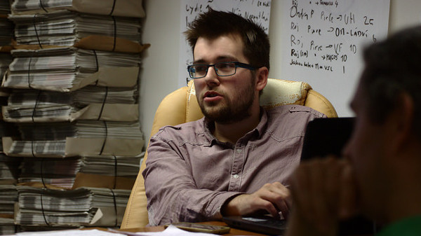

* Jsem rád, že klub funguje tak jak má, že je inspirací pro Piráty a jiné zastupitele po celé republice. Jsme fajn parta, která dostala od voličů a strany možnost realizovat své ideály.
* Vadí mi způsob myšlení magistrátních úředníků a pokrytectví a morální úpadek některých politiků.

## Odkazy

- web: <http://praha.pirati.cz>
- blog: <http://praha.pirati.cz/blog.html>
- redmine: <http://redmine.pirati.cz/projects/praha/issues>
- github: <http://github.com/pirati-cz/KlubPraha>
- facebook: <http://facebook.com/CeskaPiratskaStranaPraha>

**Děkujeme za zájem a těšíme se na Vaši návštěvu!**

Klub Pirátů v Zastupitelstvu hl. m. Prahy  
Mariánské nám. 2, Praha 1, přízemí, místnost č. 40
