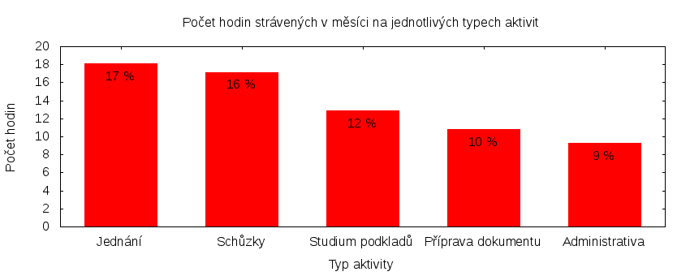

Výkaz odměňování
================

Tento výkaz shrnuje základní informace pro odměňování zastupitele hl. m. Prahy
za Česou pirátskou stranu. Je sestaven podle [metodiky odměňování][metodika]
a předkládá se předsednictvu krajského sdružení.

Časově náročné úkoly
----------------------

Následující tabulka uvádí všechny úkoly v daném měsíci, u kterých čas přesáhl
3 hodiny. Do této tabulky může zastupitel doplnit další významné splněné úkoly
nebo aktivity.

Číslo                                           |   Úkol                                    |  Fronta           |  Celkem
------------------------------------------------|-------------------------------------------|--------------------|-------:
[#321](https://redmine.pirati.cz/issues/321)    |   Technické zázemí zastupitelského klubu  |  Požadavek         |  3.00  
[#1854](https://redmine.pirati.cz/issues/1854)  |   sebevzdělávání v ICT                    |  Dlouhodobý úkol   |  3.00  
[#1856](https://redmine.pirati.cz/issues/1856)  |   Jednání klubu dne 3. 8. 2015            |  Požadavek         |  3.00  
[#1929](https://redmine.pirati.cz/issues/1929)  |   Jednání klubu dne 20. 8. 2015           |  Požadavek         |  3.25  

Můžete si zobrazit plný [přehled plněných úkolů][tasklist].

Měřitelné ukazatele
-------------------

U všech údajů jsou uvedeny odkazy do projektového systému [redmine](https://redmine.pirati.cz). Některé údaje v tomto systému mohou být neveřejné, proto se bez přihlášení může zobrazit menší počet hodin.

Rozsah činnosti                        | Počet hodin
--------------                         | ----------:
**A. Práce pro město**                 | [4.50][linktocityhours]
**B. Práce pro stranu**                | 99.85
*z toho*                               |
B.1 v projektu zastupitelstva          | [99.85][linktohomehours]
B.2 v ostatních projektech             | [0.00][linktootherhours]
**Celkový počet hodin**                | 104.35
Dohodnutý rozsah práce                 | 126.00
**Procento vytížení**                  | 82

Grafické znázornění [odpracované doby dle aktivity][activitylist]:

Odměňování
----------

Zdroj příjmu                           | Výše příjmu (Kč)
-----------------                      | --------------:
**A. Peníze od města**                 | 7511
*z toho*                               |
A.1 paušální odměna                    | 5486
A.2 náhrada výdělku                    | 2025
**B. Peníze od strany**                | 8907
*z toho*                               |
B.1 pevná složka odměny                | 6735
B.2 variabilní složka odměny           | 2172
*z toho*                               |
B.2.1 odměna za dodržení rozsahu práce | 672
B.2.2 odměna za přesčasy               | 0
B.2.3 odměna za významné splněné úkoly | 1500
B.2.4 odpočet za výhrady               | 0
**Celkový měsíční příjem**             | 16418

Částky jsou uváděny vždy v hrubé výši, přičemž z paušální odměny odvádí město zálohu na daň z příjmu a zdravotní pojištění. Je dále odpovědností každého zastupitele, aby příjem zdanil a zaplatil zákonné pojištění.

[metodika]: https://redmine.pirati.cz/projects/praha/wiki/Odm%C4%9B%C5%88ov%C3%A1n%C3%AD_zastupitel%C5%AF
[tasklist]: https://redmine.pirati.cz/projects/praha/time_entries/report?f[]=spent_on&f[]=user_id&op[user_id]==&f[]=cf_16&op[cf_16]=!*&f[]=&columns=month&criteria[]=issue&op[spent_on]=><&op[user_id]==&utf8=✓&v[spent_on][]=2015-08-01&v[spent_on][]=2015-08-31&v[user_id][]=3
[linktocityhours]: https://redmine.pirati.cz/projects/praha/time_entries?f[]=spent_on&f[]=user_id&f[]=cf_16&f[]=&op[cf_16]=*&op[spent_on]=><&op[user_id]==&utf8=✓&v[spent_on][]=2015-08-01&v[spent_on][]=2015-08-31&v[user_id][]=3
[linktohomehours]: https://redmine.pirati.cz/projects/praha/time_entries?f[]=spent_on&f[]=user_id&f[]=cf_16&f[]=&op[cf_16]=!*&op[spent_on]=><&op[user_id]==&utf8=✓&v[spent_on][]=2015-08-01&v[spent_on][]=2015-08-31&v[user_id][]=3
[linktootherhours]: https://redmine.pirati.cz/time_entries/report?f[]=spent_on&f[]=cf_16&op[cf_16]=%3D&v[cf_16][]=strana&f[]=project_id&op[project_id]=!&v[project_id][]=15&f[]=&columns=month&criteria[]=user&op[spent_on]=><&op[user_id]==&utf8=✓&v[spent_on][]=2015-08-01&v[spent_on][]=2015-08-31&v[user_id][]=3
[activitylist]: https://redmine.pirati.cz/projects/praha/time_entries/report?columns=month&criteria[]=activity&f[]=spent_on&f[]=user_id&f[]=&op[spent_on]=><&op[user_id]==&utf8=✓&v[spent_on][]=2015-08-01&v[spent_on][]=2015-08-31&v[user_id][]=3
