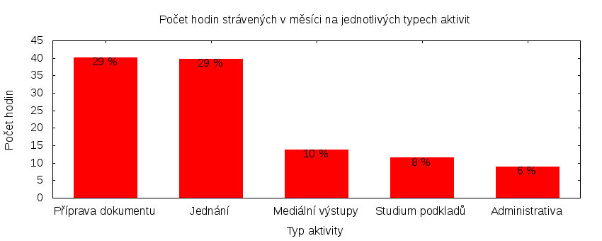

Výkaz odměňování
================

Tento výkaz shrnuje základní informace pro odměňování zastupitele hl. m. Prahy
za Česou pirátskou stranu. Je sestaven podle [metodiky odměňování][metodika]
a předkládá se předsednictvu krajského sdružení.

U všech údajů jsou uvedeny odkazy do projektového systému
[redmine](https://redmine.pirati.cz). Některé úkoly v tomto systému mohou být
neveřejné. Tyto úkoly se vám po přihlášení nezobrazí, pokud nemáte potřebná
oprávnění. Podmínky utajení a zveřejnění upravuje
[metodika odměňování][metodika].

Časově náročné úkoly
----------------------

Následující tabulka uvádí všechny úkoly v daném měsíci, u kterých čas přesáhl
3 hodiny. Do této tabulky může zastupitel doplnit další významné splněné úkoly
nebo aktivity. U neveřejných úkolů uvádíme jen číslo úkolu a počet hodin.

Číslo                                           |   Úkol                                 |  Fronta     |  Celkem
------------------------------------------------|----------------------------------------|--------------|-------:
[#1769](https://redmine.pirati.cz/issues/1769)  |   Sazba Pirátských listů               |  Požadavek   |  16.00
[#1773](https://redmine.pirati.cz/issues/1773)  |   Distribuce Pirátských listů          |  Požadavek   |  7.50  
[#2074](https://redmine.pirati.cz/issues/2074)  |   článek do roka a do dne              |  Požadavek   |  3.00  
[#2086](https://redmine.pirati.cz/issues/2086)  |   Zasedání zastupitelstva 10. 9. 2015  |  Požadavek   |  13.00
[#2211](https://redmine.pirati.cz/issues/2211)  |   Schůzka s Hanou Marvanovou           |  Schůzka     |  3.50  
[#2293](https://redmine.pirati.cz/issues/2293)  |   Výbor pro územní rozvoj 16.9.        |  Požadavek   |  3.00  

Můžete si zobrazit plný [přehled plněných úkolů][tasklist].

Měřitelné ukazatele
-------------------

Následující tabulka obsahuje měřitelné ukazatele za všechny úkoly v daném měsíci
včetně neveřejných úkolů. Proto mohou být hodiny v ní vyšší než se vám bez
přihlášení zobrazí v projektovém systému.

Rozsah činnosti                        | Počet hodin
--------------                         | ----------:
**A. Práce pro město**                 | [24.00][linktocityhours]
**B. Práce pro stranu**                | 116.44
*z toho*                               |
B.1 v projektu zastupitelstva          | [114.44][linktohomehours]
B.2 v ostatních projektech             | [2.00][linktootherhours]
**Celkový počet hodin**                | 140.44
Dohodnutý rozsah práce                 | 126.00
**Procento vytížení**                  | 111

Grafické znázornění [odpracované doby dle aktivity][activitylist]:

Odměňování
----------

Zdroj příjmu                           | Výše příjmu (Kč)
-----------------                      | --------------:
**A. Peníze od města**                 | 16286
*z toho*                               |
A.1 paušální odměna                    | 5486
A.2 náhrada výdělku                    | 10800
**B. Peníze od strany**                | 11155
*z toho*                               |
B.1 pevná složka odměny                | 7855
B.2 variabilní složka odměny           | 3300
*z toho*                               |
B.2.1 odměna za dodržení rozsahu práce | 1000
B.2.2 odměna za přesčasy               | 0
B.2.3 odměna za významné splněné úkoly | 3000
B.2.4 odpočet za výhrady               | 700
**Celkový měsíční příjem**             | 27441

Částky jsou uváděny vždy v hrubé výši, přičemž z paušální odměny odvádí město zálohu na daň z příjmu a zdravotní pojištění. Je dále odpovědností každého zastupitele, aby příjem zdanil a zaplatil zákonné pojištění.

[metodika]: https://redmine.pirati.cz/projects/praha/wiki/Odm%C4%9B%C5%88ov%C3%A1n%C3%AD_zastupitel%C5%AF
[tasklist]: https://redmine.pirati.cz/projects/praha/time_entries/report?f[]=spent_on&f[]=user_id&op[user_id]==&f[]=cf_16&op[cf_16]=!*&f[]=&columns=month&criteria[]=issue&op[spent_on]=><&op[user_id]==&utf8=✓&v[spent_on][]=2015-09-01&v[spent_on][]=2015-09-30&v[user_id][]=17
[linktocityhours]: https://redmine.pirati.cz/projects/praha/time_entries?f[]=spent_on&f[]=user_id&f[]=cf_16&f[]=&op[cf_16]=*&op[spent_on]=><&op[user_id]==&utf8=✓&v[spent_on][]=2015-09-01&v[spent_on][]=2015-09-30&v[user_id][]=17
[linktohomehours]: https://redmine.pirati.cz/projects/praha/time_entries?f[]=spent_on&f[]=user_id&f[]=cf_16&f[]=&op[cf_16]=!*&op[spent_on]=><&op[user_id]==&utf8=✓&v[spent_on][]=2015-09-01&v[spent_on][]=2015-09-30&v[user_id][]=17
[linktootherhours]: https://redmine.pirati.cz/time_entries/report?f[]=spent_on&f[]=cf_16&op[cf_16]=%3D&v[cf_16][]=strana&f[]=project_id&op[project_id]=!&v[project_id][]=15&f[]=&columns=month&criteria[]=user&op[spent_on]=><&op[user_id]==&utf8=✓&v[spent_on][]=2015-09-01&v[spent_on][]=2015-09-30&v[user_id][]=17
[activitylist]: https://redmine.pirati.cz/projects/praha/time_entries/report?columns=month&criteria[]=activity&f[]=spent_on&f[]=user_id&f[]=&op[spent_on]=><&op[user_id]==&utf8=✓&v[spent_on][]=2015-09-01&v[spent_on][]=2015-09-30&v[user_id][]=17
