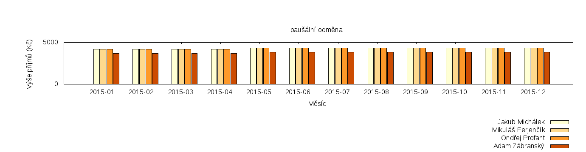
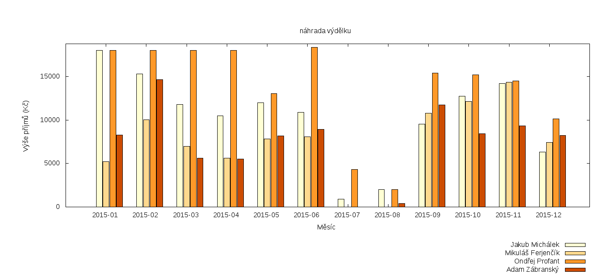
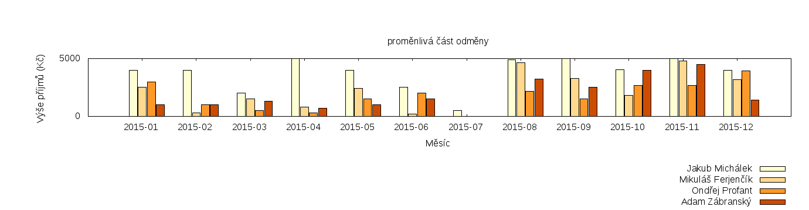
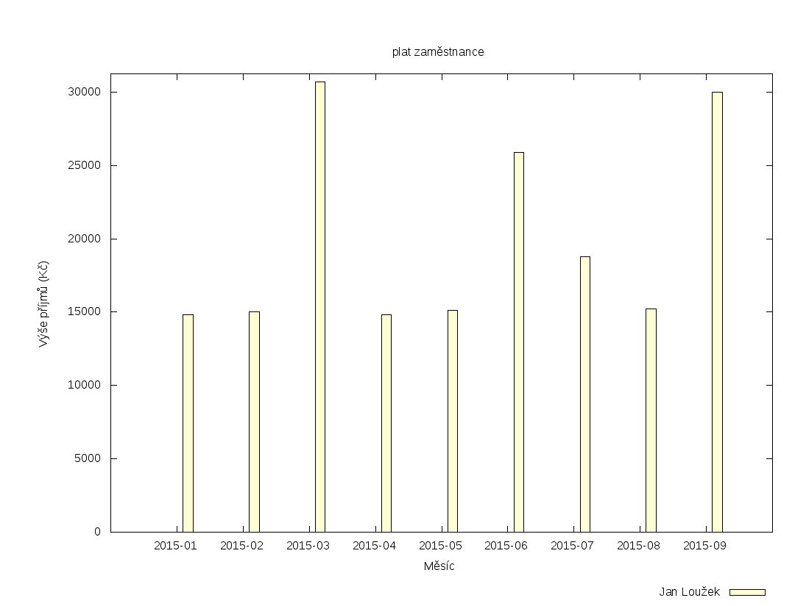

Zastupitelstvo hl. m. Prahy  
Klub České pirátské strany

# Zpráva o odměňování za rok 2015

V této zprávě zveřejňujeme přehled o příjmech zastupitelů a zaměstnanců.

> Naší ambicí je vnést **sluneční svit** do odměňování ve veřejné správě a dosáhnout spravedlivého odměňování lidí – podle jejich nasazení a prokazatelně odvedené práce.
>
>  — [Jakub Michálek](https://praha.pirati.cz/jakub-michalek.html), předseda klubu

Zdrojová data, podle nichž se vytváří tato zpráva, byla automaticky získána z [autoritativní tabulky příjmů](http://raw.githubusercontent.com/pirati-cz/KlubPraha/master/odmeny/odmeny.csv).

## Obsah zprávy

* [Příjmy zastupitelů](#prijmy-zastupitelu)
* [Příjmy zaměstnanců](#prijmy-zamestnancu)

## Příjmy zastupitelů

<a name="prijmy-zastupitelu"/>

Příjem zastupitele za Piráty v Zastupitelstvu hl. m. Prahy je tvořen z následujících zdrojů:

* [A. Peníze od města](#penize-od-mesta)
  * [A.1 Paušální odměna](#pausalni-odmena)
  * [A.2 Náhrada výdělku](#nahrada-vydelku)
* [B. Peníze od strany](#penize-od-strany)
  * [B.1 Pevná složka smluvní odměny](#pevna-slozka)
  * [B.2 Proměnlivá složka smluvní odměny](#promenliva-slozka)

Jednotliví zastupitelé vykazují svojí aktivitu v systému [redmine][redmine]. V tomto systému měříme výkonnost a kontrolujeme plnění úkolů. Podle nich je každý měsíc určena výše odměny. Všechny tyto údaje jsou shrnuty v měsíčních výkazech odměňování. Výkazy odměňování zveřejňujeme v [repozitáři odměn][repo-odmen].

[redmine]: https://redmine.pirati.cz/projects/praha
[repo-odmen]: https://github.com/pirati-cz/KlubPraha/tree/master/odmeny/2015/

### A. Peníze od města

<a name="penize-od-mesta"/>

#### A.1 Paušální odměna

<a name="pausalni-odmena"/>

**Paušální odměna** je pravidelná měsíční částka, kterou hlavní město Praha vyplácí každému neuvolněnému zastupiteli. Její výše činí přibližně 5000 Kč hrubého měsíčně.

Následující graf ukazuje výši příjmů jednotlivých zastupitelů v jednotlivých měsících:

[Paušální odměna v tabulce](podle-slozky/pausalni-odmena/data.csv)

#### A.2 Náhrada výdělku

<a name="nahrada-vydelku"/>

**Náhrada výdělku** je částka, kterou zastupiteli hlavní město Praha nahrazuje ušlý výdělek za dobu jednání zastupitelstva, výborů a komisí, účast na seminářích, pracovní cesty a plnění oficiálních úkolů pro město. Její výše činí u zastupitelů, kteří nejsou v pracovním poměru, 450 Kč hrubého za hodinu, nejvýše však 60 hodin měsíčně.

Následující graf ukazuje výši příjmů jednotlivých zastupitelů v jednotlivých měsících:

[Náhrada výdělku v tabulce](podle-slozky/nahrada-vydelku/data.csv)

V [repozitáři odměn][repo-odmen] si lze prohlédnout výčetky zastupitelů za každý měsíc. V nich je vždy rozpis konkrétní činnosti zastupitele, za který odměna náleží.

### B. Peníze od strany

<a name="penize-od-strany"/>

**Smluvní odměna** podle mandátní smlouvy je částka, kterou Česká pirátská strana odměňuje své zastupitele, aby se volené funkci mohli věnovat více času, ideálně 35 hodin týdně. Částka se skládá z pevné a proměnlivé složky. Výši odměny schvaluje každý měsíc krajské předsednictvo pražského sdružení Pirátů ([podrobnosti][mandatni-smlouvy]).

[mandatni-smlouvy]: https://praha.pirati.cz/zastupitele-piratu-pracuji-naplno.html

Následující grafy ukazují výši příjmů jednotlivých zastupitelů v jednotlivých měsících po složkách smluvní odměny:

#### B.1 Pevná složka smluvní odměny

<a name="pevna-slozka"/>

**Pevná složka** náleží zastupiteli podle rozsahu odvedené práce pro stranu. Za dohodnutý rozsah práce náleží zastupiteli částka 8500 Kč hrubého měsíčně. Odměna však zastupiteli nenáleží za oficiální jednání, za které má nárok na náhradu výdělku.

[Pevná složka smluvní odměny v tabulce](podle-slozky/pevna-cast-odmeny/data.csv)

#### B.2 Proměnlivá složka smluvní odměny

<a name="promenliva-slozka"/>

**Proměnlivá složka** náleží zastupiteli za splnění významných úkolů, za práci přes čas a za jiné výkony hodné zvláštní odměny. Proměnlivá složka může dosáhnout až částky 5000 Kč hrubého měsíčně.

[Proměnlivá složka smluvní odměny v tabulce](podle-slozky/promenliva-cast-odmeny/data.csv)

V [repozitáři odměn][repo-odmen] si lze prohlédnout výkaz odměňování za každý měsíc. V něm je odkaz na výkaz odpracovaného času a jsou v něm uvedeny významné úkoly.

## Příjmy zaměstnanců

<a name="prijmy-zamestnancu"/>

**Příjem zaměstnance** je měsíční plat, který zaměstnanci vyplácí Magistrát hl. m. Prahy. Tento plat může být zvýšen o odměny, jejichž výši určuje Magistrát hl. m. Prahy. Klub Pirátů má jednoho zaměstnance.

Následující graf ukazuje výši příjmů zaměstnanců v jednotlivých měsících:

[Platy zaměstnanců v tabulce](podle-slozky/plat-zamestnance/data.csv)

Zaměstnanec vykazuje odpracovaný čas v systému [redmine][redmine].
