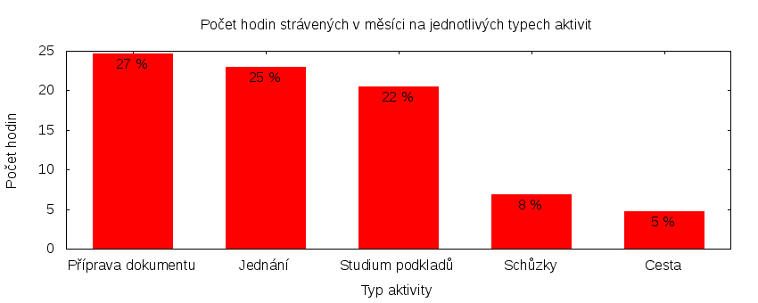

Česká pirátská strana  
krajské sdružení Praha  
klub Pirátů v Zastupitelstvu hl. m. Prahy

Výkaz odměňování
================

V tomtu výkazu zveřejňujeme základní informace o vykonané práci a odměňování osob. Výkaz je sestaven podle [metodiky odměňování][metodika],
která obsahuje podrobnosti. U všech údajů jsou uvedeny odkazy do projektového systému [redmine](https://redmine.pirati.cz). Upozorňujeme, že za podmínek stanovených v metodice mohou být některé úkoly v projektovém systému neveřejné.

Významné úkoly
----------------------

Následující seznam zahrnuje všechny úkoly z domovského [projektu krajského sdružení Praha][kspraha], které zabraly déle než 3 hodiny. Zastupitel si může tento seznam doplnit či upravit podle své úvahy tak, aby podával co nejlepší informaci o odvedené práci.

Číslo              |   Název úkolu                                    |  Celkem           
-------------------|--------------------------------------------------|------------------:
[#2651][task2651]  |   Zasedání zastupitelstva 28. 1. 2016            |  [20.25][time2651]
[#2599][task2599]  |   nezveřejněný úkol                              |  [7.25][time2599] 
[#2590][task2590]  |   Jednání klubu 2016                             |  [7.00][time2590] 
[#804][task804]    |   Výbor pro dopravu a evropské fondy             |  [6.75][time804]  
[#2653][task2653]  |   SVOČ na téma Přístup zastupitelů k informacím  |  [6.70][time2653] 
[#1763][task1763]  |   Teambuildingy                                  |  [5.00][time1763] 
[#184][task184]    |   Rada hl. m. Prahy                              |  [4.25][time184]  
[#2612][task2612]  |   Zastupitelská úterý za rok 2016                |  [4.25][time2612] 
[#2397][task2397]  |   nezveřejněný úkol                              |  [4.10][time2397] 
[#237][task237]    |   Spisová služba                                 |  [4.00][time237]  

Můžete si zobrazit plný [přehled plněných úkolů][tasklist].

Měřitelné ukazatele
-------------------

Následující tabulka obsahuje měřitelné ukazatele za všechny úkoly v daném měsíci
včetně neveřejných úkolů. Proto mohou být hodiny v ní vyšší než se vám bez
přihlášení zobrazí v projektovém systému.

Rozsah činnosti                        | Počet hodin
--------------                         | ----------:
**A. Práce pro město**                 | [13.25][linktocityhours]
**B. Práce pro stranu**                | 81.65
*z toho*                               |
B.1 v projektu zastupitelstva          | [73.25][linktohomehours]
B.2 v ostatních projektech             | [8.40][linktootherhours]
**Celkový počet hodin**                | 94.90
Dohodnutý rozsah práce                 | 120.00
**Procento vytížení**                  | 79

Grafické znázornění [odpracované doby dle aktivity][activitylist]:

Graf zahrnuje pouze aktivity v domovském [projektu krajského sdružení Praha][kspraha].

Odměňování
----------

Zastupitel má na základě zákona právo na odměnu a náhradu výdělku. Vedle toho na základě [smlouvy][smlouva] s Českou pirátskou stranou má také právo na odměnu podle rozsahu odvedené práce pro stranu.

Zdroj příjmu                           | Výše příjmu (Kč)
-----------------                      | --------------:
**A. Peníze od města**                 | 11448
*z toho*                               |
A.1 paušální odměna                    | 5486
A.2 náhrada výdělku                    | 5962
**B. Peníze od strany**                | TMPPARTYMONEY
*z toho*                               |
B.1 pevná složka odměny                | 5783
B.2 variabilní složka odměny           | TMPVARMONEY
*z toho*                               |
B.2.1 odměna za dodržení rozsahu práce | 624
B.2.2 odměna za přesčasy               | 0
B.2.3 odměna za významné splněné úkoly | TMPTASKSMONEY
B.2.4 odpočet za výhrady               | TMPSANCTIONS
**Celkový měsíční příjem**             | TMPTOTALMONEY

Částky jsou uváděny vždy v hrubé výši, přičemž z paušální odměny odvádí město zálohu na daň z příjmu a zdravotní pojištění. Je dále odpovědností každého zastupitele, aby příjem zdanil a zaplatil zákonné pojištění.

[metodika]: https://redmine.pirati.cz/projects/praha/wiki/Odm%C4%9B%C5%88ov%C3%A1n%C3%AD_zastupitel%C5%AF

[kspraha]: https://redmine.pirati.cz/projects/kspraha
[tasklist]: https://redmine.pirati.cz/projects/kspraha/time_entries/report?f[]=spent_on&f[]=user_id&op[user_id]==&f[]=&columns=month&criteria[]=issue&op[spent_on]=><&op[user_id]==&utf8=✓&v[spent_on][]=2016-01-01&v[spent_on][]=2016-01-31&v[user_id][]=16
[task2651]: https://redmine.pirati.cz/issues/2651
[time2651]:https://redmine.pirati.cz/issues/2651/time_entries?f[]=spent_on&f[]=user_id&f[]=&op[spent_on]=><&op[user_id]==&op[spent_on]=><&op[user_id]==&utf8=✓&v[spent_on][]=2016-01-01&v[spent_on][]=2016-01-31&v[user_id][]=16
[task2599]: https://redmine.pirati.cz/issues/2599
[time2599]:https://redmine.pirati.cz/issues/2599/time_entries?f[]=spent_on&f[]=user_id&f[]=&op[spent_on]=><&op[user_id]==&op[spent_on]=><&op[user_id]==&utf8=✓&v[spent_on][]=2016-01-01&v[spent_on][]=2016-01-31&v[user_id][]=16
[task2590]: https://redmine.pirati.cz/issues/2590
[time2590]:https://redmine.pirati.cz/issues/2590/time_entries?f[]=spent_on&f[]=user_id&f[]=&op[spent_on]=><&op[user_id]==&op[spent_on]=><&op[user_id]==&utf8=✓&v[spent_on][]=2016-01-01&v[spent_on][]=2016-01-31&v[user_id][]=16
[task804]: https://redmine.pirati.cz/issues/804
[time804]:https://redmine.pirati.cz/issues/804/time_entries?f[]=spent_on&f[]=user_id&f[]=&op[spent_on]=><&op[user_id]==&op[spent_on]=><&op[user_id]==&utf8=✓&v[spent_on][]=2016-01-01&v[spent_on][]=2016-01-31&v[user_id][]=16
[task2653]: https://redmine.pirati.cz/issues/2653
[time2653]:https://redmine.pirati.cz/issues/2653/time_entries?f[]=spent_on&f[]=user_id&f[]=&op[spent_on]=><&op[user_id]==&op[spent_on]=><&op[user_id]==&utf8=✓&v[spent_on][]=2016-01-01&v[spent_on][]=2016-01-31&v[user_id][]=16
[task1763]: https://redmine.pirati.cz/issues/1763
[time1763]:https://redmine.pirati.cz/issues/1763/time_entries?f[]=spent_on&f[]=user_id&f[]=&op[spent_on]=><&op[user_id]==&op[spent_on]=><&op[user_id]==&utf8=✓&v[spent_on][]=2016-01-01&v[spent_on][]=2016-01-31&v[user_id][]=16
[task184]: https://redmine.pirati.cz/issues/184
[time184]:https://redmine.pirati.cz/issues/184/time_entries?f[]=spent_on&f[]=user_id&f[]=&op[spent_on]=><&op[user_id]==&op[spent_on]=><&op[user_id]==&utf8=✓&v[spent_on][]=2016-01-01&v[spent_on][]=2016-01-31&v[user_id][]=16
[task2612]: https://redmine.pirati.cz/issues/2612
[time2612]:https://redmine.pirati.cz/issues/2612/time_entries?f[]=spent_on&f[]=user_id&f[]=&op[spent_on]=><&op[user_id]==&op[spent_on]=><&op[user_id]==&utf8=✓&v[spent_on][]=2016-01-01&v[spent_on][]=2016-01-31&v[user_id][]=16
[task2397]: https://redmine.pirati.cz/issues/2397
[time2397]:https://redmine.pirati.cz/issues/2397/time_entries?f[]=spent_on&f[]=user_id&f[]=&op[spent_on]=><&op[user_id]==&op[spent_on]=><&op[user_id]==&utf8=✓&v[spent_on][]=2016-01-01&v[spent_on][]=2016-01-31&v[user_id][]=16
[task237]: https://redmine.pirati.cz/issues/237
[time237]:https://redmine.pirati.cz/issues/237/time_entries?f[]=spent_on&f[]=user_id&f[]=&op[spent_on]=><&op[user_id]==&op[spent_on]=><&op[user_id]==&utf8=✓&v[spent_on][]=2016-01-01&v[spent_on][]=2016-01-31&v[user_id][]=16
[activitylist]: https://redmine.pirati.cz/projects/kspraha/time_entries/report?columns=month&criteria[]=activity&f[]=spent_on&f[]=user_id&f[]=&op[spent_on]=><&op[user_id]==&utf8=✓&v[spent_on][]=2016-01-01&v[spent_on][]=2016-01-31&v[user_id][]=16

[smlouva]: https://smlouvy.pirati.cz/smlouvy/2014/11/13/adam-zabransky/index.html
[linktocityhours]: https://redmine.pirati.cz/projects/praha/time_entries?f[]=spent_on&f[]=user_id&f[]=cf_16&f[]=&op[cf_16]=*&op[spent_on]=><&op[user_id]==&utf8=✓&v[spent_on][]=2016-01-01&v[spent_on][]=2016-01-31&v[user_id][]=16
[linktohomehours]: https://redmine.pirati.cz/projects/praha/time_entries?f[]=spent_on&f[]=user_id&f[]=cf_16&f[]=&op[cf_16]=!*&op[spent_on]=><&op[user_id]==&utf8=✓&v[spent_on][]=2016-01-01&v[spent_on][]=2016-01-31&v[user_id][]=16
[linktootherhours]: https://redmine.pirati.cz/time_entries/report?f[]=spent_on&f[]=cf_16&op[cf_16]=%3D&v[cf_16][]=strana&f[]=project_id&op[project_id]=!&v[project_id][]=15&f[]=&columns=month&criteria[]=user&op[spent_on]=><&op[user_id]==&utf8=✓&v[spent_on][]=2016-01-01&v[spent_on][]=2016-01-31&v[user_id][]=16
