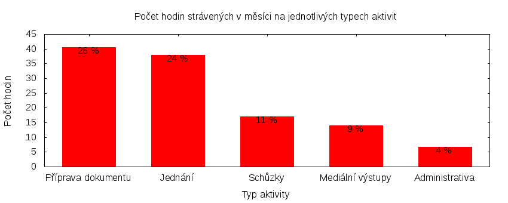

Česká pirátská strana  
Krajské sdružení Praha  
Klub Pirátů v Zastupitelstvu hl. m. Prahy

Výkaz odměňování
================

V tomtu výkazu zveřejňujeme základní informace o vykonané práci a odměňování osob. Výkaz je sestaven podle [metodiky odměňování][metodika],
která obsahuje podrobnosti. U všech údajů jsou uvedeny odkazy do projektového systému [redmine](https://redmine.pirati.cz). Upozorňujeme, že za podmínek stanovených v metodice mohou být některé úkoly v projektovém systému neveřejné.

Významné úkoly
----------------------

Následující seznam zahrnuje všechny úkoly z domovského projektu krajského sdružení Praha, které zabraly déle než 3 hodiny. Každý zastupitel si může tento seznam doplnit či upravit podle své úvahy tak, aby podával co nejlepší informaci o odvedené práci.

Číslo              |   Název úkolu                                               |  Celkem
-------------------|-------------------------------------------------------------|-------:
[#2549][task2549]  |   Připravit strategický plán krajského sdružení             |  21.16 
[#2394][task2394]  |   Vyjednávání druhé Rady                                    |  14.35 
[#2651][task2651]  |   Zasedání zastupitelstva 28. 1. 2016                       |  13.50 
[#2722][task2722]  |   Prezidentské volby                                        |  8.00  
[#2590][task2590]  |   Jednání klubu 2016                                        |  7.65  
[#2599][task2599]  |   nezveřejněný úkol                                         |  7.50  
[#279][task279]    |   Kontakt s občany                                          |  7.50  
[#165][task165]    |   Mediální výstupy                                          |  6.46  
[#1216][task1216]  |   Jednání kontrolního výboru                                |  6.30  
[#597][task597]    |   E-mailová komunikace                                      |  5.55  
[#2311][task2311]  |   Pirátské listy 2016                                       |  5.50  
[#2654][task2654]  |   Promlčení nároku na náhradu škody v kauze Škodova paláce  |  5.50  
[#1996][task1996]  |   Přenášení zkušeností do strany                            |  5.40  
[#1763][task1763]  |   Teambuildingy                                             |  5.00  
[#2358][task2358]  |   Účetnictví a rozpočet strany                              |  4.75  

Můžete si zobrazit plný [přehled plněných úkolů][tasklist].

Měřitelné ukazatele
-------------------

Následující tabulka obsahuje měřitelné ukazatele za všechny úkoly v daném měsíci
včetně neveřejných úkolů. Proto mohou být hodiny v ní vyšší než se vám bez
přihlášení zobrazí v projektovém systému.

Rozsah činnosti                        | Počet hodin
--------------                         | ----------:
**A. Práce pro město**                 | [17.25][linktocityhours]
**B. Práce pro stranu**                | 133.15
*z toho*                               |
B.1 v projektu zastupitelstva          | [124.75][linktohomehours]
B.2 v ostatních projektech             | [8.40][linktootherhours]
**Celkový počet hodin**                | 150.40
Dohodnutý rozsah práce                 | 132.00
**Procento vytížení**                  | 113

Grafické znázornění [odpracované doby dle aktivity][activitylist]:

Graf zahrnuje pouze aktivity v domovském projektu krajského sdružení Praha.

Odměňování
----------

Zdroj příjmu                           | Výše příjmu (Kč)
-----------------                      | --------------:
**A. Peníze od města**                 | 13248
*z toho*                               |
A.1 paušální odměna                    | 5486
A.2 náhrada výdělku                    | 7762
**B. Peníze od strany**                | TMPPARTYMONEY
*z toho*                               |
B.1 pevná složka odměny                | 8500
B.2 variabilní složka odměny           | TMPVARMONEY
*z toho*                               |
B.2.1 odměna za dodržení rozsahu práce | 1000
B.2.2 odměna za přesčasy               | 74
B.2.3 odměna za významné splněné úkoly | TMPTASKSMONEY
B.2.4 odpočet za výhrady               | TMPSANCTIONS
**Celkový měsíční příjem**             | TMPTOTALMONEY

Částky jsou uváděny vždy v hrubé výši, přičemž z paušální odměny odvádí město zálohu na daň z příjmu a zdravotní pojištění. Je dále odpovědností každého zastupitele, aby příjem zdanil a zaplatil zákonné pojištění.

[metodika]: https://redmine.pirati.cz/projects/praha/wiki/Odm%C4%9B%C5%88ov%C3%A1n%C3%AD_zastupitel%C5%AF
[tasklist]: https://redmine.pirati.cz/projects/kspraha/time_entries/report?f[]=spent_on&f[]=user_id&op[user_id]==&f[]=&columns=month&criteria[]=issue&op[spent_on]=><&op[user_id]==&utf8=✓&v[spent_on][]=2016-01-01&v[spent_on][]=2016-01-31&v[user_id][]=4
[task2549]: https://redmine.pirati.cz/issues/2549/time_entries?f[]=spent_on&f[]=user_id&f[]=&op[spent_on]=><&op[user_id]==&op[spent_on]=><&op[user_id]==&utf8=✓&v[spent_on][]=2016-01-01&v[spent_on][]=2016-01-31&v[user_id][]=4
[task2394]: https://redmine.pirati.cz/issues/2394/time_entries?f[]=spent_on&f[]=user_id&f[]=&op[spent_on]=><&op[user_id]==&op[spent_on]=><&op[user_id]==&utf8=✓&v[spent_on][]=2016-01-01&v[spent_on][]=2016-01-31&v[user_id][]=4
[task2651]: https://redmine.pirati.cz/issues/2651/time_entries?f[]=spent_on&f[]=user_id&f[]=&op[spent_on]=><&op[user_id]==&op[spent_on]=><&op[user_id]==&utf8=✓&v[spent_on][]=2016-01-01&v[spent_on][]=2016-01-31&v[user_id][]=4
[task2722]: https://redmine.pirati.cz/issues/2722/time_entries?f[]=spent_on&f[]=user_id&f[]=&op[spent_on]=><&op[user_id]==&op[spent_on]=><&op[user_id]==&utf8=✓&v[spent_on][]=2016-01-01&v[spent_on][]=2016-01-31&v[user_id][]=4
[task2590]: https://redmine.pirati.cz/issues/2590/time_entries?f[]=spent_on&f[]=user_id&f[]=&op[spent_on]=><&op[user_id]==&op[spent_on]=><&op[user_id]==&utf8=✓&v[spent_on][]=2016-01-01&v[spent_on][]=2016-01-31&v[user_id][]=4
[task2599]: https://redmine.pirati.cz/issues/2599/time_entries?f[]=spent_on&f[]=user_id&f[]=&op[spent_on]=><&op[user_id]==&op[spent_on]=><&op[user_id]==&utf8=✓&v[spent_on][]=2016-01-01&v[spent_on][]=2016-01-31&v[user_id][]=4
[task279]: https://redmine.pirati.cz/issues/279/time_entries?f[]=spent_on&f[]=user_id&f[]=&op[spent_on]=><&op[user_id]==&op[spent_on]=><&op[user_id]==&utf8=✓&v[spent_on][]=2016-01-01&v[spent_on][]=2016-01-31&v[user_id][]=4
[task165]: https://redmine.pirati.cz/issues/165/time_entries?f[]=spent_on&f[]=user_id&f[]=&op[spent_on]=><&op[user_id]==&op[spent_on]=><&op[user_id]==&utf8=✓&v[spent_on][]=2016-01-01&v[spent_on][]=2016-01-31&v[user_id][]=4
[task1216]: https://redmine.pirati.cz/issues/1216/time_entries?f[]=spent_on&f[]=user_id&f[]=&op[spent_on]=><&op[user_id]==&op[spent_on]=><&op[user_id]==&utf8=✓&v[spent_on][]=2016-01-01&v[spent_on][]=2016-01-31&v[user_id][]=4
[task597]: https://redmine.pirati.cz/issues/597/time_entries?f[]=spent_on&f[]=user_id&f[]=&op[spent_on]=><&op[user_id]==&op[spent_on]=><&op[user_id]==&utf8=✓&v[spent_on][]=2016-01-01&v[spent_on][]=2016-01-31&v[user_id][]=4
[task2311]: https://redmine.pirati.cz/issues/2311/time_entries?f[]=spent_on&f[]=user_id&f[]=&op[spent_on]=><&op[user_id]==&op[spent_on]=><&op[user_id]==&utf8=✓&v[spent_on][]=2016-01-01&v[spent_on][]=2016-01-31&v[user_id][]=4
[task2654]: https://redmine.pirati.cz/issues/2654/time_entries?f[]=spent_on&f[]=user_id&f[]=&op[spent_on]=><&op[user_id]==&op[spent_on]=><&op[user_id]==&utf8=✓&v[spent_on][]=2016-01-01&v[spent_on][]=2016-01-31&v[user_id][]=4
[task1996]: https://redmine.pirati.cz/issues/1996/time_entries?f[]=spent_on&f[]=user_id&f[]=&op[spent_on]=><&op[user_id]==&op[spent_on]=><&op[user_id]==&utf8=✓&v[spent_on][]=2016-01-01&v[spent_on][]=2016-01-31&v[user_id][]=4
[task1763]: https://redmine.pirati.cz/issues/1763/time_entries?f[]=spent_on&f[]=user_id&f[]=&op[spent_on]=><&op[user_id]==&op[spent_on]=><&op[user_id]==&utf8=✓&v[spent_on][]=2016-01-01&v[spent_on][]=2016-01-31&v[user_id][]=4
[task2358]: https://redmine.pirati.cz/issues/2358/time_entries?f[]=spent_on&f[]=user_id&f[]=&op[spent_on]=><&op[user_id]==&op[spent_on]=><&op[user_id]==&utf8=✓&v[spent_on][]=2016-01-01&v[spent_on][]=2016-01-31&v[user_id][]=4
[activitylist]: https://redmine.pirati.cz/projects/kspraha/time_entries/report?columns=month&criteria[]=activity&f[]=spent_on&f[]=user_id&f[]=&op[spent_on]=><&op[user_id]==&utf8=✓&v[spent_on][]=2016-01-01&v[spent_on][]=2016-01-31&v[user_id][]=4

[linktocityhours]: https://redmine.pirati.cz/projects/praha/time_entries?f[]=spent_on&f[]=user_id&f[]=cf_16&f[]=&op[cf_16]=*&op[spent_on]=><&op[user_id]==&utf8=✓&v[spent_on][]=2016-01-01&v[spent_on][]=2016-01-31&v[user_id][]=4
[linktohomehours]: https://redmine.pirati.cz/projects/praha/time_entries?f[]=spent_on&f[]=user_id&f[]=cf_16&f[]=&op[cf_16]=!*&op[spent_on]=><&op[user_id]==&utf8=✓&v[spent_on][]=2016-01-01&v[spent_on][]=2016-01-31&v[user_id][]=4
[linktootherhours]: https://redmine.pirati.cz/time_entries/report?f[]=spent_on&f[]=cf_16&op[cf_16]=%3D&v[cf_16][]=strana&f[]=project_id&op[project_id]=!&v[project_id][]=15&f[]=&columns=month&criteria[]=user&op[spent_on]=><&op[user_id]==&utf8=✓&v[spent_on][]=2016-01-01&v[spent_on][]=2016-01-31&v[user_id][]=4
