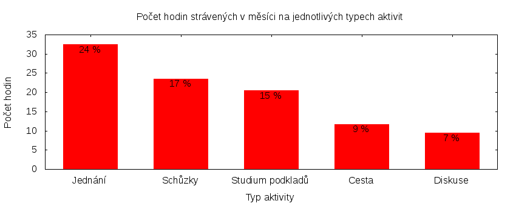

Česká pirátská strana  
krajské sdružení Praha  
klub Pirátů v Zastupitelstvu hl. m. Prahy

Výkaz odměňování
================

V tomtu výkazu zveřejňujeme základní informace o vykonané práci a odměňování osob. Výkaz je sestaven podle [metodiky odměňování][metodika],
která obsahuje podrobnosti. U všech údajů jsou uvedeny odkazy do projektového systému [redmine](https://redmine.pirati.cz). Upozorňujeme, že za podmínek stanovených v metodice mohou být některé úkoly v projektovém systému neveřejné.

Významné úkoly
----------------------

Následující seznam zahrnuje všechny úkoly z [projektu krajského sdružení Praha][kspraha], které zabraly déle než 3 hodiny. Zastupitel si může tento seznam doplnit či upravit podle své úvahy tak, aby podával co nejlepší informaci o odvedené práci.

Číslo              |   Název úkolu                             |  Celkem           
-------------------|-------------------------------------------|------------------:
[#2651][task2651]  |   Zasedání zastupitelstva 28. 1. 2016     |  [22.90][time2651]
[#2394][task2394]  |   Vyjednávání druhé Rady                  |  [12.33][time2394]
[#148][task148]    |   OpenData na magistrátu                  |  [8.65][time148]  
[#2718][task2718]  |   EET                                     |  [8.25][time2718] 
[#2590][task2590]  |   Jednání klubu 2016                      |  [6.46][time2590] 
[#321][task321]    |   Technické zázemí zastupitelského klubu  |  [6.33][time321]  
[#1763][task1763]  |   Teambuildingy                           |  [5.40][time1763] 
[#2706][task2706]  |   Libeňský most                           |  [5.11][time2706] 
[#224][task224]    |   Současné IT na magistrátu               |  [4.30][time224]  
[#678][task678]    |   Komise pro ICT                          |  [4.05][time678]  
[#914][task914]    |   Vykazování úkolů                        |  [3.45][time914]  
[#2612][task2612]  |   Zastupitelská úterý za rok 2016         |  [3.25][time2612] 

Můžete si zobrazit plný [přehled plněných úkolů][tasklist].

Měřitelné ukazatele
-------------------

Následující tabulka obsahuje měřitelné ukazatele za všechny úkoly v daném měsíci
včetně neveřejných úkolů. Proto mohou být hodiny v ní vyšší než se vám bez
přihlášení zobrazí v projektovém systému.

Rozsah činnosti                        | Počet hodin
--------------                         | ----------:
**A. Práce pro město**                 | [15.50][linktocityhours]
**B. Práce pro stranu**                | 133.40
*z toho*                               |
B.1 v projektu zastupitelstva          | [125.00][linktohomehours]
B.2 v ostatních projektech             | [8.40][linktootherhours]
**Celkový počet hodin**                | 148.90
Dohodnutý rozsah práce                 | 120.00
**Procento vytížení**                  | 124

Grafické znázornění [odpracované doby dle aktivity][activitylist]:

Graf zahrnuje pouze aktivity v [projektu krajského sdružení Praha][kspraha].

Odměňování
----------

Zastupitel má na základě zákona právo na odměnu a náhradu výdělku. Vedle toho na základě [smlouvy][smlouva] s Českou pirátskou stranou má také právo na odměnu podle rozsahu odvedené práce pro stranu.

Zdroj příjmu                           | Výše příjmu (Kč)
-----------------                      | --------------:
**A. Peníze od města**                 | 12461
*z toho*                               |
A.1 paušální odměna                    | 5486
A.2 náhrada výdělku                    | 6975
**B. Peníze od strany**                | 12949
*z toho*                               |
B.1 pevná složka odměny                | 8500
B.2 variabilní složka odměny           | 4449
*z toho*                               |
B.2.1 odměna za dodržení rozsahu práce | 1000
B.2.2 odměna za přesčasy               | 949
B.2.3 odměna za významné splněné úkoly | 2500
B.2.4 odpočet za výhrady               | 0
**Celkový měsíční příjem**             | 25410

Částky jsou uváděny vždy v hrubé výši, přičemž z paušální odměny odvádí město zálohu na daň z příjmu a zdravotní pojištění. Je dále odpovědností každého zastupitele, aby příjem zdanil a zaplatil zákonné pojištění.

[metodika]: https://redmine.pirati.cz/projects/praha/wiki/Odm%C4%9B%C5%88ov%C3%A1n%C3%AD_zastupitel%C5%AF

[kspraha]: https://redmine.pirati.cz/projects/kspraha
[tasklist]: https://redmine.pirati.cz/projects/kspraha/time_entries/report?f[]=spent_on&f[]=user_id&op[user_id]==&f[]=&columns=month&criteria[]=issue&op[spent_on]=><&op[user_id]==&utf8=✓&v[spent_on][]=2016-01-01&v[spent_on][]=2016-01-31&v[user_id][]=3
[task2651]: https://redmine.pirati.cz/issues/2651
[time2651]:https://redmine.pirati.cz/issues/2651/time_entries?f[]=spent_on&f[]=user_id&f[]=&op[spent_on]=><&op[user_id]==&op[spent_on]=><&op[user_id]==&utf8=✓&v[spent_on][]=2016-01-01&v[spent_on][]=2016-01-31&v[user_id][]=3
[task2394]: https://redmine.pirati.cz/issues/2394
[time2394]:https://redmine.pirati.cz/issues/2394/time_entries?f[]=spent_on&f[]=user_id&f[]=&op[spent_on]=><&op[user_id]==&op[spent_on]=><&op[user_id]==&utf8=✓&v[spent_on][]=2016-01-01&v[spent_on][]=2016-01-31&v[user_id][]=3
[task148]: https://redmine.pirati.cz/issues/148
[time148]:https://redmine.pirati.cz/issues/148/time_entries?f[]=spent_on&f[]=user_id&f[]=&op[spent_on]=><&op[user_id]==&op[spent_on]=><&op[user_id]==&utf8=✓&v[spent_on][]=2016-01-01&v[spent_on][]=2016-01-31&v[user_id][]=3
[task2718]: https://redmine.pirati.cz/issues/2718
[time2718]:https://redmine.pirati.cz/issues/2718/time_entries?f[]=spent_on&f[]=user_id&f[]=&op[spent_on]=><&op[user_id]==&op[spent_on]=><&op[user_id]==&utf8=✓&v[spent_on][]=2016-01-01&v[spent_on][]=2016-01-31&v[user_id][]=3
[task2590]: https://redmine.pirati.cz/issues/2590
[time2590]:https://redmine.pirati.cz/issues/2590/time_entries?f[]=spent_on&f[]=user_id&f[]=&op[spent_on]=><&op[user_id]==&op[spent_on]=><&op[user_id]==&utf8=✓&v[spent_on][]=2016-01-01&v[spent_on][]=2016-01-31&v[user_id][]=3
[task321]: https://redmine.pirati.cz/issues/321
[time321]:https://redmine.pirati.cz/issues/321/time_entries?f[]=spent_on&f[]=user_id&f[]=&op[spent_on]=><&op[user_id]==&op[spent_on]=><&op[user_id]==&utf8=✓&v[spent_on][]=2016-01-01&v[spent_on][]=2016-01-31&v[user_id][]=3
[task1763]: https://redmine.pirati.cz/issues/1763
[time1763]:https://redmine.pirati.cz/issues/1763/time_entries?f[]=spent_on&f[]=user_id&f[]=&op[spent_on]=><&op[user_id]==&op[spent_on]=><&op[user_id]==&utf8=✓&v[spent_on][]=2016-01-01&v[spent_on][]=2016-01-31&v[user_id][]=3
[task2706]: https://redmine.pirati.cz/issues/2706
[time2706]:https://redmine.pirati.cz/issues/2706/time_entries?f[]=spent_on&f[]=user_id&f[]=&op[spent_on]=><&op[user_id]==&op[spent_on]=><&op[user_id]==&utf8=✓&v[spent_on][]=2016-01-01&v[spent_on][]=2016-01-31&v[user_id][]=3
[task224]: https://redmine.pirati.cz/issues/224
[time224]:https://redmine.pirati.cz/issues/224/time_entries?f[]=spent_on&f[]=user_id&f[]=&op[spent_on]=><&op[user_id]==&op[spent_on]=><&op[user_id]==&utf8=✓&v[spent_on][]=2016-01-01&v[spent_on][]=2016-01-31&v[user_id][]=3
[task678]: https://redmine.pirati.cz/issues/678
[time678]:https://redmine.pirati.cz/issues/678/time_entries?f[]=spent_on&f[]=user_id&f[]=&op[spent_on]=><&op[user_id]==&op[spent_on]=><&op[user_id]==&utf8=✓&v[spent_on][]=2016-01-01&v[spent_on][]=2016-01-31&v[user_id][]=3
[task914]: https://redmine.pirati.cz/issues/914
[time914]:https://redmine.pirati.cz/issues/914/time_entries?f[]=spent_on&f[]=user_id&f[]=&op[spent_on]=><&op[user_id]==&op[spent_on]=><&op[user_id]==&utf8=✓&v[spent_on][]=2016-01-01&v[spent_on][]=2016-01-31&v[user_id][]=3
[task2612]: https://redmine.pirati.cz/issues/2612
[time2612]:https://redmine.pirati.cz/issues/2612/time_entries?f[]=spent_on&f[]=user_id&f[]=&op[spent_on]=><&op[user_id]==&op[spent_on]=><&op[user_id]==&utf8=✓&v[spent_on][]=2016-01-01&v[spent_on][]=2016-01-31&v[user_id][]=3
[activitylist]: https://redmine.pirati.cz/projects/kspraha/time_entries/report?columns=month&criteria[]=activity&f[]=spent_on&f[]=user_id&f[]=&op[spent_on]=><&op[user_id]==&utf8=✓&v[spent_on][]=2016-01-01&v[spent_on][]=2016-01-31&v[user_id][]=3

[smlouva]: https://smlouvy.pirati.cz/smlouvy/2014/11/13/ondrej-profant/index.html
[linktocityhours]: https://redmine.pirati.cz/projects/praha/time_entries?f[]=spent_on&f[]=user_id&f[]=cf_16&f[]=&op[cf_16]=*&op[spent_on]=><&op[user_id]==&utf8=✓&v[spent_on][]=2016-01-01&v[spent_on][]=2016-01-31&v[user_id][]=3
[linktohomehours]: https://redmine.pirati.cz/projects/praha/time_entries?f[]=spent_on&f[]=user_id&f[]=&f[]=subproject_id&op[subproject_id]=!*&op[spent_on]=><&op[user_id]==&utf8=✓&v[spent_on][]=2016-01-01&v[spent_on][]=2016-01-31&v[user_id][]=3
[linktootherhours]: https://redmine.pirati.cz/time_entries?&columns=month&criteria[]=user&f[]=spent_on&f[]=user_id&f[]=cf_16&f[]=project_id&f[]=&op[cf_16]==&op[project_id]=!&v[cf_16][]=strana&v[project_id][]=15&op[spent_on]=><&op[user_id]==&utf8=✓&v[spent_on][]=2016-01-01&v[spent_on][]=2016-01-31&v[user_id][]=3
