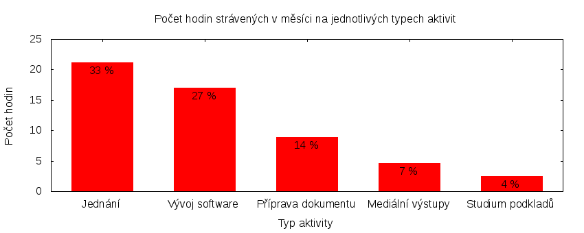

Česká pirátská strana  
krajské sdružení Praha  
klub Pirátů v Zastupitelstvu hl. m. Prahy

Výkaz odměňování
================

V tomtu výkazu zveřejňujeme základní informace o vykonané práci a odměňování osob. Výkaz je sestaven podle [metodiky odměňování][metodika],
která obsahuje podrobnosti. U všech údajů jsou uvedeny odkazy do projektového systému [redmine](https://redmine.pirati.cz). Upozorňujeme, že za podmínek stanovených v metodice mohou být některé úkoly v projektovém systému neveřejné.

Významné úkoly
----------------------

Následující seznam zahrnuje všechny úkoly z [projektu krajského sdružení Praha][kspraha], které zabraly déle než 3 hodiny. Zastupitel si může tento seznam doplnit či upravit podle své úvahy tak, aby podával co nejlepší informaci o odvedené práci.

Číslo              |   Název úkolu                                         |  Celkem           
-------------------|-------------------------------------------------------|------------------:
[#2099][task2099]  |   Výkaz odměn zastupitele                             |  [17.00][time2099]
[#2759][task2759]  |   Zasedání zastupitelstva 25. 2. 2016                 |  [12.00][time2759]
[#2735][task2735]  |   Technické normy ve stavebnictví – výkon rozhodnutí  |  [9.10][time2735] 
[#797][task797]    |   Kontrolní výbor                                     |  [5.51][time797]  
[#2612][task2612]  |   Zastupitelská úterý za rok 2016                     |  [4.00][time2612] 
[#678][task678]    |   Komise pro ICT                                      |  [3.00][time678]  

Můžete si zobrazit plný [přehled plněných úkolů][tasklist].

Měřitelné ukazatele
-------------------

Následující tabulka obsahuje měřitelné ukazatele za všechny úkoly v daném měsíci
včetně neveřejných úkolů. Proto mohou být hodiny v ní vyšší než se vám bez
přihlášení zobrazí v projektovém systému.

Rozsah činnosti                        | Počet hodin
--------------                         | ----------:
**A. Práce pro město**                 | [17.85][linktocityhours]
**B. Práce pro stranu**                | 80.74
*z toho*                               |
B.1 v projektu zastupitelstva          | [61.74][linktohomehours]
B.2 v ostatních projektech             | [19.00][linktootherhours]
**Celkový počet hodin**                | 98.59
Dohodnutý rozsah práce                 | 126.00
**Procento vytížení**                  | 78

Grafické znázornění [odpracované doby dle aktivity][activitylist]:

Graf zahrnuje pouze aktivity v [projektu krajského sdružení Praha][kspraha].

Odměňování
----------

Zastupitel má na základě zákona právo na odměnu a náhradu výdělku. Vedle toho na základě [smlouvy][smlouva] s Českou pirátskou stranou má také právo na odměnu podle rozsahu odvedené práce pro stranu.

Zdroj příjmu                           | Výše příjmu (Kč)
-----------------                      | --------------:
**A. Peníze od města**                 | 13518
*z toho*                               |
A.1 paušální odměna                    | 5486
A.2 náhrada výdělku                    | 8032
**B. Peníze od strany**                | TMPPARTYMONEY
*z toho*                               |
B.1 pevná složka odměny                | 5446
B.2 variabilní složka odměny           | TMPVARMONEY
*z toho*                               |
B.2.1 odměna za dodržení rozsahu práce | 608
B.2.2 odměna za přesčasy               | 0
B.2.3 odměna za významné splněné úkoly | TMPTASKSMONEY
B.2.4 odpočet za výhrady               | TMPSANCTIONS
**Celkový měsíční příjem**             | TMPTOTALMONEY

Částky jsou uváděny vždy v hrubé výši, přičemž z paušální odměny odvádí město zálohu na daň z příjmu a zdravotní pojištění. Je dále odpovědností každého zastupitele, aby příjem zdanil a zaplatil zákonné pojištění.

[metodika]: https://redmine.pirati.cz/projects/praha/wiki/Odm%C4%9B%C5%88ov%C3%A1n%C3%AD_zastupitel%C5%AF

[kspraha]: https://redmine.pirati.cz/projects/kspraha
[tasklist]: https://redmine.pirati.cz/projects/kspraha/time_entries/report?f[]=spent_on&f[]=user_id&op[user_id]==&f[]=&columns=month&criteria[]=issue&op[spent_on]=><&op[user_id]==&utf8=✓&v[spent_on][]=2016-02-01&v[spent_on][]=2016-02-29&v[user_id][]=4
[task2099]: https://redmine.pirati.cz/issues/2099
[time2099]:https://redmine.pirati.cz/issues/2099/time_entries?f[]=spent_on&f[]=user_id&f[]=&op[spent_on]=><&op[user_id]==&op[spent_on]=><&op[user_id]==&utf8=✓&v[spent_on][]=2016-02-01&v[spent_on][]=2016-02-29&v[user_id][]=4
[task2759]: https://redmine.pirati.cz/issues/2759
[time2759]:https://redmine.pirati.cz/issues/2759/time_entries?f[]=spent_on&f[]=user_id&f[]=&op[spent_on]=><&op[user_id]==&op[spent_on]=><&op[user_id]==&utf8=✓&v[spent_on][]=2016-02-01&v[spent_on][]=2016-02-29&v[user_id][]=4
[task2735]: https://redmine.pirati.cz/issues/2735
[time2735]:https://redmine.pirati.cz/issues/2735/time_entries?f[]=spent_on&f[]=user_id&f[]=&op[spent_on]=><&op[user_id]==&op[spent_on]=><&op[user_id]==&utf8=✓&v[spent_on][]=2016-02-01&v[spent_on][]=2016-02-29&v[user_id][]=4
[task797]: https://redmine.pirati.cz/issues/797
[time797]:https://redmine.pirati.cz/issues/797/time_entries?f[]=spent_on&f[]=user_id&f[]=&op[spent_on]=><&op[user_id]==&op[spent_on]=><&op[user_id]==&utf8=✓&v[spent_on][]=2016-02-01&v[spent_on][]=2016-02-29&v[user_id][]=4
[task2612]: https://redmine.pirati.cz/issues/2612
[time2612]:https://redmine.pirati.cz/issues/2612/time_entries?f[]=spent_on&f[]=user_id&f[]=&op[spent_on]=><&op[user_id]==&op[spent_on]=><&op[user_id]==&utf8=✓&v[spent_on][]=2016-02-01&v[spent_on][]=2016-02-29&v[user_id][]=4
[task678]: https://redmine.pirati.cz/issues/678
[time678]:https://redmine.pirati.cz/issues/678/time_entries?f[]=spent_on&f[]=user_id&f[]=&op[spent_on]=><&op[user_id]==&op[spent_on]=><&op[user_id]==&utf8=✓&v[spent_on][]=2016-02-01&v[spent_on][]=2016-02-29&v[user_id][]=4
[activitylist]: https://redmine.pirati.cz/projects/kspraha/time_entries/report?columns=month&criteria[]=activity&f[]=spent_on&f[]=user_id&f[]=&op[spent_on]=><&op[user_id]==&utf8=✓&v[spent_on][]=2016-02-01&v[spent_on][]=2016-02-29&v[user_id][]=4

[smlouva]: https://smlouvy.pirati.cz/smlouvy/2014/11/13/jakub-michalek/index.html
[linktocityhours]: https://redmine.pirati.cz/projects/praha/time_entries?f[]=spent_on&f[]=user_id&f[]=cf_16&f[]=&op[cf_16]=*&op[spent_on]=><&op[user_id]==&utf8=✓&v[spent_on][]=2016-02-01&v[spent_on][]=2016-02-29&v[user_id][]=4
[linktohomehours]: https://redmine.pirati.cz/projects/praha/time_entries?f[]=spent_on&f[]=user_id&f[]=&f[]=subproject_id&op[subproject_id]=!*&op[spent_on]=><&op[user_id]==&utf8=✓&v[spent_on][]=2016-02-01&v[spent_on][]=2016-02-29&v[user_id][]=4
[linktootherhours]: https://redmine.pirati.cz/time_entries?&columns=month&criteria[]=user&f[]=spent_on&f[]=user_id&f[]=cf_16&f[]=project_id&f[]=&op[cf_16]==&op[project_id]=!&v[cf_16][]=strana&v[project_id][]=15&op[spent_on]=><&op[user_id]==&utf8=✓&v[spent_on][]=2016-02-01&v[spent_on][]=2016-02-29&v[user_id][]=4
