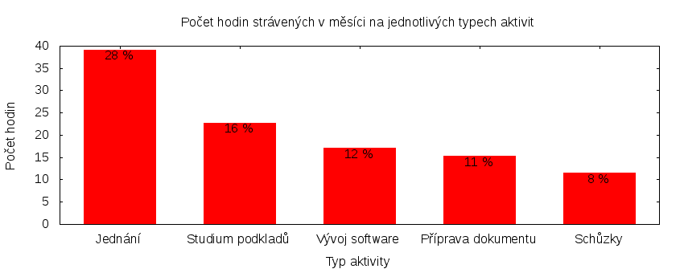

Česká pirátská strana  
krajské sdružení Praha  
klub Pirátů v Zastupitelstvu hl. m. Prahy

Výkaz odměňování
================

V tomtu výkazu zveřejňujeme základní informace o vykonané práci a odměňování osob. Výkaz je sestaven podle [metodiky odměňování][metodika],
která obsahuje podrobnosti. U všech údajů jsou uvedeny odkazy do projektového systému [redmine](https://redmine.pirati.cz). Upozorňujeme, že za podmínek stanovených v metodice mohou být některé úkoly v projektovém systému neveřejné.

Významné úkoly
----------------------

Následující seznam zahrnuje všechny úkoly z [projektu krajského sdružení Praha][kspraha], které zabraly déle než 3 hodiny. Zastupitel si může tento seznam doplnit či upravit podle své úvahy tak, aby podával co nejlepší informaci o odvedené práci.

Číslo              |   Název úkolu                                            |  Celkem           
-------------------|----------------------------------------------------------|------------------:
[#2759][task2759]  |   Zasedání zastupitelstva 25. 2. 2016                    |  [24.40][time2759]
[#933][task933]    |   Nový web Pirátů Praha                                  |  [16.40][time933] 
[#1670][task1670]  |   Konzultační skupina k TTIP                             |  [11.45][time1670]
[#1853][task1853]  |   Mediální výstupy ohledně ICT                           |  [9.71][time1853] 
[#148][task148]    |   OpenData na magistrátu                                 |  [6.85][time148]  
[#678][task678]    |   Komise pro ICT                                         |  [6.75][time678]  
[#674][task674]    |   Výbor pro správu majetku a majetkové podíly (majetek)  |  [6.00][time674]  
[#2612][task2612]  |   Zastupitelská úterý za rok 2016                        |  [5.90][time2612] 
[#2719][task2719]  |   Kandidáti do senátu                                    |  [5.75][time2719] 
[#2590][task2590]  |   Jednání klubu 2016                                     |  [5.10][time2590] 
[#224][task224]    |   Současné IT na magistrátu                              |  [3.60][time224]  

Můžete si zobrazit plný [přehled plněných úkolů][tasklist].

Měřitelné ukazatele
-------------------

Následující tabulka obsahuje měřitelné ukazatele za všechny úkoly v daném měsíci
včetně neveřejných úkolů. Proto mohou být hodiny v ní vyšší než se vám bez
přihlášení zobrazí v projektovém systému.

Rozsah činnosti                        | Počet hodin
--------------                         | ----------:
**A. Práce pro město**                 | [21.50][linktocityhours]
**B. Práce pro stranu**                | 116.16
*z toho*                               |
B.1 v projektu zastupitelstva          | [100.35][linktohomehours]
B.2 v ostatních projektech             | [15.81][linktootherhours]
**Celkový počet hodin**                | 137.66
Dohodnutý rozsah práce                 | 126.00
**Procento vytížení**                  | 109

Grafické znázornění [odpracované doby dle aktivity][activitylist]:

Graf zahrnuje pouze aktivity v [projektu krajského sdružení Praha][kspraha].

Odměňování
----------

Zastupitel má na základě zákona právo na odměnu a náhradu výdělku. Vedle toho na základě [smlouvy][smlouva] s Českou pirátskou stranou má také právo na odměnu podle rozsahu odvedené práce pro stranu.

Zdroj příjmu                           | Výše příjmu (Kč)
-----------------                      | --------------:
**A. Peníze od města**                 | 15161
*z toho*                               |
A.1 paušální odměna                    | 5486
A.2 náhrada výdělku                    | 9675
**B. Peníze od strany**                | 10338
*z toho*                               |
B.1 pevná složka odměny                | 7836
B.2 variabilní složka odměny           | 2502
*z toho*                               |
B.2.1 odměna za dodržení rozsahu práce | 1000
B.2.2 odměna za přesčasy               | 0
B.2.3 odměna za významné splněné úkoly | 2600
B.2.4 odpočet za výhrady               | 1098
**Celkový měsíční příjem**             | 25499

Částky jsou uváděny vždy v hrubé výši, přičemž z paušální odměny odvádí město zálohu na daň z příjmu a zdravotní pojištění. Je dále odpovědností každého zastupitele, aby příjem zdanil a zaplatil zákonné pojištění.

[metodika]: https://redmine.pirati.cz/projects/praha/wiki/Odm%C4%9B%C5%88ov%C3%A1n%C3%AD_zastupitel%C5%AF

[kspraha]: https://redmine.pirati.cz/projects/kspraha
[tasklist]: https://redmine.pirati.cz/projects/kspraha/time_entries/report?f[]=spent_on&f[]=user_id&op[user_id]==&f[]=&columns=month&criteria[]=issue&op[spent_on]=><&op[user_id]==&utf8=✓&v[spent_on][]=2016-02-01&v[spent_on][]=2016-02-29&v[user_id][]=3
[task2759]: https://redmine.pirati.cz/issues/2759
[time2759]:https://redmine.pirati.cz/issues/2759/time_entries?f[]=spent_on&f[]=user_id&f[]=&op[spent_on]=><&op[user_id]==&op[spent_on]=><&op[user_id]==&utf8=✓&v[spent_on][]=2016-02-01&v[spent_on][]=2016-02-29&v[user_id][]=3
[task933]: https://redmine.pirati.cz/issues/933
[time933]:https://redmine.pirati.cz/issues/933/time_entries?f[]=spent_on&f[]=user_id&f[]=&op[spent_on]=><&op[user_id]==&op[spent_on]=><&op[user_id]==&utf8=✓&v[spent_on][]=2016-02-01&v[spent_on][]=2016-02-29&v[user_id][]=3
[task1670]: https://redmine.pirati.cz/issues/1670
[time1670]:https://redmine.pirati.cz/issues/1670/time_entries?f[]=spent_on&f[]=user_id&f[]=&op[spent_on]=><&op[user_id]==&op[spent_on]=><&op[user_id]==&utf8=✓&v[spent_on][]=2016-02-01&v[spent_on][]=2016-02-29&v[user_id][]=3
[task1853]: https://redmine.pirati.cz/issues/1853
[time1853]:https://redmine.pirati.cz/issues/1853/time_entries?f[]=spent_on&f[]=user_id&f[]=&op[spent_on]=><&op[user_id]==&op[spent_on]=><&op[user_id]==&utf8=✓&v[spent_on][]=2016-02-01&v[spent_on][]=2016-02-29&v[user_id][]=3
[task148]: https://redmine.pirati.cz/issues/148
[time148]:https://redmine.pirati.cz/issues/148/time_entries?f[]=spent_on&f[]=user_id&f[]=&op[spent_on]=><&op[user_id]==&op[spent_on]=><&op[user_id]==&utf8=✓&v[spent_on][]=2016-02-01&v[spent_on][]=2016-02-29&v[user_id][]=3
[task678]: https://redmine.pirati.cz/issues/678
[time678]:https://redmine.pirati.cz/issues/678/time_entries?f[]=spent_on&f[]=user_id&f[]=&op[spent_on]=><&op[user_id]==&op[spent_on]=><&op[user_id]==&utf8=✓&v[spent_on][]=2016-02-01&v[spent_on][]=2016-02-29&v[user_id][]=3
[task674]: https://redmine.pirati.cz/issues/674
[time674]:https://redmine.pirati.cz/issues/674/time_entries?f[]=spent_on&f[]=user_id&f[]=&op[spent_on]=><&op[user_id]==&op[spent_on]=><&op[user_id]==&utf8=✓&v[spent_on][]=2016-02-01&v[spent_on][]=2016-02-29&v[user_id][]=3
[task2612]: https://redmine.pirati.cz/issues/2612
[time2612]:https://redmine.pirati.cz/issues/2612/time_entries?f[]=spent_on&f[]=user_id&f[]=&op[spent_on]=><&op[user_id]==&op[spent_on]=><&op[user_id]==&utf8=✓&v[spent_on][]=2016-02-01&v[spent_on][]=2016-02-29&v[user_id][]=3
[task2719]: https://redmine.pirati.cz/issues/2719
[time2719]:https://redmine.pirati.cz/issues/2719/time_entries?f[]=spent_on&f[]=user_id&f[]=&op[spent_on]=><&op[user_id]==&op[spent_on]=><&op[user_id]==&utf8=✓&v[spent_on][]=2016-02-01&v[spent_on][]=2016-02-29&v[user_id][]=3
[task2590]: https://redmine.pirati.cz/issues/2590
[time2590]:https://redmine.pirati.cz/issues/2590/time_entries?f[]=spent_on&f[]=user_id&f[]=&op[spent_on]=><&op[user_id]==&op[spent_on]=><&op[user_id]==&utf8=✓&v[spent_on][]=2016-02-01&v[spent_on][]=2016-02-29&v[user_id][]=3
[task224]: https://redmine.pirati.cz/issues/224
[time224]:https://redmine.pirati.cz/issues/224/time_entries?f[]=spent_on&f[]=user_id&f[]=&op[spent_on]=><&op[user_id]==&op[spent_on]=><&op[user_id]==&utf8=✓&v[spent_on][]=2016-02-01&v[spent_on][]=2016-02-29&v[user_id][]=3
[activitylist]: https://redmine.pirati.cz/projects/kspraha/time_entries/report?columns=month&criteria[]=activity&f[]=spent_on&f[]=user_id&f[]=&op[spent_on]=><&op[user_id]==&utf8=✓&v[spent_on][]=2016-02-01&v[spent_on][]=2016-02-29&v[user_id][]=3

[smlouva]: https://smlouvy.pirati.cz/smlouvy/2014/11/13/ondrej-profant/index.html
[linktocityhours]: https://redmine.pirati.cz/projects/praha/time_entries?f[]=spent_on&f[]=user_id&f[]=cf_16&f[]=&op[cf_16]=*&op[spent_on]=><&op[user_id]==&utf8=✓&v[spent_on][]=2016-02-01&v[spent_on][]=2016-02-29&v[user_id][]=3
[linktohomehours]: https://redmine.pirati.cz/projects/praha/time_entries?f[]=spent_on&f[]=user_id&f[]=&f[]=subproject_id&op[subproject_id]=!*&op[spent_on]=><&op[user_id]==&utf8=✓&v[spent_on][]=2016-02-01&v[spent_on][]=2016-02-29&v[user_id][]=3&f[]=cf_16&op[cf_16]=!*
[linktootherhours]: https://redmine.pirati.cz/time_entries?&columns=month&criteria[]=user&f[]=spent_on&f[]=user_id&f[]=cf_16&f[]=project_id&f[]=&op[cf_16]==&op[project_id]=!&v[cf_16][]=strana&v[project_id][]=15&op[spent_on]=><&op[user_id]==&utf8=✓&v[spent_on][]=2016-02-01&v[spent_on][]=2016-02-29&v[user_id][]=3
