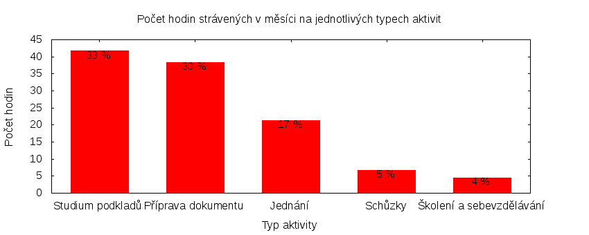

Česká pirátská strana  
krajské sdružení Praha  
klub Pirátů v Zastupitelstvu hl. m. Prahy

Výkaz odměňování
================

V tomtu výkazu zveřejňujeme základní informace o vykonané práci a odměňování osob. Výkaz je sestaven podle [metodiky odměňování][metodika],
která obsahuje podrobnosti. U všech údajů jsou uvedeny odkazy do projektového systému [redmine](https://redmine.pirati.cz). Upozorňujeme, že za podmínek stanovených v metodice mohou být některé úkoly v projektovém systému neveřejné.

Významné úkoly
----------------------

Následující seznam zahrnuje všechny úkoly z [projektu krajského sdružení Praha][kspraha], které zabraly déle než 3 hodiny. Zastupitel si může tento seznam doplnit či upravit podle své úvahy tak, aby podával co nejlepší informaci o odvedené práci.

Číslo              |   Název úkolu                                      |  Celkem           
-------------------|----------------------------------------------------|------------------:
[#2316][task2316]  |   Připomínkování strategického plánu hl. m. Prahy  |  [21.70][time2316]
[#2846][task2846]  |   Zasedání zastupitelstva 31. 3. 2016              |  [21.65][time2846]
[#184][task184]    |   Rada hl. m. Prahy                                |  [9.90][time184]  
[#2653][task2653]  |   SVOČ na téma Přístup zastupitelů k informacím    |  [9.40][time2653] 
[#105][task105]    |   Podněty občanů                                   |  [4.85][time105]  
[#2795][task2795]  |   Zveřejňování dat z maturit                       |  [4.45][time2795] 
[#182][task182]    |   Jednání klubu                                    |  [3.65][time182]  
[#2879][task2879]  |   Konference Dobrá radnice 2016                    |  [3.50][time2879] 
[#652][task652]    |   Výbor pro sport a volný čas                      |  [3.40][time652]  
[#2590][task2590]  |   Jednání klubu 2016                               |  [3.25][time2590] 
[#914][task914]    |   Vykazování úkolů                                 |  [3.20][time914]  
[#2550][task2550]  |   Zjištění podkladů k metropolitnímu plánu         |  [3.10][time2550] 
[#2065][task2065]  |   Kauza koeficienty                                |  [3.00][time2065] 

Můžete si zobrazit plný [přehled plněných úkolů][tasklist].

Měřitelné ukazatele
-------------------

Následující tabulka obsahuje měřitelné ukazatele za všechny úkoly v daném měsíci
včetně neveřejných úkolů. Proto mohou být hodiny v ní vyšší než se vám bez
přihlášení zobrazí v projektovém systému.

Rozsah činnosti                        | Počet hodin
--------------                         | ----------:
**A. Práce pro město**                 | [18.40][linktocityhours]
**B. Práce pro stranu**                | 108.00
*z toho*                               |
B.1 v projektu zastupitelstva          | [108.00][linktohomehours]
B.2 v ostatních projektech             | [0.00][linktootherhours]
**Celkový počet hodin**                | 126.40
Dohodnutý rozsah práce                 | 126.00
**Procento vytížení**                  | 100

Grafické znázornění [odpracované doby dle aktivity][activitylist]:

Graf zahrnuje pouze aktivity v [projektu krajského sdružení Praha][kspraha].

Odměňování
----------

Zastupitel má na základě zákona právo na odměnu a náhradu výdělku. Vedle toho na základě [smlouvy][smlouva] s Českou pirátskou stranou má také právo na odměnu podle rozsahu odvedené práce pro stranu.

Zdroj příjmu                           | Výše příjmu (Kč)
-----------------                      | --------------:
**A. Peníze od města**                 | 13766
*z toho*                               |
A.1 paušální odměna                    | 5486
A.2 náhrada výdělku                    | 8280
**B. Peníze od strany**                | 11285
*z toho*                               |
B.1 pevná složka odměny                | 7285
B.2 variabilní složka odměny           | 4000
*z toho*                               |
B.2.1 odměna za dodržení rozsahu práce | 1000
B.2.2 odměna za přesčasy               | 0
B.2.3 odměna za významné splněné úkoly | 3000
B.2.4 odpočet za výhrady               | 0
**Celkový měsíční příjem**             | 25051

Částky jsou uváděny vždy v hrubé výši, přičemž z paušální odměny odvádí město zálohu na daň z příjmu a zdravotní pojištění. Je dále odpovědností každého zastupitele, aby příjem zdanil a zaplatil zákonné pojištění.

[metodika]: https://redmine.pirati.cz/projects/praha/wiki/Odm%C4%9B%C5%88ov%C3%A1n%C3%AD_zastupitel%C5%AF

[kspraha]: https://redmine.pirati.cz/projects/kspraha
[tasklist]: https://redmine.pirati.cz/projects/kspraha/time_entries/report?f[]=spent_on&f[]=user_id&op[user_id]==&f[]=&columns=month&criteria[]=issue&op[spent_on]=><&op[user_id]==&utf8=✓&v[spent_on][]=2016-03-01&v[spent_on][]=2016-03-31&v[user_id][]=16
[task2316]: https://redmine.pirati.cz/issues/2316
[time2316]:https://redmine.pirati.cz/issues/2316/time_entries?f[]=spent_on&f[]=user_id&f[]=&op[spent_on]=><&op[user_id]==&op[spent_on]=><&op[user_id]==&utf8=✓&v[spent_on][]=2016-03-01&v[spent_on][]=2016-03-31&v[user_id][]=16
[task2846]: https://redmine.pirati.cz/issues/2846
[time2846]:https://redmine.pirati.cz/issues/2846/time_entries?f[]=spent_on&f[]=user_id&f[]=&op[spent_on]=><&op[user_id]==&op[spent_on]=><&op[user_id]==&utf8=✓&v[spent_on][]=2016-03-01&v[spent_on][]=2016-03-31&v[user_id][]=16
[task184]: https://redmine.pirati.cz/issues/184
[time184]:https://redmine.pirati.cz/issues/184/time_entries?f[]=spent_on&f[]=user_id&f[]=&op[spent_on]=><&op[user_id]==&op[spent_on]=><&op[user_id]==&utf8=✓&v[spent_on][]=2016-03-01&v[spent_on][]=2016-03-31&v[user_id][]=16
[task2653]: https://redmine.pirati.cz/issues/2653
[time2653]:https://redmine.pirati.cz/issues/2653/time_entries?f[]=spent_on&f[]=user_id&f[]=&op[spent_on]=><&op[user_id]==&op[spent_on]=><&op[user_id]==&utf8=✓&v[spent_on][]=2016-03-01&v[spent_on][]=2016-03-31&v[user_id][]=16
[task105]: https://redmine.pirati.cz/issues/105
[time105]:https://redmine.pirati.cz/issues/105/time_entries?f[]=spent_on&f[]=user_id&f[]=&op[spent_on]=><&op[user_id]==&op[spent_on]=><&op[user_id]==&utf8=✓&v[spent_on][]=2016-03-01&v[spent_on][]=2016-03-31&v[user_id][]=16
[task2795]: https://redmine.pirati.cz/issues/2795
[time2795]:https://redmine.pirati.cz/issues/2795/time_entries?f[]=spent_on&f[]=user_id&f[]=&op[spent_on]=><&op[user_id]==&op[spent_on]=><&op[user_id]==&utf8=✓&v[spent_on][]=2016-03-01&v[spent_on][]=2016-03-31&v[user_id][]=16
[task182]: https://redmine.pirati.cz/issues/182
[time182]:https://redmine.pirati.cz/issues/182/time_entries?f[]=spent_on&f[]=user_id&f[]=&op[spent_on]=><&op[user_id]==&op[spent_on]=><&op[user_id]==&utf8=✓&v[spent_on][]=2016-03-01&v[spent_on][]=2016-03-31&v[user_id][]=16
[task2879]: https://redmine.pirati.cz/issues/2879
[time2879]:https://redmine.pirati.cz/issues/2879/time_entries?f[]=spent_on&f[]=user_id&f[]=&op[spent_on]=><&op[user_id]==&op[spent_on]=><&op[user_id]==&utf8=✓&v[spent_on][]=2016-03-01&v[spent_on][]=2016-03-31&v[user_id][]=16
[task652]: https://redmine.pirati.cz/issues/652
[time652]:https://redmine.pirati.cz/issues/652/time_entries?f[]=spent_on&f[]=user_id&f[]=&op[spent_on]=><&op[user_id]==&op[spent_on]=><&op[user_id]==&utf8=✓&v[spent_on][]=2016-03-01&v[spent_on][]=2016-03-31&v[user_id][]=16
[task2590]: https://redmine.pirati.cz/issues/2590
[time2590]:https://redmine.pirati.cz/issues/2590/time_entries?f[]=spent_on&f[]=user_id&f[]=&op[spent_on]=><&op[user_id]==&op[spent_on]=><&op[user_id]==&utf8=✓&v[spent_on][]=2016-03-01&v[spent_on][]=2016-03-31&v[user_id][]=16
[task914]: https://redmine.pirati.cz/issues/914
[time914]:https://redmine.pirati.cz/issues/914/time_entries?f[]=spent_on&f[]=user_id&f[]=&op[spent_on]=><&op[user_id]==&op[spent_on]=><&op[user_id]==&utf8=✓&v[spent_on][]=2016-03-01&v[spent_on][]=2016-03-31&v[user_id][]=16
[task2550]: https://redmine.pirati.cz/issues/2550
[time2550]:https://redmine.pirati.cz/issues/2550/time_entries?f[]=spent_on&f[]=user_id&f[]=&op[spent_on]=><&op[user_id]==&op[spent_on]=><&op[user_id]==&utf8=✓&v[spent_on][]=2016-03-01&v[spent_on][]=2016-03-31&v[user_id][]=16
[task2065]: https://redmine.pirati.cz/issues/2065
[time2065]:https://redmine.pirati.cz/issues/2065/time_entries?f[]=spent_on&f[]=user_id&f[]=&op[spent_on]=><&op[user_id]==&op[spent_on]=><&op[user_id]==&utf8=✓&v[spent_on][]=2016-03-01&v[spent_on][]=2016-03-31&v[user_id][]=16
[activitylist]: https://redmine.pirati.cz/projects/kspraha/time_entries/report?columns=month&criteria[]=activity&f[]=spent_on&f[]=user_id&f[]=&op[spent_on]=><&op[user_id]==&utf8=✓&v[spent_on][]=2016-03-01&v[spent_on][]=2016-03-31&v[user_id][]=16

[smlouva]: https://smlouvy.pirati.cz/smlouvy/2014/11/13/adam-zabransky/index.html
[linktocityhours]: https://redmine.pirati.cz/projects/praha/time_entries?f[]=spent_on&f[]=user_id&f[]=cf_16&f[]=&op[cf_16]=*&op[spent_on]=><&op[user_id]==&utf8=✓&v[spent_on][]=2016-03-01&v[spent_on][]=2016-03-31&v[user_id][]=16
[linktohomehours]: https://redmine.pirati.cz/projects/praha/time_entries?f[]=spent_on&f[]=user_id&f[]=&f[]=subproject_id&op[subproject_id]=!*&op[spent_on]=><&op[user_id]==&utf8=✓&v[spent_on][]=2016-03-01&v[spent_on][]=2016-03-31&v[user_id][]=16&f[]=cf_16&op[cf_16]=!*
[linktootherhours]: https://redmine.pirati.cz/time_entries?&columns=month&criteria[]=user&f[]=spent_on&f[]=user_id&f[]=cf_16&f[]=project_id&f[]=&op[cf_16]==&op[project_id]=!&v[cf_16][]=strana&v[project_id][]=15&op[spent_on]=><&op[user_id]==&utf8=✓&v[spent_on][]=2016-03-01&v[spent_on][]=2016-03-31&v[user_id][]=16
