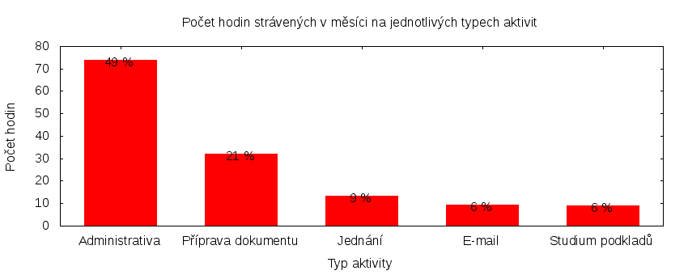

Česká pirátská strana  
krajské sdružení Praha  
klub Pirátů v Zastupitelstvu hl. m. Prahy

Výkaz odměňování
================

V tomtu výkazu zveřejňujeme základní informace o vykonané práci a odměňování osob. Výkaz je sestaven podle [metodiky odměňování][metodika],
která obsahuje podrobnosti. U všech údajů jsou uvedeny odkazy do projektového systému [redmine](https://redmine.pirati.cz). Upozorňujeme, že za podmínek stanovených v metodice mohou být některé úkoly v projektovém systému neveřejné.

Významné úkoly
----------------------

Následující seznam zahrnuje všechny úkoly z [projektu krajského sdružení Praha][kspraha], které zabraly déle než 3 hodiny. Zaměstnanec si může tento seznam doplnit či upravit podle své úvahy tak, aby podával co nejlepší informaci o odvedené práci.

Číslo              |   Název úkolu                                 |  Celkem           
-------------------|-----------------------------------------------|------------------:
[#237][task237]    |   Spisová služba                              |  [36.55][time237] 
[#2846][task2846]  |   Zasedání zastupitelstva 31. 3. 2016         |  [18.96][time2846]
[#597][task597]    |   E-mailová komunikace                        |  [10.84][time597] 
[#1256][task1256]  |   Práce s grafikou                            |  [9.92][time1256] 
[#165][task165]    |   Mediální výstupy                            |  [9.86][time165]  
[#658][task658]    |   Administrativa                              |  [7.84][time658]  
[#2786][task2786]  |   Rekreační areál Džbán                       |  [6.97][time2786] 
[#914][task914]    |   Vykazování úkolů                            |  [5.15][time914]  
[#2612][task2612]  |   Zastupitelská úterý za rok 2016             |  [4.92][time2612] 
[#506][task506]    |   Proplácení nákladů zastupitelské kanceláře  |  [4.33][time506]  
[#598][task598]    |   Telefonická komunikace                      |  [4.07][time598]  
[#1102][task1102]  |   Zprovoznit newsletter                       |  [3.15][time1102] 

Můžete si zobrazit plný [přehled plněných úkolů][tasklist].

Měřitelné ukazatele
-------------------

Následující tabulka obsahuje měřitelné ukazatele za všechny úkoly v daném měsíci
včetně neveřejných úkolů. Proto mohou být hodiny v ní vyšší, než se vám bez
přihlášení zobrazí v projektovém systému.

Rozsah činnosti                        | Počet hodin
--------------                         | ----------:
**A. Práce pro město**                 | [152.50][linktocityhours]
**Celkový počet hodin**                | 152.50
Dohodnutý rozsah práce                 | 168.00
**Procento vytížení**                  | 90

Grafické znázornění [odpracované doby dle aktivity][activitylist]:

Graf zahrnuje pouze aktivity v [projektu krajského sdružení Praha][kspraha].

Odměňování
----------

Odměňování zaměstnance není přímo vázáno na počet hodin evidovaný v našem projektovém systému. Odměny zaměstnance určuje ředitel odboru volených orgánů Magistrátu hl. m. Prahy.

Zdroj příjmu                           | Výše příjmu (Kč)
-----------------                      | --------------:
**A. Peníze od města**                 | 15000
*z toho*                               |
A.1 měsíční plat zaměstnance           | 15000
A.2 mimořádná odměna                   | 0
**Celkový měsíční příjem**             | 15000

Částky jsou uváděny vždy v hrubé výši, přičemž z platu odvádí město zálohy na daň z příjmu a zákonné pojištění. Vedle toho město platí za zaměstnance odvody na straně zaměstnavatele.

[metodika]: https://redmine.pirati.cz/projects/praha/wiki/Odm%C4%9B%C5%88ov%C3%A1n%C3%AD_zastupitel%C5%AF

[kspraha]: https://redmine.pirati.cz/projects/kspraha
[tasklist]: https://redmine.pirati.cz/projects/kspraha/time_entries/report?f[]=spent_on&f[]=user_id&op[user_id]==&f[]=&columns=month&criteria[]=issue&op[spent_on]=><&op[user_id]==&utf8=✓&v[spent_on][]=2016-03-01&v[spent_on][]=2016-03-31&v[user_id][]=46
[task237]: https://redmine.pirati.cz/issues/237
[time237]:https://redmine.pirati.cz/issues/237/time_entries?f[]=spent_on&f[]=user_id&f[]=&op[spent_on]=><&op[user_id]==&op[spent_on]=><&op[user_id]==&utf8=✓&v[spent_on][]=2016-03-01&v[spent_on][]=2016-03-31&v[user_id][]=46
[task2846]: https://redmine.pirati.cz/issues/2846
[time2846]:https://redmine.pirati.cz/issues/2846/time_entries?f[]=spent_on&f[]=user_id&f[]=&op[spent_on]=><&op[user_id]==&op[spent_on]=><&op[user_id]==&utf8=✓&v[spent_on][]=2016-03-01&v[spent_on][]=2016-03-31&v[user_id][]=46
[task597]: https://redmine.pirati.cz/issues/597
[time597]:https://redmine.pirati.cz/issues/597/time_entries?f[]=spent_on&f[]=user_id&f[]=&op[spent_on]=><&op[user_id]==&op[spent_on]=><&op[user_id]==&utf8=✓&v[spent_on][]=2016-03-01&v[spent_on][]=2016-03-31&v[user_id][]=46
[task1256]: https://redmine.pirati.cz/issues/1256
[time1256]:https://redmine.pirati.cz/issues/1256/time_entries?f[]=spent_on&f[]=user_id&f[]=&op[spent_on]=><&op[user_id]==&op[spent_on]=><&op[user_id]==&utf8=✓&v[spent_on][]=2016-03-01&v[spent_on][]=2016-03-31&v[user_id][]=46
[task165]: https://redmine.pirati.cz/issues/165
[time165]:https://redmine.pirati.cz/issues/165/time_entries?f[]=spent_on&f[]=user_id&f[]=&op[spent_on]=><&op[user_id]==&op[spent_on]=><&op[user_id]==&utf8=✓&v[spent_on][]=2016-03-01&v[spent_on][]=2016-03-31&v[user_id][]=46
[task658]: https://redmine.pirati.cz/issues/658
[time658]:https://redmine.pirati.cz/issues/658/time_entries?f[]=spent_on&f[]=user_id&f[]=&op[spent_on]=><&op[user_id]==&op[spent_on]=><&op[user_id]==&utf8=✓&v[spent_on][]=2016-03-01&v[spent_on][]=2016-03-31&v[user_id][]=46
[task2786]: https://redmine.pirati.cz/issues/2786
[time2786]:https://redmine.pirati.cz/issues/2786/time_entries?f[]=spent_on&f[]=user_id&f[]=&op[spent_on]=><&op[user_id]==&op[spent_on]=><&op[user_id]==&utf8=✓&v[spent_on][]=2016-03-01&v[spent_on][]=2016-03-31&v[user_id][]=46
[task914]: https://redmine.pirati.cz/issues/914
[time914]:https://redmine.pirati.cz/issues/914/time_entries?f[]=spent_on&f[]=user_id&f[]=&op[spent_on]=><&op[user_id]==&op[spent_on]=><&op[user_id]==&utf8=✓&v[spent_on][]=2016-03-01&v[spent_on][]=2016-03-31&v[user_id][]=46
[task2612]: https://redmine.pirati.cz/issues/2612
[time2612]:https://redmine.pirati.cz/issues/2612/time_entries?f[]=spent_on&f[]=user_id&f[]=&op[spent_on]=><&op[user_id]==&op[spent_on]=><&op[user_id]==&utf8=✓&v[spent_on][]=2016-03-01&v[spent_on][]=2016-03-31&v[user_id][]=46
[task506]: https://redmine.pirati.cz/issues/506
[time506]:https://redmine.pirati.cz/issues/506/time_entries?f[]=spent_on&f[]=user_id&f[]=&op[spent_on]=><&op[user_id]==&op[spent_on]=><&op[user_id]==&utf8=✓&v[spent_on][]=2016-03-01&v[spent_on][]=2016-03-31&v[user_id][]=46
[task598]: https://redmine.pirati.cz/issues/598
[time598]:https://redmine.pirati.cz/issues/598/time_entries?f[]=spent_on&f[]=user_id&f[]=&op[spent_on]=><&op[user_id]==&op[spent_on]=><&op[user_id]==&utf8=✓&v[spent_on][]=2016-03-01&v[spent_on][]=2016-03-31&v[user_id][]=46
[task1102]: https://redmine.pirati.cz/issues/1102
[time1102]:https://redmine.pirati.cz/issues/1102/time_entries?f[]=spent_on&f[]=user_id&f[]=&op[spent_on]=><&op[user_id]==&op[spent_on]=><&op[user_id]==&utf8=✓&v[spent_on][]=2016-03-01&v[spent_on][]=2016-03-31&v[user_id][]=46
[activitylist]: https://redmine.pirati.cz/projects/kspraha/time_entries/report?columns=month&criteria[]=activity&f[]=spent_on&f[]=user_id&f[]=&op[spent_on]=><&op[user_id]==&utf8=✓&v[spent_on][]=2016-03-01&v[spent_on][]=2016-03-31&v[user_id][]=46

[linktocityhours]: https://redmine.pirati.cz/projects/praha/time_entries?f[]=spent_on&f[]=user_id&f[]=&op[spent_on]=><&op[user_id]==&utf8=✓&v[spent_on][]=2016-03-01&v[spent_on][]=2016-03-31&v[user_id][]=46
