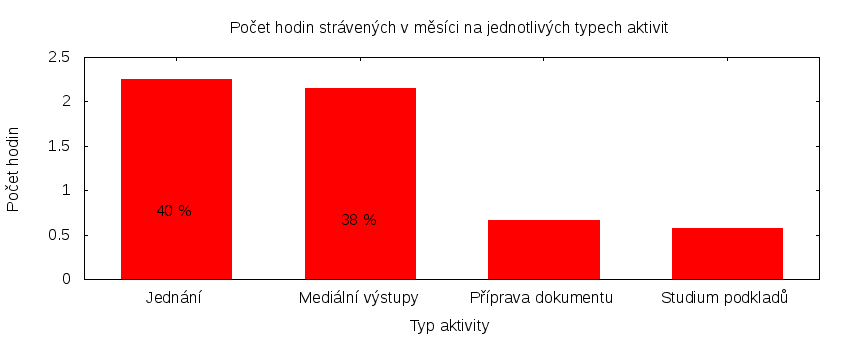

Česká pirátská strana  
krajské sdružení Praha  
klub Pirátů v Zastupitelstvu hl. m. Prahy

Výkaz odměňování
================

V tomtu výkazu zveřejňujeme základní informace o vykonané práci a odměňování osob. Výkaz je sestaven podle [metodiky odměňování][metodika],
která obsahuje podrobnosti. U všech údajů jsou uvedeny odkazy do projektového systému [redmine](https://redmine.pirati.cz). Upozorňujeme, že za podmínek stanovených v metodice mohou být některé úkoly v projektovém systému neveřejné.

Významné úkoly
----------------------

Následující seznam zahrnuje všechny úkoly z [projektu krajského sdružení Praha][kspraha], které zabraly déle než 3 hodiny. Zastupitel si může tento seznam doplnit či upravit podle své úvahy tak, aby podával co nejlepší informaci o odvedené práci.

Číslo              |   Název úkolu                            |  Celkem           
-------------------|------------------------------------------|------------------:
[#2846][task2846]  |   Zasedání zastupitelstva 31. 3. 2016    |  [19.91][time2846]
[#165][task165]    |   Mediální výstupy                       |  [10.81][time165] 
[#686][task686]    |   Šíření informací a sdílení zkušeností  |  [7.66][time686]  
[#2590][task2590]  |   Jednání klubu 2016                     |  [5.00][time2590] 
[#597][task597]    |   E-mailová komunikace                   |  [3.16][time597]  
[#1862][task1862]  |   nezveřejněný úkol                      |  [3.15][time1862] 
[#2311][task2311]  |   Pirátské listy 2016                    |  [3.08][time2311] 
[#2612][task2612]  |   Zastupitelská úterý za rok 2016        |  [3.00][time2612] 
[#582][task582]    |   Podpora Kliniky                        |  [3.00][time582]  

Můžete si zobrazit plný [přehled plněných úkolů][tasklist].

Měřitelné ukazatele
-------------------

Následující tabulka obsahuje měřitelné ukazatele za všechny úkoly v daném měsíci
včetně neveřejných úkolů. Proto mohou být hodiny v ní vyšší než se vám bez
přihlášení zobrazí v projektovém systému.

Rozsah činnosti                        | Počet hodin
--------------                         | ----------:
**A. Práce pro město**                 | [15.25][linktocityhours]
**B. Práce pro stranu**                | 54.54
*z toho*                               |
B.1 v projektu zastupitelstva          | [53.88][linktohomehours]
B.2 v ostatních projektech             | [0.66][linktootherhours]
**Celkový počet hodin**                | 69.79
Dohodnutý rozsah práce                 | 126.00
**Procento vytížení**                  | 55

Grafické znázornění [odpracované doby dle aktivity][activitylist]:

Graf zahrnuje pouze aktivity v [projektu krajského sdružení Praha][kspraha].

Odměňování
----------

Zastupitel má na základě zákona právo na odměnu a náhradu výdělku. Vedle toho na základě [smlouvy][smlouva] s Českou pirátskou stranou má také právo na odměnu podle rozsahu odvedené práce pro stranu.

Zdroj příjmu                           | Výše příjmu (Kč)
-----------------                      | --------------:
**A. Peníze od města**                 | 12348
*z toho*                               |
A.1 paušální odměna                    | 5486
A.2 náhrada výdělku                    | 6862
**B. Peníze od strany**                | 3981
*z toho*                               |
B.1 pevná složka odměny                | 3679
B.2 variabilní složka odměny           | 302
*z toho*                               |
B.2.1 odměna za dodržení rozsahu práce | 302
B.2.2 odměna za přesčasy               | 0
B.2.3 odměna za významné splněné úkoly | 0
B.2.4 odpočet za výhrady               | 0
**Celkový měsíční příjem**             | 16329

Částky jsou uváděny vždy v hrubé výši, přičemž z paušální odměny odvádí město zálohu na daň z příjmu a zdravotní pojištění. Je dále odpovědností každého zastupitele, aby příjem zdanil a zaplatil zákonné pojištění.

[metodika]: https://redmine.pirati.cz/projects/praha/wiki/Odm%C4%9B%C5%88ov%C3%A1n%C3%AD_zastupitel%C5%AF

[kspraha]: https://redmine.pirati.cz/projects/kspraha
[tasklist]: https://redmine.pirati.cz/projects/kspraha/time_entries/report?f[]=spent_on&f[]=user_id&op[user_id]==&f[]=&columns=month&criteria[]=issue&op[spent_on]=><&op[user_id]==&utf8=✓&v[spent_on][]=2016-03-01&v[spent_on][]=2016-03-31&v[user_id][]=17
[task2846]: https://redmine.pirati.cz/issues/2846
[time2846]:https://redmine.pirati.cz/issues/2846/time_entries?f[]=spent_on&f[]=user_id&f[]=&op[spent_on]=><&op[user_id]==&op[spent_on]=><&op[user_id]==&utf8=✓&v[spent_on][]=2016-03-01&v[spent_on][]=2016-03-31&v[user_id][]=17
[task165]: https://redmine.pirati.cz/issues/165
[time165]:https://redmine.pirati.cz/issues/165/time_entries?f[]=spent_on&f[]=user_id&f[]=&op[spent_on]=><&op[user_id]==&op[spent_on]=><&op[user_id]==&utf8=✓&v[spent_on][]=2016-03-01&v[spent_on][]=2016-03-31&v[user_id][]=17
[task686]: https://redmine.pirati.cz/issues/686
[time686]:https://redmine.pirati.cz/issues/686/time_entries?f[]=spent_on&f[]=user_id&f[]=&op[spent_on]=><&op[user_id]==&op[spent_on]=><&op[user_id]==&utf8=✓&v[spent_on][]=2016-03-01&v[spent_on][]=2016-03-31&v[user_id][]=17
[task2590]: https://redmine.pirati.cz/issues/2590
[time2590]:https://redmine.pirati.cz/issues/2590/time_entries?f[]=spent_on&f[]=user_id&f[]=&op[spent_on]=><&op[user_id]==&op[spent_on]=><&op[user_id]==&utf8=✓&v[spent_on][]=2016-03-01&v[spent_on][]=2016-03-31&v[user_id][]=17
[task597]: https://redmine.pirati.cz/issues/597
[time597]:https://redmine.pirati.cz/issues/597/time_entries?f[]=spent_on&f[]=user_id&f[]=&op[spent_on]=><&op[user_id]==&op[spent_on]=><&op[user_id]==&utf8=✓&v[spent_on][]=2016-03-01&v[spent_on][]=2016-03-31&v[user_id][]=17
[task1862]: https://redmine.pirati.cz/issues/1862
[time1862]:https://redmine.pirati.cz/issues/1862/time_entries?f[]=spent_on&f[]=user_id&f[]=&op[spent_on]=><&op[user_id]==&op[spent_on]=><&op[user_id]==&utf8=✓&v[spent_on][]=2016-03-01&v[spent_on][]=2016-03-31&v[user_id][]=17
[task2311]: https://redmine.pirati.cz/issues/2311
[time2311]:https://redmine.pirati.cz/issues/2311/time_entries?f[]=spent_on&f[]=user_id&f[]=&op[spent_on]=><&op[user_id]==&op[spent_on]=><&op[user_id]==&utf8=✓&v[spent_on][]=2016-03-01&v[spent_on][]=2016-03-31&v[user_id][]=17
[task2612]: https://redmine.pirati.cz/issues/2612
[time2612]:https://redmine.pirati.cz/issues/2612/time_entries?f[]=spent_on&f[]=user_id&f[]=&op[spent_on]=><&op[user_id]==&op[spent_on]=><&op[user_id]==&utf8=✓&v[spent_on][]=2016-03-01&v[spent_on][]=2016-03-31&v[user_id][]=17
[task582]: https://redmine.pirati.cz/issues/582
[time582]:https://redmine.pirati.cz/issues/582/time_entries?f[]=spent_on&f[]=user_id&f[]=&op[spent_on]=><&op[user_id]==&op[spent_on]=><&op[user_id]==&utf8=✓&v[spent_on][]=2016-03-01&v[spent_on][]=2016-03-31&v[user_id][]=17
[activitylist]: https://redmine.pirati.cz/projects/kspraha/time_entries/report?columns=month&criteria[]=activity&f[]=spent_on&f[]=user_id&f[]=&op[spent_on]=><&op[user_id]==&utf8=✓&v[spent_on][]=2016-03-01&v[spent_on][]=2016-03-31&v[user_id][]=17

[smlouva]: https://smlouvy.pirati.cz/smlouvy/2014/11/13/mikulas-ferjencik/index.html
[linktocityhours]: https://redmine.pirati.cz/projects/praha/time_entries?f[]=spent_on&f[]=user_id&f[]=cf_16&f[]=&op[cf_16]=*&op[spent_on]=><&op[user_id]==&utf8=✓&v[spent_on][]=2016-03-01&v[spent_on][]=2016-03-31&v[user_id][]=17
[linktohomehours]: https://redmine.pirati.cz/projects/praha/time_entries?f[]=spent_on&f[]=user_id&f[]=&f[]=subproject_id&op[subproject_id]=!*&op[spent_on]=><&op[user_id]==&utf8=✓&v[spent_on][]=2016-03-01&v[spent_on][]=2016-03-31&v[user_id][]=17&f[]=cf_16&op[cf_16]=!*
[linktootherhours]: https://redmine.pirati.cz/time_entries?&columns=month&criteria[]=user&f[]=spent_on&f[]=user_id&f[]=cf_16&f[]=project_id&f[]=&op[cf_16]==&op[project_id]=!&v[cf_16][]=strana&v[project_id][]=15&op[spent_on]=><&op[user_id]==&utf8=✓&v[spent_on][]=2016-03-01&v[spent_on][]=2016-03-31&v[user_id][]=17
