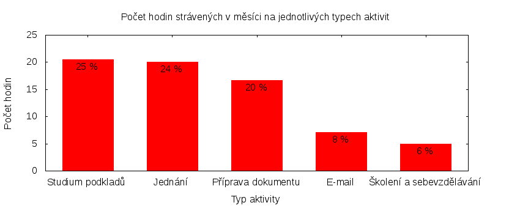

Česká pirátská strana  
krajské sdružení Praha  
klub Pirátů v Zastupitelstvu hl. m. Prahy

Výkaz odměňování
================

V tomtu výkazu zveřejňujeme základní informace o vykonané práci a odměňování osob. Výkaz je sestaven podle [metodiky odměňování][metodika],
která obsahuje podrobnosti. U všech údajů jsou uvedeny odkazy do projektového systému [redmine](https://redmine.pirati.cz). Upozorňujeme, že za podmínek stanovených v metodice mohou být některé úkoly v projektovém systému neveřejné.

Významné úkoly
----------------------

Následující seznam zahrnuje všechny úkoly z [projektu krajského sdružení Praha][kspraha], které zabraly déle než 3 hodiny. Zastupitel si může tento seznam doplnit či upravit podle své úvahy tak, aby podával co nejlepší informaci o odvedené práci.

Číslo              |   Název úkolu                                    |  Celkem           
-------------------|--------------------------------------------------|------------------:
[#2911][task2911]  |   Zasedání zastupitelstva 28. 4. 2016            |  [15.75][time2911]
[#105][task105]    |   Podněty občanů                                 |  [7.90][time105]  
[#597][task597]    |   E-mailová komunikace                           |  [5.75][time597]  
[#184][task184]    |   Rada hl. m. Prahy                              |  [5.60][time184]  
[#799][task799]    |   Výbor pro výchovu a vzdělávání                 |  [4.80][time799]  
[#237][task237]    |   Spisová služba                                 |  [4.45][time237]  
[#2653][task2653]  |   SVOČ na téma Přístup zastupitelů k informacím  |  [4.20][time2653] 
[#693][task693]    |   Sebevzdělávání                                 |  [3.75][time693]  
[#2612][task2612]  |   Zastupitelská úterý za rok 2016                |  [3.60][time2612] 
[#2308][task2308]  |   Zveřejnění faktur Magistrátu                   |  [3.25][time2308] 
[#2311][task2311]  |   Pirátské listy 2016                            |  [3.25][time2311] 

Můžete si zobrazit plný [přehled plněných úkolů][tasklist].

Měřitelné ukazatele
-------------------

Následující tabulka obsahuje měřitelné ukazatele za všechny úkoly v daném měsíci
včetně neveřejných úkolů. Proto mohou být hodiny v ní vyšší než se vám bez
přihlášení zobrazí v projektovém systému.

Rozsah činnosti                        | Počet hodin
--------------                         | ----------:
**A. Práce pro město**                 | [15.35][linktocityhours]
**B. Práce pro stranu**                | 68.30
*z toho*                               |
B.1 v projektu zastupitelstva          | [68.30][linktohomehours]
B.2 v ostatních projektech             | [0.00][linktootherhours]
**Celkový počet hodin**                | 83.65
Dohodnutý rozsah práce                 | 120.00
**Procento vytížení**                  | 69

Grafické znázornění [odpracované doby dle aktivity][activitylist]:

Graf zahrnuje pouze aktivity v [projektu krajského sdružení Praha][kspraha].

Odměňování
----------

Zastupitel má na základě zákona právo na odměnu a náhradu výdělku. Vedle toho na základě [smlouvy][smlouva] s Českou pirátskou stranou má také právo na odměnu podle rozsahu odvedené práce pro stranu.

Zdroj příjmu                           | Výše příjmu (Kč)
-----------------                      | --------------:
**A. Peníze od města**                 | 12393
*z toho*                               |
A.1 paušální odměna                    | 5486
A.2 náhrada výdělku                    | 6907
**B. Peníze od strany**                | 6313
*z toho*                               |
B.1 pevná složka odměny                | 4837
B.2 variabilní složka odměny           | 1476
*z toho*                               |
B.2.1 odměna za dodržení rozsahu práce | 476
B.2.2 odměna za přesčasy               | 0
B.2.3 odměna za významné splněné úkoly | 1000
B.2.4 odpočet za výhrady               | 0
**Celkový měsíční příjem**             | 18706

Částky jsou uváděny vždy v hrubé výši, přičemž z paušální odměny odvádí město zálohu na daň z příjmu a zdravotní pojištění. Je dále odpovědností každého zastupitele, aby příjem zdanil a zaplatil zákonné pojištění.

[metodika]: https://redmine.pirati.cz/projects/praha/wiki/Odm%C4%9B%C5%88ov%C3%A1n%C3%AD_zastupitel%C5%AF

[kspraha]: https://redmine.pirati.cz/projects/kspraha
[tasklist]: https://redmine.pirati.cz/projects/kspraha/time_entries/report?f[]=spent_on&f[]=user_id&op[user_id]==&f[]=&columns=month&criteria[]=issue&op[spent_on]=><&op[user_id]==&utf8=✓&v[spent_on][]=2016-04-01&v[spent_on][]=2016-04-30&v[user_id][]=16
[task2911]: https://redmine.pirati.cz/issues/2911
[time2911]:https://redmine.pirati.cz/issues/2911/time_entries?f[]=spent_on&f[]=user_id&f[]=&op[spent_on]=><&op[user_id]==&op[spent_on]=><&op[user_id]==&utf8=✓&v[spent_on][]=2016-04-01&v[spent_on][]=2016-04-30&v[user_id][]=16
[task105]: https://redmine.pirati.cz/issues/105
[time105]:https://redmine.pirati.cz/issues/105/time_entries?f[]=spent_on&f[]=user_id&f[]=&op[spent_on]=><&op[user_id]==&op[spent_on]=><&op[user_id]==&utf8=✓&v[spent_on][]=2016-04-01&v[spent_on][]=2016-04-30&v[user_id][]=16
[task597]: https://redmine.pirati.cz/issues/597
[time597]:https://redmine.pirati.cz/issues/597/time_entries?f[]=spent_on&f[]=user_id&f[]=&op[spent_on]=><&op[user_id]==&op[spent_on]=><&op[user_id]==&utf8=✓&v[spent_on][]=2016-04-01&v[spent_on][]=2016-04-30&v[user_id][]=16
[task184]: https://redmine.pirati.cz/issues/184
[time184]:https://redmine.pirati.cz/issues/184/time_entries?f[]=spent_on&f[]=user_id&f[]=&op[spent_on]=><&op[user_id]==&op[spent_on]=><&op[user_id]==&utf8=✓&v[spent_on][]=2016-04-01&v[spent_on][]=2016-04-30&v[user_id][]=16
[task799]: https://redmine.pirati.cz/issues/799
[time799]:https://redmine.pirati.cz/issues/799/time_entries?f[]=spent_on&f[]=user_id&f[]=&op[spent_on]=><&op[user_id]==&op[spent_on]=><&op[user_id]==&utf8=✓&v[spent_on][]=2016-04-01&v[spent_on][]=2016-04-30&v[user_id][]=16
[task237]: https://redmine.pirati.cz/issues/237
[time237]:https://redmine.pirati.cz/issues/237/time_entries?f[]=spent_on&f[]=user_id&f[]=&op[spent_on]=><&op[user_id]==&op[spent_on]=><&op[user_id]==&utf8=✓&v[spent_on][]=2016-04-01&v[spent_on][]=2016-04-30&v[user_id][]=16
[task2653]: https://redmine.pirati.cz/issues/2653
[time2653]:https://redmine.pirati.cz/issues/2653/time_entries?f[]=spent_on&f[]=user_id&f[]=&op[spent_on]=><&op[user_id]==&op[spent_on]=><&op[user_id]==&utf8=✓&v[spent_on][]=2016-04-01&v[spent_on][]=2016-04-30&v[user_id][]=16
[task693]: https://redmine.pirati.cz/issues/693
[time693]:https://redmine.pirati.cz/issues/693/time_entries?f[]=spent_on&f[]=user_id&f[]=&op[spent_on]=><&op[user_id]==&op[spent_on]=><&op[user_id]==&utf8=✓&v[spent_on][]=2016-04-01&v[spent_on][]=2016-04-30&v[user_id][]=16
[task2612]: https://redmine.pirati.cz/issues/2612
[time2612]:https://redmine.pirati.cz/issues/2612/time_entries?f[]=spent_on&f[]=user_id&f[]=&op[spent_on]=><&op[user_id]==&op[spent_on]=><&op[user_id]==&utf8=✓&v[spent_on][]=2016-04-01&v[spent_on][]=2016-04-30&v[user_id][]=16
[task2308]: https://redmine.pirati.cz/issues/2308
[time2308]:https://redmine.pirati.cz/issues/2308/time_entries?f[]=spent_on&f[]=user_id&f[]=&op[spent_on]=><&op[user_id]==&op[spent_on]=><&op[user_id]==&utf8=✓&v[spent_on][]=2016-04-01&v[spent_on][]=2016-04-30&v[user_id][]=16
[task2311]: https://redmine.pirati.cz/issues/2311
[time2311]:https://redmine.pirati.cz/issues/2311/time_entries?f[]=spent_on&f[]=user_id&f[]=&op[spent_on]=><&op[user_id]==&op[spent_on]=><&op[user_id]==&utf8=✓&v[spent_on][]=2016-04-01&v[spent_on][]=2016-04-30&v[user_id][]=16
[activitylist]: https://redmine.pirati.cz/projects/kspraha/time_entries/report?columns=month&criteria[]=activity&f[]=spent_on&f[]=user_id&f[]=&op[spent_on]=><&op[user_id]==&utf8=✓&v[spent_on][]=2016-04-01&v[spent_on][]=2016-04-30&v[user_id][]=16

[smlouva]: https://smlouvy.pirati.cz/smlouvy/2014/11/13/adam-zabransky/index.html
[linktocityhours]: https://redmine.pirati.cz/projects/praha/time_entries?f[]=spent_on&f[]=user_id&f[]=cf_16&f[]=&op[cf_16]=*&op[spent_on]=><&op[user_id]==&utf8=✓&v[spent_on][]=2016-04-01&v[spent_on][]=2016-04-30&v[user_id][]=16
[linktohomehours]: https://redmine.pirati.cz/projects/praha/time_entries?f[]=spent_on&f[]=user_id&f[]=&f[]=subproject_id&op[subproject_id]=!*&op[spent_on]=><&op[user_id]==&utf8=✓&v[spent_on][]=2016-04-01&v[spent_on][]=2016-04-30&v[user_id][]=16&f[]=cf_16&op[cf_16]=!*
[linktootherhours]: https://redmine.pirati.cz/time_entries?&columns=month&criteria[]=user&f[]=spent_on&f[]=user_id&f[]=cf_16&f[]=project_id&f[]=&op[cf_16]==&op[project_id]=!&v[cf_16][]=strana&v[project_id][]=15&op[spent_on]=><&op[user_id]==&utf8=✓&v[spent_on][]=2016-04-01&v[spent_on][]=2016-04-30&v[user_id][]=16
