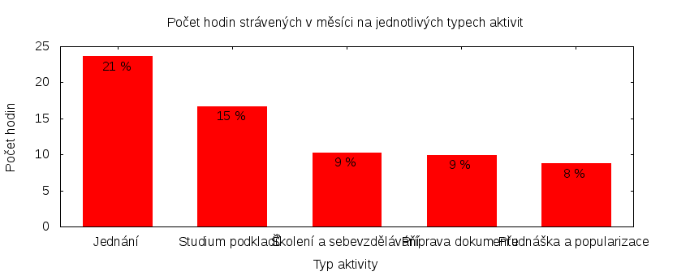

Česká pirátská strana  
krajské sdružení Praha  
klub Pirátů v Zastupitelstvu hl. m. Prahy

Výkaz odměňování
================

V tomtu výkazu zveřejňujeme základní informace o vykonané práci a odměňování osob. Výkaz je sestaven podle [metodiky odměňování][metodika],
která obsahuje podrobnosti. U všech údajů jsou uvedeny odkazy do projektového systému [redmine](https://redmine.pirati.cz). Upozorňujeme, že za podmínek stanovených v metodice mohou být některé úkoly v projektovém systému neveřejné.

Významné úkoly
----------------------

Následující seznam zahrnuje všechny úkoly z [projektu krajského sdružení Praha][kspraha], které zabraly déle než 3 hodiny. Zastupitel si může tento seznam doplnit či upravit podle své úvahy tak, aby podával co nejlepší informaci o odvedené práci.

Číslo              |   Název úkolu                                     |  Celkem           
-------------------|---------------------------------------------------|------------------:
[#2911][task2911]  |   Zasedání zastupitelstva 28. 4. 2016             |  [17.75][time2911]
[#1316][task1316]  |   Konference ISSS                                 |  [13.40][time1316]
[#799][task799]    |   Výbor pro výchovu a vzdělávání                  |  [8.25][time799]  
[#933][task933]    |   Nový web Pirátů Praha                           |  [7.65][time933]  
[#2248][task2248]  |   Konference Morgenstadt City Lab                 |  [5.50][time2248] 
[#2966][task2966]  |   Digitalizace úřadu                              |  [4.95][time2966] 
[#2590][task2590]  |   Jednání klubu 2016                              |  [4.75][time2590] 
[#3137][task3137]  |   IPR audit                                       |  [4.25][time3137] 
[#678][task678]    |   Komise ICT RHMP                                 |  [4.10][time678]  
[#2526][task2526]  |   Schůzka s Krnáčovou a ASD software (IS granty)  |  [3.40][time2526] 
[#914][task914]    |   Vykazování úkolů                                |  [3.35][time914]  
[#1973][task1973]  |   Vedení zastupitelského klubu                    |  [3.15][time1973] 

Můžete si zobrazit plný [přehled plněných úkolů][tasklist].

Měřitelné ukazatele
-------------------

Následující tabulka obsahuje měřitelné ukazatele za všechny úkoly v daném měsíci
včetně neveřejných úkolů. Proto mohou být hodiny v ní vyšší než se vám bez
přihlášení zobrazí v projektovém systému.

Rozsah činnosti                        | Počet hodin
--------------                         | ----------:
**A. Práce pro město**                 | [15.60][linktocityhours]
**B. Práce pro stranu**                | 94.30
*z toho*                               |
B.1 v projektu zastupitelstva          | [85.60][linktohomehours]
B.2 v ostatních projektech             | [8.70][linktootherhours]
**Celkový počet hodin**                | 109.90
Dohodnutý rozsah práce                 | 126.00
**Procento vytížení**                  | 87

Grafické znázornění [odpracované doby dle aktivity][activitylist]:

Graf zahrnuje pouze aktivity v [projektu krajského sdružení Praha][kspraha].

Odměňování
----------

Zastupitel má na základě zákona právo na odměnu a náhradu výdělku. Vedle toho na základě [smlouvy][smlouva] s Českou pirátskou stranou má také právo na odměnu podle rozsahu odvedené práce pro stranu.

Zdroj příjmu                           | Výše příjmu (Kč)
-----------------                      | --------------:
**A. Peníze od města**                 | 12506
*z toho*                               |
A.1 paušální odměna                    | 5486
A.2 náhrada výdělku                    | 7020
**B. Peníze od strany**                | TMPPARTYMONEY
*z toho*                               |
B.1 pevná složka odměny                | 6361
B.2 variabilní složka odměny           | TMPVARMONEY
*z toho*                               |
B.2.1 odměna za dodržení rozsahu práce | 756
B.2.2 odměna za přesčasy               | 0
B.2.3 odměna za významné splněné úkoly | TMPTASKSMONEY
B.2.4 odpočet za výhrady               | TMPSANCTIONS
**Celkový měsíční příjem**             | TMPTOTALMONEY

Částky jsou uváděny vždy v hrubé výši, přičemž z paušální odměny odvádí město zálohu na daň z příjmu a zdravotní pojištění. Je dále odpovědností každého zastupitele, aby příjem zdanil a zaplatil zákonné pojištění.

[metodika]: https://redmine.pirati.cz/projects/praha/wiki/Odm%C4%9B%C5%88ov%C3%A1n%C3%AD_zastupitel%C5%AF

[kspraha]: https://redmine.pirati.cz/projects/kspraha
[tasklist]: https://redmine.pirati.cz/projects/kspraha/time_entries/report?f[]=spent_on&f[]=user_id&op[user_id]==&f[]=&columns=month&criteria[]=issue&op[spent_on]=><&op[user_id]==&utf8=✓&v[spent_on][]=2016-04-01&v[spent_on][]=2016-04-30&v[user_id][]=3
[task2911]: https://redmine.pirati.cz/issues/2911
[time2911]:https://redmine.pirati.cz/issues/2911/time_entries?f[]=spent_on&f[]=user_id&f[]=&op[spent_on]=><&op[user_id]==&op[spent_on]=><&op[user_id]==&utf8=✓&v[spent_on][]=2016-04-01&v[spent_on][]=2016-04-30&v[user_id][]=3
[task1316]: https://redmine.pirati.cz/issues/1316
[time1316]:https://redmine.pirati.cz/issues/1316/time_entries?f[]=spent_on&f[]=user_id&f[]=&op[spent_on]=><&op[user_id]==&op[spent_on]=><&op[user_id]==&utf8=✓&v[spent_on][]=2016-04-01&v[spent_on][]=2016-04-30&v[user_id][]=3
[task799]: https://redmine.pirati.cz/issues/799
[time799]:https://redmine.pirati.cz/issues/799/time_entries?f[]=spent_on&f[]=user_id&f[]=&op[spent_on]=><&op[user_id]==&op[spent_on]=><&op[user_id]==&utf8=✓&v[spent_on][]=2016-04-01&v[spent_on][]=2016-04-30&v[user_id][]=3
[task933]: https://redmine.pirati.cz/issues/933
[time933]:https://redmine.pirati.cz/issues/933/time_entries?f[]=spent_on&f[]=user_id&f[]=&op[spent_on]=><&op[user_id]==&op[spent_on]=><&op[user_id]==&utf8=✓&v[spent_on][]=2016-04-01&v[spent_on][]=2016-04-30&v[user_id][]=3
[task2248]: https://redmine.pirati.cz/issues/2248
[time2248]:https://redmine.pirati.cz/issues/2248/time_entries?f[]=spent_on&f[]=user_id&f[]=&op[spent_on]=><&op[user_id]==&op[spent_on]=><&op[user_id]==&utf8=✓&v[spent_on][]=2016-04-01&v[spent_on][]=2016-04-30&v[user_id][]=3
[task2966]: https://redmine.pirati.cz/issues/2966
[time2966]:https://redmine.pirati.cz/issues/2966/time_entries?f[]=spent_on&f[]=user_id&f[]=&op[spent_on]=><&op[user_id]==&op[spent_on]=><&op[user_id]==&utf8=✓&v[spent_on][]=2016-04-01&v[spent_on][]=2016-04-30&v[user_id][]=3
[task2590]: https://redmine.pirati.cz/issues/2590
[time2590]:https://redmine.pirati.cz/issues/2590/time_entries?f[]=spent_on&f[]=user_id&f[]=&op[spent_on]=><&op[user_id]==&op[spent_on]=><&op[user_id]==&utf8=✓&v[spent_on][]=2016-04-01&v[spent_on][]=2016-04-30&v[user_id][]=3
[task3137]: https://redmine.pirati.cz/issues/3137
[time3137]:https://redmine.pirati.cz/issues/3137/time_entries?f[]=spent_on&f[]=user_id&f[]=&op[spent_on]=><&op[user_id]==&op[spent_on]=><&op[user_id]==&utf8=✓&v[spent_on][]=2016-04-01&v[spent_on][]=2016-04-30&v[user_id][]=3
[task678]: https://redmine.pirati.cz/issues/678
[time678]:https://redmine.pirati.cz/issues/678/time_entries?f[]=spent_on&f[]=user_id&f[]=&op[spent_on]=><&op[user_id]==&op[spent_on]=><&op[user_id]==&utf8=✓&v[spent_on][]=2016-04-01&v[spent_on][]=2016-04-30&v[user_id][]=3
[task2526]: https://redmine.pirati.cz/issues/2526
[time2526]:https://redmine.pirati.cz/issues/2526/time_entries?f[]=spent_on&f[]=user_id&f[]=&op[spent_on]=><&op[user_id]==&op[spent_on]=><&op[user_id]==&utf8=✓&v[spent_on][]=2016-04-01&v[spent_on][]=2016-04-30&v[user_id][]=3
[task914]: https://redmine.pirati.cz/issues/914
[time914]:https://redmine.pirati.cz/issues/914/time_entries?f[]=spent_on&f[]=user_id&f[]=&op[spent_on]=><&op[user_id]==&op[spent_on]=><&op[user_id]==&utf8=✓&v[spent_on][]=2016-04-01&v[spent_on][]=2016-04-30&v[user_id][]=3
[task1973]: https://redmine.pirati.cz/issues/1973
[time1973]:https://redmine.pirati.cz/issues/1973/time_entries?f[]=spent_on&f[]=user_id&f[]=&op[spent_on]=><&op[user_id]==&op[spent_on]=><&op[user_id]==&utf8=✓&v[spent_on][]=2016-04-01&v[spent_on][]=2016-04-30&v[user_id][]=3
[activitylist]: https://redmine.pirati.cz/projects/kspraha/time_entries/report?columns=month&criteria[]=activity&f[]=spent_on&f[]=user_id&f[]=&op[spent_on]=><&op[user_id]==&utf8=✓&v[spent_on][]=2016-04-01&v[spent_on][]=2016-04-30&v[user_id][]=3

[smlouva]: https://smlouvy.pirati.cz/smlouvy/2014/11/13/ondrej-profant/index.html
[linktocityhours]: https://redmine.pirati.cz/projects/praha/time_entries?f[]=spent_on&f[]=user_id&f[]=cf_16&f[]=&op[cf_16]=*&op[spent_on]=><&op[user_id]==&utf8=✓&v[spent_on][]=2016-04-01&v[spent_on][]=2016-04-30&v[user_id][]=3
[linktohomehours]: https://redmine.pirati.cz/projects/praha/time_entries?f[]=spent_on&f[]=user_id&f[]=&f[]=subproject_id&op[subproject_id]=!*&op[spent_on]=><&op[user_id]==&utf8=✓&v[spent_on][]=2016-04-01&v[spent_on][]=2016-04-30&v[user_id][]=3&f[]=cf_16&op[cf_16]=!*
[linktootherhours]: https://redmine.pirati.cz/time_entries?&columns=month&criteria[]=user&f[]=spent_on&f[]=user_id&f[]=cf_16&f[]=project_id&f[]=&op[cf_16]==&op[project_id]=!&v[cf_16][]=strana&v[project_id][]=15&op[spent_on]=><&op[user_id]==&utf8=✓&v[spent_on][]=2016-04-01&v[spent_on][]=2016-04-30&v[user_id][]=3
