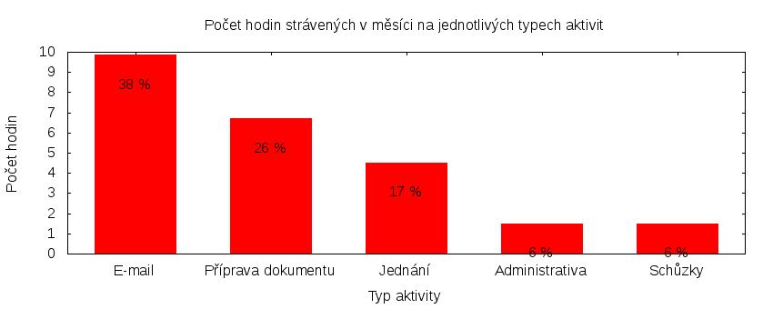

Česká pirátská strana  
krajské sdružení Praha

Výkaz odměňování
================

V tomtu výkazu zveřejňujeme základní informace o vykonané práci a odměňování osob. Výkaz je sestaven podle [metodiky odměňování][metodika],
která obsahuje podrobnosti. U všech údajů jsou uvedeny odkazy do projektového systému [redmine](https://redmine.pirati.cz). Upozorňujeme, že za podmínek stanovených v metodice mohou být některé úkoly v projektovém systému neveřejné.

Významné úkoly
----------------------

Následující seznam zahrnuje všechny úkoly z [projektu krajského sdružení Praha][kspraha], které zabraly déle než 3 hodiny. Dodavatel si může tento seznam doplnit či upravit podle své úvahy tak, aby podával co nejlepší informaci o odvedené práci.

Číslo              |   Název úkolu                                     |  Celkem          
-------------------|---------------------------------------------------|-----------------:
[#2309][task2309]  |   Koordinace dobrovolníků                         |  [6.90][time2309]
[#2311][task2311]  |   Pirátské listy 2016                             |  [5.30][time2311]
[#2590][task2590]  |   Jednání klubu 2016                              |  [4.50][time2590]
[#2626][task2626]  |   E-mailový zpravodaj pro příznivce (newsletter)  |  [3.60][time2626]

Můžete si zobrazit plný [přehled plněných úkolů][tasklist].

Měřitelné ukazatele
-------------------

Následující tabulka obsahuje měřitelné ukazatele za všechny úkoly v daném měsíci
včetně neveřejných úkolů. Proto mohou být hodiny v ní vyšší, než se vám bez
přihlášení zobrazí v projektovém systému.

Rozsah činnosti                        | Počet hodin
--------------                         | ----------:
**B. Práce pro stranu**                | 15.10
*z toho*                               |
B.1 v projektu krajského sdružení Praha| [15.10][linktohomehours]
B.2 v ostatních projektech             | [0.00][linktootherhours]
**Celkový počet hodin**                | 15.10
Dohodnutý rozsah práce                 | 88.00
**Procento vytížení**                  | 17

Grafické znázornění [odpracované doby dle aktivity][activitylist]:

Graf zahrnuje pouze aktivity v [projektu krajského sdružení Praha][kspraha].

Odměňování
----------

Dodavatel má na základě [smlouvy][smlouva] s Českou pirátskou stranou právo na odměnu podle rozsahu odvedené práce pro stranu.

Zdroj příjmu                           | Výše příjmu (Kč)
-----------------                      | --------------:
**B. Peníze od strany**                | TMPPARTYMONEY
*z toho*                               |
B.1 pevná složka odměny                | 1029
B.2 variabilní složka odměny           | TMPVARMONEY
*z toho*                               |
B.2.1 odměna za dodržení rozsahu práce | 0
B.2.2 odměna za přesčasy               | 0
B.2.3 odměna za významné splněné úkoly | TMPTASKSMONEY
B.2.4 odpočet za výhrady               | TMPSANCTIONS
**Celkový měsíční příjem**             | TMPTOTALMONEY

Částky jsou uváděny vždy v hrubé výši. Je odpovědností každého dodavatele, aby příjem zdanil a zaplatil zákonné pojištění.

[metodika]: https://redmine.pirati.cz/projects/praha/wiki/Odm%C4%9B%C5%88ov%C3%A1n%C3%AD_zastupitel%C5%AF

[kspraha]: https://redmine.pirati.cz/projects/kspraha
[tasklist]: https://redmine.pirati.cz/projects/kspraha/time_entries/report?f[]=spent_on&f[]=user_id&op[user_id]==&f[]=&columns=month&criteria[]=issue&op[spent_on]=><&op[user_id]==&utf8=✓&v[spent_on][]=2016-06-01&v[spent_on][]=2016-06-30&v[user_id][]=7
[task2309]: https://redmine.pirati.cz/issues/2309
[time2309]:https://redmine.pirati.cz/issues/2309/time_entries?f[]=spent_on&f[]=user_id&f[]=&op[spent_on]=><&op[user_id]==&op[spent_on]=><&op[user_id]==&utf8=✓&v[spent_on][]=2016-06-01&v[spent_on][]=2016-06-30&v[user_id][]=7
[task2311]: https://redmine.pirati.cz/issues/2311
[time2311]:https://redmine.pirati.cz/issues/2311/time_entries?f[]=spent_on&f[]=user_id&f[]=&op[spent_on]=><&op[user_id]==&op[spent_on]=><&op[user_id]==&utf8=✓&v[spent_on][]=2016-06-01&v[spent_on][]=2016-06-30&v[user_id][]=7
[task2590]: https://redmine.pirati.cz/issues/2590
[time2590]:https://redmine.pirati.cz/issues/2590/time_entries?f[]=spent_on&f[]=user_id&f[]=&op[spent_on]=><&op[user_id]==&op[spent_on]=><&op[user_id]==&utf8=✓&v[spent_on][]=2016-06-01&v[spent_on][]=2016-06-30&v[user_id][]=7
[task2626]: https://redmine.pirati.cz/issues/2626
[time2626]:https://redmine.pirati.cz/issues/2626/time_entries?f[]=spent_on&f[]=user_id&f[]=&op[spent_on]=><&op[user_id]==&op[spent_on]=><&op[user_id]==&utf8=✓&v[spent_on][]=2016-06-01&v[spent_on][]=2016-06-30&v[user_id][]=7
[activitylist]: https://redmine.pirati.cz/projects/kspraha/time_entries/report?columns=month&criteria[]=activity&f[]=spent_on&f[]=user_id&f[]=&op[spent_on]=><&op[user_id]==&utf8=✓&v[spent_on][]=2016-06-01&v[spent_on][]=2016-06-30&v[user_id][]=7

[smlouva]: https://smlouvy.pirati.cz/smlouvy/2016/01/misa/index.html
[linktohomehours]: https://redmine.pirati.cz/projects/kspraha/time_entries?f[]=spent_on&f[]=user_id&f[]=&f[]=subproject_id&op[subproject_id]=!*&op[spent_on]=><&op[user_id]==&utf8=✓&v[spent_on][]=2016-06-01&v[spent_on][]=2016-06-30&v[user_id][]=7
[linktootherhours]: https://redmine.pirati.cz/time_entries?&columns=month&criteria[]=user&f[]=spent_on&f[]=user_id&f[]=cf_16&f[]=project_id&f[]=&op[cf_16]==&op[project_id]=!&v[cf_16][]=strana&v[project_id][]=44&op[spent_on]=><&op[user_id]==&utf8=✓&v[spent_on][]=2016-06-01&v[spent_on][]=2016-06-30&v[user_id][]=7
