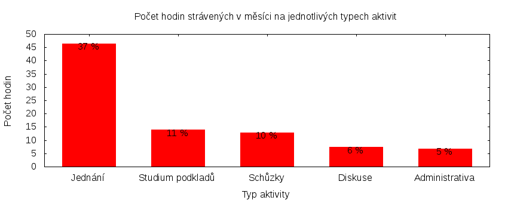

Česká pirátská strana  
krajské sdružení Praha  
klub Pirátů v Zastupitelstvu hl. m. Prahy

Výkaz odměňování
================

V tomtu výkazu zveřejňujeme základní informace o vykonané práci a odměňování osob. Výkaz je sestaven podle [metodiky odměňování][metodika],
která obsahuje podrobnosti. U všech údajů jsou uvedeny odkazy do projektového systému [redmine](https://redmine.pirati.cz). Upozorňujeme, že za podmínek stanovených v metodice mohou být některé úkoly v projektovém systému neveřejné.

Významné úkoly
----------------------

Následující seznam zahrnuje všechny úkoly z [projektu krajského sdružení Praha][kspraha], které zabraly déle než 3 hodiny. Zastupitel si může tento seznam doplnit či upravit podle své úvahy tak, aby podával co nejlepší informaci o odvedené práci.

Číslo              |   Název úkolu                                            |  Celkem           
-------------------|----------------------------------------------------------|------------------:
[#3296][task3296]  |   Zasedání zastupitelstva 16. 6. 2016                    |  [17.75][time3296]
[#3269][task3269]  |   Rozvoj celopražských otevřených dat (opendat)          |  [14.40][time3269]
[#2590][task2590]  |   Jednání klubu 2016                                     |  [8.50][time2590] 
[#933][task933]    |   Nový web Pirátů Praha                                  |  [5.90][time933]  
[#1763][task1763]  |   Teambuildingy                                          |  [5.50][time1763] 
[#674][task674]    |   Výbor pro správu majetku a majetkové podíly (majetek)  |  [4.55][time674]  
[#3318][task3318]  |   Schůzka Red Hat                                        |  [4.50][time3318] 
[#2612][task2612]  |   Zastupitelská úterý za rok 2016                        |  [3.55][time2612] 
[#3271][task3271]  |   Výbor pro Smart City (cities)                          |  [3.25][time3271] 
[#3359][task3359]  |   Smíchov city                                           |  [3.15][time3359] 
[#597][task597]    |   E-mailová komunikace                                   |  [3.15][time597]  

Můžete si zobrazit plný [přehled plněných úkolů][tasklist].

Měřitelné ukazatele
-------------------

Následující tabulka obsahuje měřitelné ukazatele za všechny úkoly v daném měsíci
včetně neveřejných úkolů. Proto mohou být hodiny v ní vyšší než se vám bez
přihlášení zobrazí v projektovém systému.

Rozsah činnosti                        | Počet hodin
--------------                         | ----------:
**A. Práce pro město**                 | [32.50][linktocityhours]
**B. Práce pro stranu**                | 109.55
*z toho*                               |
B.1 v projektu zastupitelstva          | [78.45][linktohomehours]
B.2 v ostatních projektech             | [31.10][linktootherhours]
**Celkový počet hodin**                | 142.05
Dohodnutý rozsah práce                 | 132.00
**Procento vytížení**                  | 107

Grafické znázornění [odpracované doby dle aktivity][activitylist]:

Graf zahrnuje pouze aktivity v [projektu krajského sdružení Praha][kspraha].

Odměňování
----------

Zastupitel má na základě zákona právo na odměnu a náhradu výdělku. Vedle toho na základě [smlouvy][smlouva] s Českou pirátskou stranou má také právo na odměnu podle rozsahu odvedené práce pro stranu.

Zdroj příjmu                           | Výše příjmu (Kč)
-----------------                      | --------------:
**A. Peníze od města**                 | 20111
*z toho*                               |
A.1 paušální odměna                    | 5486
A.2 náhrada výdělku                    | 14625
**B. Peníze od strany**                | TMPPARTYMONEY
*z toho*                               |
B.1 pevná složka odměny                | 7054
B.2 variabilní složka odměny           | TMPVARMONEY
*z toho*                               |
B.2.1 odměna za dodržení rozsahu práce | 1000
B.2.2 odměna za přesčasy               | 0
B.2.3 odměna za významné splněné úkoly | TMPTASKSMONEY
B.2.4 odpočet za výhrady               | TMPSANCTIONS
**Celkový měsíční příjem**             | TMPTOTALMONEY

Částky jsou uváděny vždy v hrubé výši, přičemž z paušální odměny odvádí město zálohu na daň z příjmu a zdravotní pojištění. Je dále odpovědností každého zastupitele, aby příjem zdanil a zaplatil zákonné pojištění.

[metodika]: https://redmine.pirati.cz/projects/praha/wiki/Odm%C4%9B%C5%88ov%C3%A1n%C3%AD_zastupitel%C5%AF

[kspraha]: https://redmine.pirati.cz/projects/kspraha
[tasklist]: https://redmine.pirati.cz/projects/kspraha/time_entries/report?f[]=spent_on&f[]=user_id&op[user_id]==&f[]=&columns=month&criteria[]=issue&op[spent_on]=><&op[user_id]==&utf8=✓&v[spent_on][]=2016-06-01&v[spent_on][]=2016-06-30&v[user_id][]=3
[task3296]: https://redmine.pirati.cz/issues/3296
[time3296]:https://redmine.pirati.cz/issues/3296/time_entries?f[]=spent_on&f[]=user_id&f[]=&op[spent_on]=><&op[user_id]==&op[spent_on]=><&op[user_id]==&utf8=✓&v[spent_on][]=2016-06-01&v[spent_on][]=2016-06-30&v[user_id][]=3
[task3269]: https://redmine.pirati.cz/issues/3269
[time3269]:https://redmine.pirati.cz/issues/3269/time_entries?f[]=spent_on&f[]=user_id&f[]=&op[spent_on]=><&op[user_id]==&op[spent_on]=><&op[user_id]==&utf8=✓&v[spent_on][]=2016-06-01&v[spent_on][]=2016-06-30&v[user_id][]=3
[task2590]: https://redmine.pirati.cz/issues/2590
[time2590]:https://redmine.pirati.cz/issues/2590/time_entries?f[]=spent_on&f[]=user_id&f[]=&op[spent_on]=><&op[user_id]==&op[spent_on]=><&op[user_id]==&utf8=✓&v[spent_on][]=2016-06-01&v[spent_on][]=2016-06-30&v[user_id][]=3
[task933]: https://redmine.pirati.cz/issues/933
[time933]:https://redmine.pirati.cz/issues/933/time_entries?f[]=spent_on&f[]=user_id&f[]=&op[spent_on]=><&op[user_id]==&op[spent_on]=><&op[user_id]==&utf8=✓&v[spent_on][]=2016-06-01&v[spent_on][]=2016-06-30&v[user_id][]=3
[task1763]: https://redmine.pirati.cz/issues/1763
[time1763]:https://redmine.pirati.cz/issues/1763/time_entries?f[]=spent_on&f[]=user_id&f[]=&op[spent_on]=><&op[user_id]==&op[spent_on]=><&op[user_id]==&utf8=✓&v[spent_on][]=2016-06-01&v[spent_on][]=2016-06-30&v[user_id][]=3
[task674]: https://redmine.pirati.cz/issues/674
[time674]:https://redmine.pirati.cz/issues/674/time_entries?f[]=spent_on&f[]=user_id&f[]=&op[spent_on]=><&op[user_id]==&op[spent_on]=><&op[user_id]==&utf8=✓&v[spent_on][]=2016-06-01&v[spent_on][]=2016-06-30&v[user_id][]=3
[task3318]: https://redmine.pirati.cz/issues/3318
[time3318]:https://redmine.pirati.cz/issues/3318/time_entries?f[]=spent_on&f[]=user_id&f[]=&op[spent_on]=><&op[user_id]==&op[spent_on]=><&op[user_id]==&utf8=✓&v[spent_on][]=2016-06-01&v[spent_on][]=2016-06-30&v[user_id][]=3
[task2612]: https://redmine.pirati.cz/issues/2612
[time2612]:https://redmine.pirati.cz/issues/2612/time_entries?f[]=spent_on&f[]=user_id&f[]=&op[spent_on]=><&op[user_id]==&op[spent_on]=><&op[user_id]==&utf8=✓&v[spent_on][]=2016-06-01&v[spent_on][]=2016-06-30&v[user_id][]=3
[task3271]: https://redmine.pirati.cz/issues/3271
[time3271]:https://redmine.pirati.cz/issues/3271/time_entries?f[]=spent_on&f[]=user_id&f[]=&op[spent_on]=><&op[user_id]==&op[spent_on]=><&op[user_id]==&utf8=✓&v[spent_on][]=2016-06-01&v[spent_on][]=2016-06-30&v[user_id][]=3
[task3359]: https://redmine.pirati.cz/issues/3359
[time3359]:https://redmine.pirati.cz/issues/3359/time_entries?f[]=spent_on&f[]=user_id&f[]=&op[spent_on]=><&op[user_id]==&op[spent_on]=><&op[user_id]==&utf8=✓&v[spent_on][]=2016-06-01&v[spent_on][]=2016-06-30&v[user_id][]=3
[task597]: https://redmine.pirati.cz/issues/597
[time597]:https://redmine.pirati.cz/issues/597/time_entries?f[]=spent_on&f[]=user_id&f[]=&op[spent_on]=><&op[user_id]==&op[spent_on]=><&op[user_id]==&utf8=✓&v[spent_on][]=2016-06-01&v[spent_on][]=2016-06-30&v[user_id][]=3
[activitylist]: https://redmine.pirati.cz/projects/kspraha/time_entries/report?columns=month&criteria[]=activity&f[]=spent_on&f[]=user_id&f[]=&op[spent_on]=><&op[user_id]==&utf8=✓&v[spent_on][]=2016-06-01&v[spent_on][]=2016-06-30&v[user_id][]=3

[smlouva]: https://smlouvy.pirati.cz/smlouvy/2014/11/13/ondrej-profant/index.html
[linktocityhours]: https://redmine.pirati.cz/projects/praha/time_entries?f[]=spent_on&f[]=user_id&f[]=cf_16&f[]=&op[cf_16]=*&op[spent_on]=><&op[user_id]==&utf8=✓&v[spent_on][]=2016-06-01&v[spent_on][]=2016-06-30&v[user_id][]=3
[linktohomehours]: https://redmine.pirati.cz/projects/praha/time_entries?f[]=spent_on&f[]=user_id&f[]=&f[]=subproject_id&op[subproject_id]=!*&op[spent_on]=><&op[user_id]==&utf8=✓&v[spent_on][]=2016-06-01&v[spent_on][]=2016-06-30&v[user_id][]=3&f[]=cf_16&op[cf_16]=!*
[linktootherhours]: https://redmine.pirati.cz/time_entries?&columns=month&criteria[]=user&f[]=spent_on&f[]=user_id&f[]=cf_16&f[]=project_id&f[]=&op[cf_16]==&op[project_id]=!&v[cf_16][]=strana&v[project_id][]=15&op[spent_on]=><&op[user_id]==&utf8=✓&v[spent_on][]=2016-06-01&v[spent_on][]=2016-06-30&v[user_id][]=3
