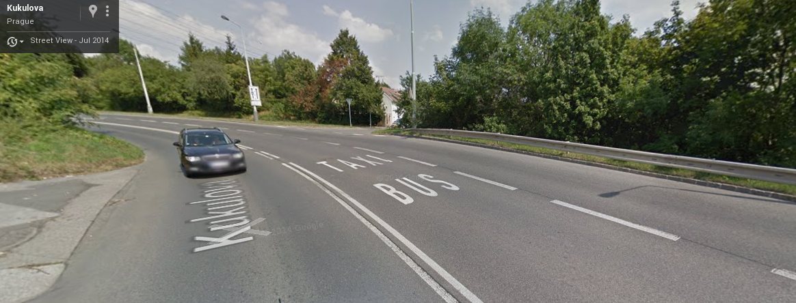
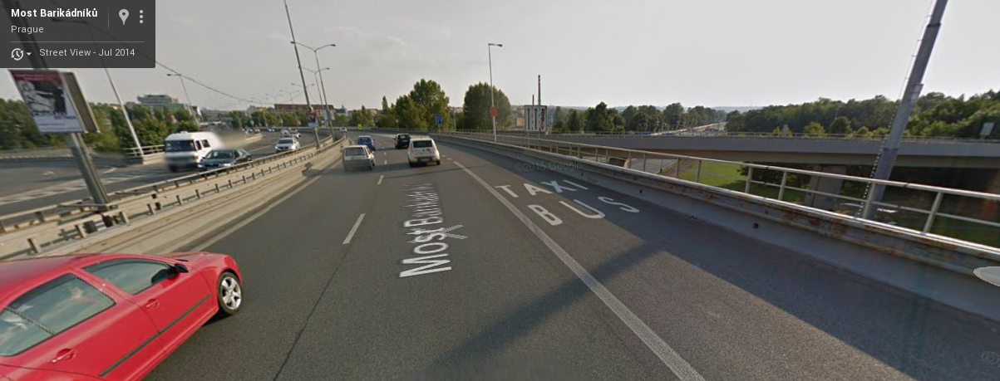

Interpelace nam. P. Dolínka dne 10. 9.
======================================

Vážený pane náměstku,

chci se zeptat jaké je zdůvodnění vyhrazení pruhů pro "Bux a Taxi".
Tyto pruhy můžeme vidět např. na Mostě barikádníků či v ulici Kukulova u Motolské nemocnice.
Samozřejmě chápu přínos autobusu, ale zvýhodňování soukromých podnikatelů nerozumím.

Chtěl bych se tedy zeptat jaký je smysl takovéhoto opatření.

\bigskip

Ondřej Profant
