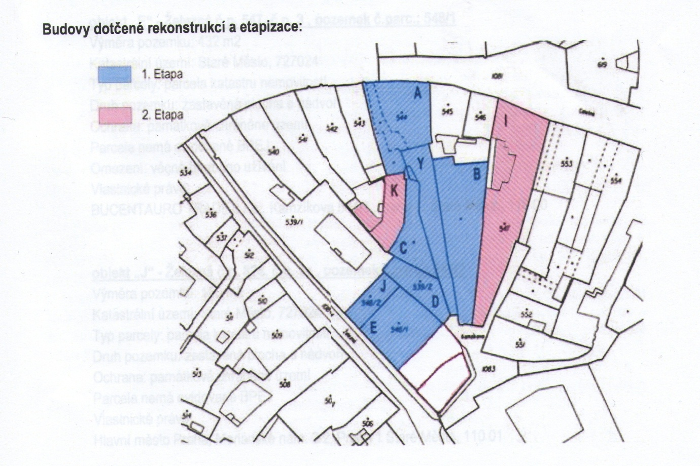

Kauza hotelového komplexu U Sixtů
=================================

Úvod
----

Zahrnuté domy:

| Adresa       | Název              | Na plánku    | Vlastník             | Etapa | Poznámka                         |
|--------------|--------------------|--------------|----------------------|-------|----------------------------------|
| Celetná 2    | Sixtův dům         | A, B, C, Y   | [Bucentauro Trade][] | 1     | Nemovitá kulturní památka rejstříkové číslo 1 – 299, 293, 294. |
| Železná 3    | U Kamenného ptáka  | E            | Bucentauro Trade     | 1     |    |
| Železná 3a   | U Uherské koruny   | J            | HMP -> [Akroterion][]| 1     |    |
| Kamzíkova 5  | U Jednorožce       | D            | HMP -> Akroterion    | 1     |    |
| Celetná 8    | U Černého slunce   | I            | HMP -> Akroterion    | 2     |    |
| Staroměstské náměstí 17 | U Kamenného beránka | K| HMP -> Akroterion    | 2     |    |
| Železná 5    | U Bílého vlka      | F            | MČ P1                | 2     | Hlavní vchod Komplexu, MČ Praha 1   |
| Kamzíkova 1  | U Zlatého hroznu   | G            | ?                    | 2     | Sídlo Akroterion a Bucentauro Trade |

Etapa 1: platné stavební povolení vydané stavebním úřadem MČ Praha 1, 84 pokojů. 

Viz [mapy](foto/)

Problémy:

- Ztrátu bytové funkce ve vylidňujícím se centru
	- Praha 1: 70 000 v roce 1992 => 30 000 
	- je potřeba [více](foto/mapy/mapa5-hotely.jpg) hotelů?
- Poškození nemovitostí v důsledku začlenění do hotelového komplexu 
- Ztrátu historické parcelace a struktury zástavby, zastřešování dvorů, bourání historických konstrukcí, stavbu výtahů
- Jednotlivé domy přestanou existovat jako jednotlivé individuální památky 
- Akroterion uhradní smluvní pokuty
- Investor ([Akroterion][] s.r.o.) má plnou moc pro jednání se stávajícími nájemníky
- Finanční nevýhodnost:
	- povinnost hradit nájem v plné výši vzniká až 5. měsícem od zkolaudování
	- RHMP odsouhlasila 90% slevu od roku 2007 (resp. 2012), maximálně do roku 2017
	- Akroterion 595 012 Kč ročně za 3 nemovitosti
	- 5 255 109 Kč ročně by bylo nájemné z daných bytů
	- => MHMP podepsal smlouvy se ztrátou 61 235 015 Kč za 2012-1017 
	- v připadě krachu Akroterion s.r.o. Praha nic nezíská zpět
	- Dluh 20 000 000 Kč za nedodržení smlouvy 

Co to znamená pro Prahu:

- Pravděpodobná finanční ztráta
- Ztráta bytové funkce domů, ztráta bytů pro své vlastní občany
- Znehodnocení architektonických památek jejich vybouráním
- Zvýšená zátěž města v případě, že se investici vůbec podaří dokončit a že celý projekt neskončí pouze zničenými, vybydlenými, případně zevnitř vybouranými domy
- Další [asanace][] jako na přelomu 19. a 20. století?

<iframe src='//cdn.knightlab.com/libs/timeline3/latest/embed/index.html?source=1vxbccTlHDt42mtfN2ti4y7w-g0pNaIbs0IV_k6EuurE&font=Default&lang=en&initial_zoom=2&height=650' width='100%' height='650' frameborder='0'></iframe>

Zúčastněné osoby
----------------

Filip Dvořák:
    
Soukromé:

- CTY GROUP, a. s. - Člen představenstva 1999 - 2001 (typografická společnost)
- CASTULLUS - jednatel od 31. 12. 2002 (pronájem nemovitostí)
- Vltava 767 s.r.o. - jednatel od roku 2004 (pronájem nemovitostí)
- jednatel Dvorak Shoe accessories, od roku 2015 

Městské a státní:

- Nadační fond SOFOS (v likvidaci), od roku 2008 je tam místopředseda správní rady.
- Pražská plynárenská holding, v letech 2007-2012 předseda představenstva.
- Obvodní hospodářská komora na Praze 1, od dubna 2015 je tam místopředseda
- TCP - Vinohrady; 1998-2000 předseda představenstva
- česká nadace jana a medy mládkových; v letech 2006-2011 člen správní rady
- Trade center praha: 2000-2011 všechny vrcholné funkce

Vyjádření
---------

> z hlediska památkové péče nelze souhlasit s připojováním dalších čtyř objektů, a to ani v případě, že by se závěr jevil jako finančně zajištěný

Národní památkový ústav

Smlouvy
-------

### INO/83/01/006785/2012

Konstatování stavu, výběr:

- Na základě předchozích smluv byl Akroterion ve stanovené lhůře provést rekonstrukci pronajatých budov. Nesplnění je sankcionováno pokutami v souhrné výši 20 000 000 Kč.
- HMP vznikl nárok na smluvní pokuty
- Akroterion hodlá realizovat Komplex

Kumulativní podmínky ukončení:

- Akroterion uhradní smluvní pokuty
- Akroterion uhradní nově vzniklé smluvní pokuty
- Akroterion dokoční realizaci Komplexu

Legislativa
-----------

### Veřejný záměr

Dle § 2 zákona č. [131/2000][] Sb., zákona o hlavním městě Praze:
 
> (2) Hlavní město Praha a městské části pečují o všestranný rozvoj svého území a o potřeby svých občanů; při plnění svých úkolů chrání též veřejný zájem vyjádřený v zákonech a jiných právních předpisech (dále jen „veřejný zájem“).

Dle § 16 odst. 3 „Hlavní město Praha v samostatné působnosti ve svém územním obvodu dále pečuje v souladu

> s místními předpoklady a místními zvyklostmi o vytváření podmínek pro rozvoj sociální péče a pro uspokojování potřeb svých občanů. Jde především o uspokojování potřeby bydlení, ochrany a rozvoje zdraví, dopravy a spojů, potřeby informací, výchovy a vzdělávání, celkového kulturního rozvoje a ochrany veřejného pořádku. 

### Neplatnost dlouhodobých pronájmů

> Smluvní doba trvání 99 let neodpovídá zakonnému požadavku dočasnosti smlouvy.

Zjevně se mluví [§ 2201 NOZ][NOZ], resp. obdobném [SOZ][].

> Nadto je možno říci, že poskytnutí předmětných pozemků dovolatelce na dobu 99 let na základě **bezúplatného** právního úkonu se především svou podstatou a ekonomickým dopadem blíží institutu vzdání se práva, neboť se jím obec vzdává možnosti po značnou dobu tyto pozemky užívat či s nimi jinak nakládat, aniž by za to obdržela adekvátní protiplnění, tedy i analogickým použitím ustanovení § 36a odst. 1 písm. g) zákona č. 367/1990 Sb. zařazujícím mezi úkony, o nichž má rozhodovat zastupitelstvo, i vzdání se práva, lze dospět ke stejnému závěru.

Zdroj: Rozhodnutí o odmítnutí dovolání Nejvyššího soudu [28 Cdo 2258/2010][] ze dne 15. 9. 2010 reagující na rozsudek Obvodního soudu pro Prahu 9 ze dne 19. 8. 2009, č. j. 52 C 268/2008-134.

> Podstatným znakem úplatných právních úkonů je stejnost (resp. adekvátnost) hodnoty vzájemných plnění (viz Komentář k československému obecnému zákoníku občanskému, red. F. R., J. S., Díl 4., Praha 1936, s. 321). V daném případě lze však konstatovat zjevný nepoměr mezi hodnotou vzájemných plnění, vyplývající ze zjevného nepoměru ceny ujednané a ceny zjištěné. Posuzovaný právní úkon nutno proto kvalifikovat jako výsledek disimulace, a tudíž za smíšený právní úkon (negotium mixtum cum donatione). Z uvedeného důvodu jej Krajský soud v Českých Budějovicích opodstatněně považoval za právní úkon zčásti bezúplatný a žalobu navrhovatele o zrušení rozhodnutí F.Ř. v B., ze dne 7. 4. 1994, č.j. 3167/93-1, zamítl.

[Zdroj](http://webcache.googleusercontent.com/search?q=cache:AZ5BgXyJg-8J:kraken.slv.cz/III.US135/94+&cd=2&hl=cs&ct=clnk&gl=cz)

#### Fakta o kauze

|  Smlouva              | Trvání | Rozloha |    Ze dne                         |
|-----------------------|--------|---------|-----------------------------------|
| D/39/4702/06          | 99 let | 22 ha   | 13. 7. 1999, resp dodatek č. 1 ze dne 24. 6. 2003 |
| VYP/23/01/001032/2003 | 99 let | 2,2 ha  | 25. 6. 2003                                       |

Odkazy
------

* timeline
* [chronologie][]
* [souhrn][]
* media
	* [ct][]
	* [idnes][]

[chronologie]: http://obcanskymonitoring.cz/?p=4036
[souhrn]: http://obcanskymonitoring.cz/?p=3970
[Akroterion]: http://rejstrik-firem.kurzy.cz/26726068/akroterion-sro/
[Bucentauro Trade]: http://rejstrik-firem.kurzy.cz/26729989/bucentauro-trade-sro/
[asanace]: https://cs.wikipedia.org/wiki/Pra%C5%BEsk%C3%A1_asanace
[131/2000]: http://www.zakonyprolidi.cz/cs/2000-131
[idnes]: http://bydleni.idnes.cz/hotel-celetna-u-sixtu-0t4-/stavba.aspx?c=A150610_184612_stavba_web
[ct]: http://www.ceskatelevize.cz/ct24/regiony/1501840-u-staromestskeho-namesti-vznikne-z-bytu-hotel-najemnici-musi-pryc
[noz]: http://www.zakonyprolidi.cz/cs/2012-89#p2201
[soz]: http://www.zakonyprolidi.cz/cs/1964-40
[28 Cdo 2258/2010]: http://kraken.slv.cz/28Cdo2258/2010
