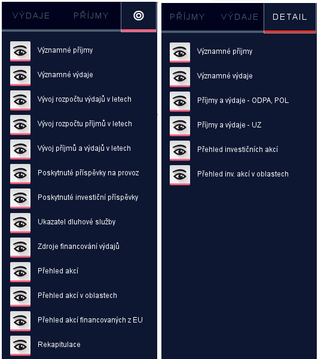
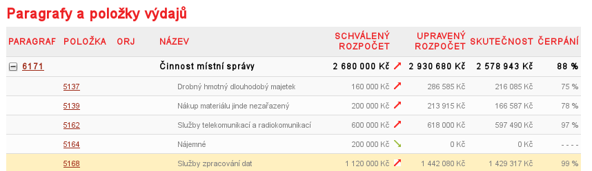

Vážený pane,

píšu Vám v reakci na žádost o připomínky k „Rozklikávací rozpočet hl. m. Prahy“. Připomínky jsem rozdělil do dvou kategorii - věcných a technických.

Věcné:

1. Není jasný vztah mezi weby: http://rozpocet.praha.eu a http://rozpocet.praha.eu/Navrh2015. Navíc adresa obsahující "Navrh2015" je poněkud matoucí.
2. 	Na adrese http://rozpocet.praha.eu/Navrh2015/ se proklikám na "Kultura -> Divadelní činnost", kde jsou sloupce:

	"ROZPOČET SCHVÁLENÝ 2014", "ROZPOČET UPRAVENÝ 2014", "NÁVRH 2015", "NÁVRH 2015 K RU 2014 %". 

	Připadá mi to, že jsou posunuté roky. Když si zadám rozpočet za rok 2015 očekával bych spíš schválený rozpočet 2015.
3. Nešlo by zveřejnit i předchozí roky? (Třeba 2000-2014) Vše je ve stejném systému, tak by to snad mělo být jen o nastavení, ne?
4. Šlo by zveřejnit rozpočty městských částí jako to má Brno? Zdroj: http://gbrno.cz/RR_mb00/
5. 	Brno má v záložce detail více položek. Očekával bych, že to by mohlo být stejné. My třeba nemáme položku "Přehled akcí financovaných z EU". Viz obrazové srovnání.
	
	
	
6. 	Nešlo by zanést rozpočet do větších podrobností? Například Nové město na Moravě[^1]
má s každou položkou spárované i základní údaje faktury (metadata). Hezký příklad je: 
"Výdaje->Veřejná správa->Výpočetní technika->Položka 5168"[^2].
	
	

Technické:

1. Každá podstránka by měla mít url (adresu), aby na ní bylo možné odkázat.
2. Celý systém by měl mít možnost exportu (i pro veřejnost) do formátu CSV (jednoduchý excell)/formátu JSON. Tyto exporty bychom pak mohli umístit na opendata.praha.eu.

[^1]: Rozklikávací rozpočet NMNM: http://rozpocet.nmnm.cz/cz/rok2015/rozpocet/
[^2]: Položka 5168: http://rozpocet.nmnm.cz/cz/rok2015/vydaje/akce/0000000000208/?paragraph=6171&item=5168#kdf

\medskip

S pozdravem

---
signature: 
  - Ondřej Profant
  - koordinátor projektu opendat
  - zastupitel hl. m. Prahy
abbr: ondra
---
