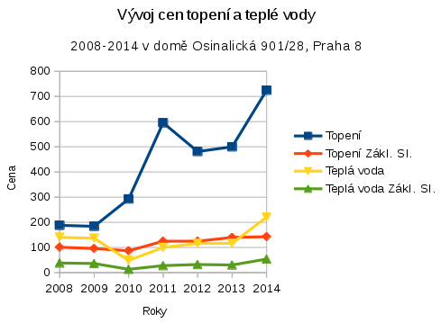

Dům: 47 bytů  
2010: rozbil se kotel (prasklé plynové potrubí v zahradě)  
2010 (konec): První faktura od firmy ACTON  
2010 (konec): Další faktura od firmy ACTON  
2011: Zvyšují se nedoplatky  

## Odkazy

* Acton
   * http://www.acton.cz
   * [Výpis z Justice](https://or.justice.cz/ias/ui/rejstrik-firma.vysledky?subjektId=461567&typ=UPLNY)
* [Smlouva MHMP a Acton](http://usneseni.praha.eu/ina2010/cessmldetail.aspx?id=139850)
* [Vývoj cen zem. plynu 2008-2014]( http://www.kurzy.cz/komodity/index.asp?A=5&idk=43&od=01.01.2008&do=01.01.2015&curr=CZK&unit=1%20GJhttp://www.kurzy.cz/komodity/index.asp?A=5&idk=43&od=01.01.2008&do=01.01.2015&curr=CZK&unit=1%20GJ)

## Shrnutí

Skokové, bezdůvodné a svévolné **zvýšení ceny za ohřev vody o 90% a topení o 69% během jednoho roku v domě s nájemními byty v majetku hl.m. Prahy.**

V roce 2010 se v našem domě rozbil plynový kotel, kterým je vytápěno 47 bytů. Plyn je přiváděn do kotelny plynovou trubkou, která byla prasklá, a plyn unikal v oblasti zahrady domu ven.

Nevím, po jak dlouhé době se na závadu přišlo, ale po rozhovoru se správcem domu to bylo dlouho. Tehdy se vyjádřil ve smyslu, ať se připravíme, že se budou dít věci…

A ony se bohužel dít začaly…

Na konci zúčtovacího období za rok 2010 přišla od firmy ACTON, která náš dům spravuje faktura. Na této faktuře jsme měli vzhledem k teplé zimě přeplatky. Záhy nám bylo sděleno, že došlo k omylu a přišla nová faktura, kde byly nedoplatky. Sice nijak velké, ale zároveň se zvedly ceny. VIZ tabulka dole…

Následující rok 2011 jsme již za teplou vodu (ohřívanou plynem) a plynové topení, měli opravdu velké nedoplatky. Největší měla paní, která žije s postiženou dcerou a je samoživitelka ve výši 20.000,- Kč a nyní je to u ní již za všechny roky a penále 73 000,- Kč.

Nedoplatků po celém domě bylo mnoho. Můj byl za rok 2012 11.000,- a další rok opět. Jiní nájemníci měli i více. Sice jsem se s firmou dala do reklamačního řízení, ale málokdo se vyzná v jejich vyúčtováních a tak jsem to vzdala a dluh po částech zaplatila s tím, že snížím odběr plynu za topení a budu víc šetřit i teplou vodou.

V roce 2013 přišlo vyúčtování, kde jsem zjistila, že spotřebu teplé vody a plynu jsem sice snížila, přesto zase doplácím 11 500,-Kč. Přišla jsem na to, že oproti předešlému roku se cena ohřevu vody zvýšila o 90% a topení o 69%.

Obešla jsem tedy všechny známé, aby mi poradili a pomohli porovnat ceny v panelácích a u nás.  Bohužel jsem zjistila, že většina lidí vyúčtování nerozumí, ale i tak jsem se dala do reklamace.

Nejdříve jsem o celé záležitosti vyrozuměla Magistrát hl. města Prahy, který je vlastníkem bytů a vybral správcovskou firmu ACTON, která se o nás stará a má na starosti tvorbu cen.

Z mailové korespondence jsem se nic kloudného nedozvěděla a o snaze situaci pomoci vyřešit Magistrátem nelze hovořit.

Tak jsem si psala s firmou ACTON, která odpověděla jen na první mail a na následující již nereagovala.
Do dnešního dne jsem oficiálně nedostala ani složenku k zaplacení a ani upomínku – nekomunikují. Tak se trochu bojím, že mě vedou jako dlužníka a problémového nájemníka, se kterým se nemusí z těchto důvodů obnovit smlouva na byt. A i kdybych zaplatit chtěla, což se mi z principu věci nechce, nemám číslo účtu. Tato situace mi připadá protiprávní…

Vím zde v domě o třech případech, kdy nájemníkům odmítli prodloužit nájemní smlouvu a chtěli okamžitě vrátit klíče od bytu. Jedna nájemnice o které výše píšu s postiženou dcerou přišla kvůli tomu o příspěvek na bydlení. Takže někteří  si raději peníze půjčili a zaplatili. Nyní v nervech čekají, zda jim smlouvu prodlouží, nebo skončí s dětmi na ulici. Na splátkový kalendář byli ochotni přistoupit až po vyklizení bytu… Nikdo nás ani předem neinformoval o tom, že se ceny tak razantně zvednou.

Další paní, která se písemně obrátila na firmu, aby jí sdělili jaké má zálohy, poslali kopii splátkového kalendáře, který předešlý rok platila. Dělají si z nás legraci. Otázkám se vyhýbají, neodpovídají, nebo vyhrožují, že máme být rádi, že bydlíme.

Celá situace je velmi urgentní. Strach obchází tento dům. Už raději netopíme… Naprosto nechápeme, proč platíme 2x víc, než je celorepublikový průměr.

Víte, je mi líto lidí zde žijících, nejedná se jen o mě, příběhů jsem si po domě vyslechla dost. Jsme okrádáni a neumíme se bránit. Myslím si, že vaše pomoc a návod, jak se v těchto případech bránit, pomůže hodně lidem, kteří Vaše pořady sledují. A také se, doufám, naučíme, jak rozumět vyúčtování a jak postupovat s reklamací, pokud s vámi ten, kdo má nekomunikuje.

S pozdravem a poděkováním za nájemníky

Radka Frömlová  

Tabulka vývoje cen spotřební a základní složky plynu na ohřev užitkové teplé vody a vytápění v Kč/Gj.

| Plyn na (Kč/Gj)     |  2008 | 2009 | 2010 | 2011 | 2012 | 2013 | 2014 |
|---------------------|------:|-----:|-----:|-----:|-----:|-----:|-----:|
| Topení				      | 187,95|184,03|292,70|595,06|481,09|499,76|724,55|
| Topení Zákl. Sl.    | 101,10| 95,82| 86,87|124,73|125,01|140,00|142,94|
| Teplá voda			    | 140,41|136,48| 48,62| 99,83|116,34|116,32|220,44|
| Teplá voda Zákl. Sl.|  38,22| 36,22| 13,33| 27,95| 32,30| 30,47| 54,03|
Tabulka: Vývoje cen spotřební a základní složky plynu na ohřev užitkové teplé vody a vytápění v Kč/Gj

## Korespondence se správcovskou firmou ACTON

> Od: "Zdenka Plzakova"  
> Komu: "Radka Frömlová"    
> Předmět: RE: Žádost o informace týkající se tvorby cen energií pro nájemníky bytů hl.m. Prahy  
> Datum: 08.12.2015 08:59  
>
> Dobrý den paní Frömlová,
>
> Na základě Vaší žádost a na základě našich zkušeností se domníváme, že by bylo lépe se sejít u nás v kanceláři, kde bychom si všechno vysvětlili a ukázali bychom Vám příslušné doklady.
Navrhněte prosím několik termínů kdy by jste se mohla dostavit k nám do kanceláře.
>
> S pozdravem  
> Ing. Plzáková  
> ACTON s.r.o.
>
>> From: Radka Frömlová  
>> Sent: Tuesday, December 1, 2015 1:39 PM  
>> To: Zdenka Plzakova, Rostislav Kopecky  
>> Subject: Žádost o informace týkající se tvorby cen energií pro nájemníky bytů hl.m. Prahy
>>
>> Vážená paní Plzáková, vážený pane řediteli,
>> 
>> Již od léta se snažím komunikovat s vaší kolegyní paní Chudáčkovou na téma zvýšených cen plynu v nájemním domě na adrese Osinalická 28, Praha 8 v majetku Magistrátu hl.m. Prahy, který je pod správou firmy Acton.
>> Naposledy jsem jí psala 28.6. a 28.9., viz přílohy. Bohužel mi nebyla schopna odpovědět.
>> 
>> Já i mnoho dalších nájemníků z našeho domu jsme se letos podivili nad výrazně zvýšenou cenou plynu používaného k vytápění a ohřevu teplé vody, viz. následující čísla:
>>
>> | Služba				|  2008 | 2009 | 2010 | 2011 | 2012 | 2013 | 2014 |
>> |---------------------|------:|-----:|-----:|-----:|-----:|-----:|-----:|
>> | Topení				| 187,95|184,03|292,70|595,06|481,09|499,76|724,55|
>> | Topení Zákl. Sl.	| 101,10| 95,82| 86,87|124,73|125,01|140,00|142,94|
>> | Teplá voda			| 140,41|136,48| 48,62| 99,83|116,34|116,32|220,44|
>> | Teplá voda Zákl. Sl.|  38,22| 36,22| 13,33| 27,95| 32,30| 30,47| 54,03|
>> Tabulka: vývoje cen spotřební a základní složky plynu na ohřev užitkové teplé vody a vytápění v Kč/Gj
>>
>> Vzhledem k tomu, že ceny plynu dlouhodobě mírně klesají, tak nerozumíme tomu, proč se cena taký výrazně zvýšila?
>> 
>> Jak vyplynulo z komunikace s Magistrátem a firmou BT-VUSTE, za tvorbu konečných cen plynu jste zodpovědni vy jako firma.
>> 
>> Můžete mi, prosím, zaslat postup tvorby konečné ceny plynu v našem domě?
>> 
>> S tím souvisí takéž smlouva mezi vámi (ACTON) a Magistrátem hl.m.P., resp. pasáže týkající se účtování služeb a energií pro nájemníky a smlouva a vyúčtování mezi vámi a Pražskou plynárenskou, případně jakékoliv další smlouvy či účty, ze kterých by bylo zřejmé, jak vzniká konečná cena.
O tyto smlouvy Vás taktéž žádám.
>>
>> Taktéž prosím o zaslání Pravidel o poskytování a rozúčtování plnění nezbytných při užívání bytových a nebytových jednotek.
>> 
>> Všechny dokumenty mohou být v elektronické formě.
>> 
>> Dále bych od Vás žádám o informaci, jak mám řešit situaci, kdy jsem paní Chudáčkové oznámila, že vstupuji do reklamace kvůli účtovanému nedoplatku za r. 2014.
Nedostala jsem od ní ani emailem ani poštou žádnou zprávu potvrzující, že probíhá reklamace. Taktéž jsem nedostala žádný dopis o tom, kam mám příslušný nedostatek poslat. Proto jsem ho poslala na účet: 129023-0005157998/6000, v.s. 0090101037. Spec. symbol se každoročně mění, takže jsem ho nemohla napsat.
>>
>> V reklamaci tedy nadále pokračuji.
>>
>> Děkuji za informace a vyžádané dokumenty.
>>
>> S pozdravem  
>> Radka Frömlová, Osinalická 28

## Komunikace s magistrátem

> Od: "Vostrá Milena (MHMP, SVM)"  
> Komu: "Radka Frömlová" <r.fromlova@centrum.cz>  
> Předmět: RE: Informace o cenách plynu a vody  
> Datum: 02.12.2015 06:52
>
> Dobrý den paní Frömlová,
>
> hl.m.Prahy prostřednictvím správce rozúčtuje spotřeby všech médií (elektrika, plyn, voda, dodávku tepla) bez jakéhokoli zisku. Jak již jsem Vám nabízela, tak do 15.12.2015 si určete termín, ve kterém by jste se dostavila na středisko správce ACTON s.r.o. Sochařské 14, Praha 7, kde Vám budou předloženy faktury dodavatelů médií a další doklady, ze kterých bylo rozúčtování provedeno. Znovu sděluji, že koromě ceny za vodu, neschvaluje Zastupitelstvo hl.m.Prahy žádné jiné ceny za dodávaná média. Acton s.r.o., má od roku 1995 s hlm.Praha uzavřenou Mandátní smlouvu. Pokud máte zájem, můžete se v úřední den (pondělí a středa do 16:00) dostavit do kanceláře 204, nám. Fr.Kafky 1, Praha 1, kde Vám mohu dát smlouvu k nahlédnutí.
>
> S pozdravem 
>
> Milena Vostrá 
> referent odd.správy a využití majetku 
> Odbor evidence,správy a využití majetku Magistrátu hl.m.Prahy 
> pracoviště nám. Franze Kafky 1, 110 00 Praha 1 
> tel. 236 002 985 
> e-mail: milena.vostra@praha.eu
>
>> From: Radka Frömlová  
>> Sent: Tuesday, December 01, 2015 2:01 PM  
>> To: Vostrá Milena (MHMP, SVM)  
>> Subject: RE: Informace o cenách plynu a vody
>>
>> Dobrý den,
>>
>> máte pravdu, že jste na začátku skutečně psala, že se jedná o ceny vody.
>> 
>> Je to však v rozporu se smlouvou, v jejímž aktuálním znění z r. 2014 se v článku V., odst. 4. píše:
>>
>>> Ceny za služby se rozúčtují dle Pravidel o poskytování a rozúčtování plnění nezbytných při užívání bytových a nebytových jednotek schválených usnesením Rady hl. m. Prahy. Správní firma je povinna na vyžádání poskytnout nájemci "pravidla" platná pro příslušné zúčtovací období.
>>
>> Nikde jinde též není zmíněno, že některé ceny hl.m. Praha schvaluje a jiné ne, proto jsem byla přesvědčena, že zastupitelstvo schvaluje přirozeně i ceny plynu.
>>
>> Na firmu ACTON jsem se již se žádostí o informace obrátila.
>>
>> Žádám tedy od Vás už po několikáté kopii smlouvy mezi Magistrátem hl. m. Prahy a firmou ACTON. Předpokládám, že Magistrát musí být minimálně informován o tom, jaké ceny ACTON svým nájemníkům účtuje, pokud je neschvaluje. 
>>
>> Žádám tedy i o informace o cenách plynu, které platí nájemníci v dalších bytech v majetku hl.m. Prahy a to za účelem srovnání.
>>
>> Děkuji za Vaši ochotu a spolupráci 
>> 
>> S pozdravem  
>> Radka Frömlová
>>
>>> Vážená paní,
>>>
>>> to se jednalo o cenu za vodu, nikoli za plyn.
>>>
>>> S pozdravem   
>>> Milena Vostrá
>>>
>>>> Datum: Wednesday, 25. 11 2015 16:12  
>>>> Dobrý den,  
>>>> můžete mi tedy objasnit smysl teto Vaší věty z Vašeho prvního emailu z 14.7.? "Cena je schvalována koncem každého roku na rok následující Zastupitelstvem hl. m. Prahy." Prosím tedy znovu o zaslání zápisu z jednání zastupitelstva, na kterém proběhlo toto schvalování.
>>>>  
>>>> Děkuji.  
>>>> S pozdravem  
>>>> Radka Frömlová
>>>>
>>>>> *Datum: 25. 11. 2015 06:38*
>>>>>
>>>>> Dobrý den,
>>>>>
>>>>> ceny plynu neschvaluje Magistrát. Tuto informaci jsem Vám nikdy nepodala viz můj e-malil níže.  Znovu Vám tedy sděluji, že ceny plynu si určuje dodvatel plynu a respektivě výrobce plynu  nikoli ten, kdo plyn používá t.j. kupř. v Praze Pražská plynárenská a.s. v jiných krajích ta společnost která plyn dodává.
>>>>>
>>>>> Cenu kontroluje Státní regulační ústav. 
>>>>>
>>>>> Pokud chcete nějaké doklady jak společnost, která vyrábí nebo dodává plyn  stanovila cenu, tak si od této společnosti informaci vyžádejte, nebo si informace vyžádejte přímo od Státního regulačního ústavu.
>>>>>
>>>>> S pozdravem  
>>>>> Milena Vostrá 
>>>>>
>>>>>> *Datum: Tuesday, 24. 11., 2015 15:28*
>>>>>>
>>>>>> Vážená paní Vostrá,
>>>>>>
>>>>>> ve Vaší první odpovědi píšete, že ceny plynu schvaluje Magistrát hl.m. Prahy. A ve své žádosti píšu jasně, že bych chtěla od Vás kopie dokumentů, ve kterých je záznam o tomto schvalování. Předpokládám, že o tom existuje nějaký standardní zápis, tak jak by mělo u každého jednání zastupitelstva být.
>>>>>> Prosím tedy o tyto dokumenty. 
>>>>>> 
>>>>>> Děkuji.  
>>>>>> Radka Frömlová
>>>>>>
>>>>>>> *Datum: 18.11.2015 15:47*
>>>>>>>
>>>>>>> Vážená paní Frömlová,
>>>>>>>
>>>>>>> ceny jsou stanovovány dodavatelem plynu pod dohledem Státního regulačního ústavu. Společnost BT- VUSTE žádné ceny nestanovuje, ta jen propočítá spotřebu podle naměřených hodnot na měřidlech dle zákona, což je obsaženo i v Pravidlech, které máte k dispozici od správce a jsou přílohou nájemní smlouvy. Pokud Vám to není jasné, neboť tato informace je obsažena v mé odpovědi níže, tak bude třeba se Vám podrobněji věnovat a podrobně vysvětlit u správce. Navrhněte několik termínů, kdy bychom se u správce mohly sejít.
>>>>>>>
>>>>>>> Znovu důrazně sděluji, že žádná společnost, která provádí výpočty spotřeby tepla nebo odečítá spotřebu tepla si nestanovuje cenu na spotřebované množství. 
>>>>>>>
>>>>>>> Kolik byla stanovena sena Pražskou plynárenskou a.s. v roce 2004 Vám určitě zodpoví správce společnost ASCTON s.r.o.
>>>>>>>
>>>>>>> S pozdravem  
>>>>>>> Milena Vostrá 
>>>>>>>
>>>>>>>> *Datum: Wednesday, 18. 11. 2015 1:34*
>>>>>>>>
>>>>>>>> Vážená paní Vostrá,
>>>>>>>>
>>>>>>>> Děkuji za zaslané informace, nicméně není to kompletní. Zde je znovu text mé žádosti z 28.6.2015, kterou jsem posílala na posta@praha.eu:
>>>>>>>>
>>>>>>>>> Dobrý den,
>>>>>>>>>
>>>>>>>>> na základě zákona o informacích zákon 106/1999 Sb Vás žádám o informaci, kdy jak a kým, byly schváleny ceny, za které dodávala firma BT-VUSTE, spol.s.r.o. v roce 2014 plyn k vytápění a ohřevu TUV a vodu, nájemníkům v bytech vlastněných Magistrátem hl. města Prahy a spravovaných firmou ACTON na Praze 8 Osinalická 901/28, případně, kde je možné, tuto informaci získat.
>>>>>>>>>
>>>>>>>>> Žádám též o příslušné dokumenty, tj smlouvy, či usnesení, které se vážou k tomuto rozhodnutí.
>>>>>>>>
>>>>>>>> Ve Vaší odpovědi chybí dokumenty, tj smlouvy, či usnesení, ze kterých by bylo jasné, kdo, kdy a jak o těchto cenách rozhodoval a kdy je Zastupitelstvo hl.m.Prahy schválilo a též text smlouvy pražského magistrátu s firmou Acton o správě bytů v majetku magistrátu.
>>>>>>>>
>>>>>>>> Prosím tedy o doplnění, abych nemusela Váš postup pokládat za nedodržení Vašich povinností vyplývající ze Zákona o poskytování informací.
>>>>>>>>
>>>>>>>> Děkuji.  
>>>>>>>> Radka Frömlová
>>>>>>>>
>>>>>>>>> *Datum: 14.07.2015 11:51*

>>>>>>>>> Vážená paní Frömlová,

>>>>>>>>> Podávám Vám tímto vyžádané informace, které nám byly předány k vyřízení na základě Vašeho elektronického podání ze dne 28. června 2015
>>>>>>>>>
>>>>>>>>> Cena za 1 m^3 vody a stočné je stanovena v Praze provozovatelem vodovodů a kanalizací v Praze a výrobcem pitné vody, kterým je Pražská vodohospodářská společnost a.s. Cena je schvalována koncem každého roku na rok následující Zastupiutelstvem hl. m. Prahy. 
>>>>>>>>>
>>>>>>>>> Cena za 1 m^3 plynu je stanovována jednotlivými dodavateli **plynu** v České republice pod dohledem Státního regulačního úřadu. V Praze pro **dům č.p. 901** dodává **plyn Pražská plynárenská a.s.**. Faktury za spotřebu plynu pro jednotlivé domy jsou hrazeny hl. m. Praha prostřednictví svých mandatářů. Spotřeba a cena uvedená ve faktuře, se následně rozúčtuje beze zbytku všem nájemcům v domě tj. tomu, kdo plyn v jakékoli formě odebral (kupř. tak, že plyn byl byl potřeba k ohřevu vody pro mytí a pro topení).
>>>>>>>>>
>>>>>>>>> K  výpočtu spotřeby **teplé vody** a vody do topného systému pro jednotlivé domy ve vlastnictví hl. m. Prahy jsou schválena Pravidla, která jste v minulých letech obdržela a můžete do nich nahlédnout i u správce domu na firmě **ACTON s.r.o.**. Výpočet  spotřebyvody a tepla Vám bude vysvětlen rovněž přímo u správce domu. Je však třeba se předem ohlásit e-mailem nebo telefonicky  na tel. 233372554, e-mail : info@acton.cz.
>>>>>>>>>
>>>>>>>>> S pozdravem  
>>>>>>>>> Milena Vostrá
>>>>>>>>>
>>>>>>>>>> *Datum: 28.06.2015 18:17*

>>>>>>>>>> Dobrý den,  
>>>>>>>>>> na základě zákona o informacích zákon 106/1999 Sb Vás žádám o informaci, kdy jak a kým, byly schváleny ceny, za které dodávala firma BT-VUSTE, spol.s.r.o. v roce 2014 plyn k vytápění a ohřevu TUV a vodu, nájemníkům v bytech vlastněných Magistrátem hl. města Prahy a spravovaných firmou ACTON na Praze 8 Osinalická 901/28, případně, kde je možné, tuto informaci získat.
>>>>>>>>>>
>>>>>>>>>> Žádám též o příslušné dokumenty, tj smlouvy, či usnesení, které se vážou k tomuto rozhodnutí.
>>>>>>>>>>
>>>>>>>>>> Děkuji z kladné vyřízení žádosti.  
>>>>>>>>>> Radka Frömlová
