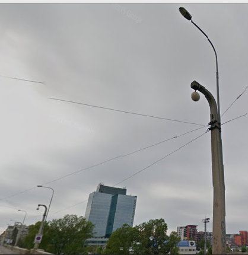

---
geometry:
- right=20mm
- left=20mm
- top=15mm
- bottom=15mm
---

## Interpelace radního pro dopravu 28. 1.

Tento dotaz jsem již vznesl v úterní debatě k Libeňskému mostu, naneštěstí jste musel odejít dřív. Podle mého názoru je TSK jedna z nejhůře pracujících organizací v rámci Hlavního města Prahy.

Byli jsme svědky, jak dokázali zašantročit celý několika milionový rozpočet na projektováná cyklostezek.

U Libeňského mostu je situace ještě markantnější. Na reálnou údržbu se kašlalo desítky let. Při tom každý, kdo se o\ věc zajímal viděl, že by stačili opravdu drobné opravy, aby byla stavba v lepším stavu. Projekt je zpracován pouze v\ extrémistické variantě. Navíc Ministerstvo kultury bylo uvedeno v omyl, když mu bylo oficiálně sděleno, že most je neopravitelný. Stejně tak bych mohl zmínit moderní lampy připevněné k historickým... 

Pane radní, vyvodíte z těchto pochybení nějaké následky? Kontrolujete zda jsou usnesení plněna? Popř. máte nějakou vizi, jak zabránit obdobným chybám.

\bigskip

Ondřej Profant  
Zastupitel Hl. m. Prahy
