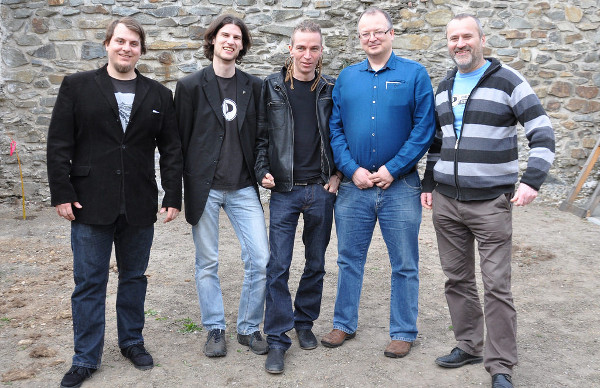

Česká pirátská strana  
republikové předsednictvo

**VÝBĚROVÉ ŘÍZENÍ BYLO VYHLÁŠENO DNE 3. 8. 2016**

Výběrové řízení na asistenta pro administrativu
========================

Ahoj!

V Pirátské straně hledáme **asistenta pro administrativu**, tedy člověka, který bude asistovat republikovému předsednictvu, administrativnímu odboru a dalším orgánům. Pokud sympatizuješ s Piráty, administrativa ti nedělá problémy a rád vnášíš do chaosu řád, a zároveň si chceš i trochu přivydělat, je tohle pro tebe ta pravá nabídka. 

## Poptávaná činnost:

* administrativní agenda celostátního vedení (republikového předsednictva, administrativního odboru, republikového výboru) 
* např. tvorba stručných zápisů z jednání, správa podatelny, příprava jednání a schůzek a jednoduchých rešerší, správa spisové služby, vedení registrů, pomoc s okrskovými volebními komisemi, zjišťování stavu úkolů apod., případně další věci dle dohody a schopností
* předpokládaný rozsah činnosti je cca 20 hodin týdně (cca poloviční úvazek)

## Nabízíme:

* smlouvu na dobu neurčitou, s odměnou 8 až 11 tis. Kč měsíčně (odměna dle kvality a náročnosti splněných úkolů),
* možnost podílet se na realizaci Pirátského programu,
* práce ve skvělém kolektivu předních osobností Pirátů v České republice,
* seznámení s moderními technologiemi používanými při fungování Pirátské strany,
* neomezený telefonní tarif s internetem, 
* nabídka je otevřená pro lidi z celé republiky, lze pracovat z domova; k činnosti lze využít některé Pirátské centrum po celé republice (podle dohody a aktuálních potřeb).

## Požadujeme:

* filosofické ztotožnění se s [Pirátským programem][program] a jeho dobrou znalost, loajalitu k Pirátské straně jako organizaci,
* znalost kancelářských balíků, schopnost naučit se používat [Pirátský redmine][redmine] a [Pirátské fórum][forum] a další technické systémy,
* vynikající komunikační dovednosti, reprezentativní a příjemné vystupování,
* dobrý písemný projev,
* časová flexibilita (aktivity mají často nárazový charakter v časovém tlaku),
* schopnost plánování, samostatnost a svědomitost,
* znalost anglického jazyka,
* osobní zkušenost s dobrovolnickou prací v libovolné podobě je výhodou,
* nástup nejpozději 1. září 2016.

Podmínkou výběrového řízení je, aby daná osoba ještě neměla s Českou pirátskou stranou uzavřenou smlouvu s očekávaným rozsahem práce 20 hodin týdně a více. 

[program]: https://www.pirati.cz/program/start
[forum]: https://forum.pirati.cz
[redmine]: https://redmine.pirati.cz/

## Zasílání nabídek

V nabídce nám prosím zašli v jednom PDF dokumentu následující materiály: 

1. krátký motivační dopis,
2. svůj životopis.

Z výše uvedených dokumentů by měly být patrné zejména zkušenosti z administrativy, práce s technickými systémy (preferujeme ty svobodné), plánování, příp. zkušenosti s dobrovolnictvím, a dále znalost angličtiny.

[plan]: https://redmine.pirati.cz/projects/senat/roadmap

Pokud máš nedejbože záznam v trestním rejstříku, popiš ho a zdůvodni. Podrobnosti o výběrovém řízení si přečti v [pravidlech výběrového řízení](pravidla.md). Pokud máš zájem o upřesnění informací, neváhej se na mne obrátit emailem či telefonicky.

Poptávaná činnost může být dodána jako služba živnostníkem (na IČO) či můžeme na tuto činnost přijmout zaměstnance (DPP, DPČ) – v takovém případě zahrnuje výše avizovaná částka i všechny odvody na straně zadavatele, skutečná částka vyplacená zaměstnanci tedy bude nižší. Na zadání bude sepsán standardní zadávací list podle [podmínek pro placené úkoly](https://github.com/pirati-cz/sablony/blob/4b07ba675434ee634c527909d537122264cc712e/ukoly/podminky/podminky.md) s vykazováním v systémů [redmine][redmine].

**Nabídku nám prosím zašli do 19. 8. 2016, do tří dnů se ti ozveme ohledně výsledku výběrového řízení nebo dalšího postupu. Nabídku pošli na adresu <jan.louzek@pirati.cz>, kopii potom na <info@pirati.cz>.**

S pozdravem 

Bc. Jan Loužek  
zveřejňovač Pirátů v Praze  
<jan.louzek@pirati.cz>, tel. 608 213 119

----

## Související odkazy

* [Pravidla výběrového řízení](pravidla.md)
* [Schválené usnesení](usneseni.md) 
