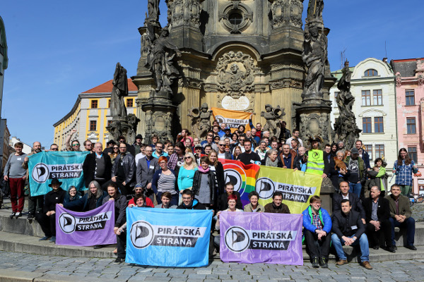

Česká pirátská strana  
republikové předsednictvo

**TOTO JE NÁVRH DOSUD NEVYHLÁŠENÉHO VÝBĚROVÉHO ŘÍZENÍ. NEPOSÍLEJTE NÁM PROSÍM ZATÍM ŽÁDNÉ NABÍDKY.**

Výběrové řízení na celostátního koordinátora dobrovolníků
========================

Ahoj!

Hledáme **celostátního koordinátora dobrovolníků** pro Pirátskou stranu. Pokud sympatizuješ s Piráty, baví tě spolupracovat s dobrovolníky, motivovat druhé a chceš si trochu přivydělat, je tohle pro tebe ta pravá nabídka.

## Poptávaná činnost:

* zjednodušovat a koordinovat zapojení členů, příznivců i lidí úplně zvenku do činnosti Pirátské strany,
* telefonicky, elektronicky a osobně kontaktovat dobrovolníky, členy strany a příznivce, vést jejich databázi a udržovat seznam volných úkolů pro dobrovolníky,
* koordinovat probíhající dobrovolnické kampaně (volební kampaně, Hrajeme svobodnou hudbu, roznos Pirátských listů, rozesílání newsletteru apod.),
* jiné personální činnosti podle potřeb personálního odboru Pirátské strany.

Předpokládaný rozsah činnosti je cca 20 hodin týdně (cca poloviční úvazek).

## Nabízíme:

* smlouvu na dobu neurčitou, s odměnou 6 až 10 tis. Kč měsíčně (odměna dle kvality a náročnosti splněných úkolů),
* možnost podílet se na realizaci Pirátského programu,
* práce ve skvělém kolektivu Pirátské strany i s širokou a rozmanitou členskou základnou,
* seznámení s moderními technologiemi používanými při fungování Pirátské strany,
* neomezený telefonní tarif s internetem, 
* nabídka je otevřená pro lidi z celé republiky, lze pracovat z domova; k činnosti lze využít některé Pirátské centrum po celé republice (podle dohody a aktuálních potřeb).

## Požadujeme:

* filosofické ztotožnění se s [Pirátským programem][program], 
* osobní zkušenost s dobrovolnickou prací v libovolné podobě (zkušenost s koordinací dobrovolníků výhodou),
* znalost kancelářských balíků, schopnost naučit se používat [Pirátský redmine][redmine] a [Pirátské fórum][forum] a další technické systémy,
* vynikající komunikační dovednosti, reprezentativní a příjemné vystupování, dobrý písemný projev,
* časová flexibilita (aktivity mají často nárazový charakter v časovém tlaku),
* schopnost plánování, samostatnost a svědomitost,
* nástup nejpozději 1. září 2016.

[program]: https://www.pirati.cz/program/start
[forum]: https://forum.pirati.cz
[redmine]: https://redmine.pirati.cz/

## Zasílání nabídek

V nabídce nám prosím zašli v jednom PDF dokumentu následující materiály: 

1. krátký motivační dopis; popiš zde svou zkušenost s dobrovolnickou prací v libovolné podobě, případně zkušenost s koordinací dobrovolníků, 
2. referenční text, kterým prokážeš schopnost písemnou zprávou aktivizovat dobrovolníky (např. text e-mailu pro dobrovolníky ze skutečnné kampaně či demonstrace, obsah tebou vytvořené facebookové stránky k demonstraci apod.) – pokud nemáte, vytvořte ho; maximální rozsah textu 2 normostrany, 
3. úkol na plánování: navrhněte Pirátskou kampaň na zapojení (nábor) dobrovolníků do konkrétních úkolů v rámci kampaně na krajské volby a postup při realizaci. Maximální rozpočet 20 000 Kč. Maximální rozsah textu 2 normostrany, 
4. svůj životopis.

Pokud máš nedejbože záznam v trestním rejstříku, popiš ho a zdůvodni v motivačním dopise. Podrobnosti o výběrovém řízení si přečti v [pravidlech výběrového řízení](pravidla.md). Pokud máš zájem o upřesnění informací, neváhej se na mne obrátit emailem či telefonicky.

Poptávaná činnost může být dodána jako služba živnostníkem (na IČO) či můžeme na tuto činnost přijmout zaměstnance (DPP, DPČ) – v takovém případě zahrnuje výše avizovaná částka i všechny odvody na straně zadavatele, skutečná částka vyplacená zaměstnanci tedy bude nižší. Na zadání bude sepsán standardní zadávací list podle [podmínek pro placené úkoly](https://github.com/pirati-cz/sablony/blob/4b07ba675434ee634c527909d537122264cc712e/ukoly/podminky/podminky.md) s vykazováním v systémů [redmine][redmine].

**Nabídku nám prosím zašli do 16 dnů od vyhlášení výběrového řízení, do tří dnů se ti ozveme ohledně výsledku výběrového řízení nebo dalšího postupu. Nabídku pošli na adresu <jan.louzek@pirati.cz>, kopii potom na <info@pirati.cz>.**

S pozdravem 

Bc. Jan Loužek  
zveřejňovač Pirátů v Praze  
<jan.louzek@pirati.cz>, tel. 608 213 119

----

## Související odkazy

* [Pravidla výběrového řízení](pravidla.md)
* [Schválené usnesení](usneseni.md) 
